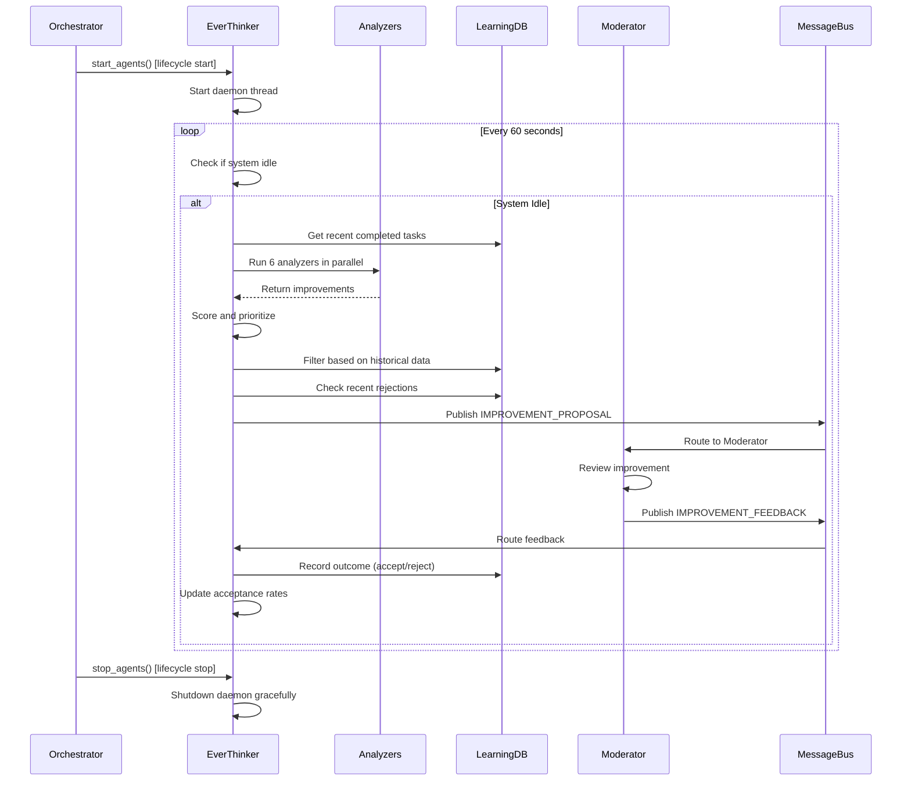

# Epic Technical Specification: Epic 3 - Ever-Thinker Continuous Improvement Engine

Date: 2025-11-08
Author: Tomer
Epic ID: epic-3
Status: Draft

---

## Overview

The Ever-Thinker Continuous Improvement Engine is the core innovation of the Moderator system - a background daemon that continuously analyzes completed work and identifies improvement opportunities. Unlike traditional code generation tools that consider work "complete" after initial implementation, Ever-Thinker embodies the philosophy that software can always be improved.

**Core Innovation:**
- Runs as a background daemon during system idle time
- Analyzes work from 6 distinct perspectives: performance, code quality, testing, documentation, UX, and architecture
- Creates PRs for proposed improvements
- Learns from user acceptance/rejection of improvements
- Integrates with the Learning System to improve suggestion quality over time

**Value Proposition:**
- Catches performance bottlenecks before they become critical
- Ensures comprehensive test coverage and documentation
- Maintains code quality standards consistently
- Improves user experience through automated UX analysis
- Enforces architectural best practices
- Gets smarter with every project through learning

## Objectives and Scope

### Epic Objectives

1. **Implement Background Daemon** - Create Ever-Thinker agent that runs as Python daemon thread without blocking primary work
2. **Multi-Perspective Analysis** - Implement 6 analyzer modules covering all aspects of software quality
3. **Improvement Orchestration** - Coordinate complete improvement cycle from analysis → PR creation → feedback → learning
4. **Learning Integration** - Connect Ever-Thinker to Learning System to query patterns and update outcomes
5. **Configurable Operation** - Support configuration for max cycles, perspectives, and analysis depth

### In Scope

- EverThinkerAgent class with daemon threading
- 6 analyzer modules (Performance, CodeQuality, Testing, Documentation, UX, Architecture)
- Improvement cycle orchestration with priority scoring
- Integration with LearningDB for pattern querying and outcome tracking
- Configuration via `gear3.ever_thinker` section
- Graceful shutdown and idle time detection

### Out of Scope (Future Enhancements)

- Custom analyzer plugins (v2)
- Multi-project learning aggregation (v2)
- Real-time analysis during task execution (v2)
- Advanced ML-based pattern detection (Gear 4)
- Integration with external code analysis tools beyond what's in QA Manager (Epic 4)

## System Architecture Alignment

### Position in Moderator Architecture

```
┌─────────────────────────────────────────────────────────┐
│                    Orchestrator                         │
│  - Manages agent lifecycle                             │
│  - Registers Ever-Thinker as conditional agent         │
└───────────────┬─────────────────────────────────────────┘
                │
                ├─────────────────────────────────────────┐
                │                                         │
        ┌───────▼─────────┐                   ┌──────────▼────────────┐
        │ Moderator Agent │                   │ Ever-Thinker Agent    │
        │  (Gear 2)       │                   │  (Gear 3)             │
        │                 │◄──────Messages────┤  - Background daemon  │
        └─────────────────┘                   │  - 6 analyzers        │
                │                              │  - Improvement cycle  │
                │                              └──────────┬────────────┘
                │                                         │
        ┌───────▼─────────┐                   ┌──────────▼────────────┐
        │  TechLead Agent │                   │  Learning System      │
        │  (Gear 2)       │                   │  (Epic 2)             │
        └─────────────────┘                   │  - Pattern detector   │
                                              │  - Improvement tracker│
                                              └───────────────────────┘
```

### Integration Points

1. **Orchestrator** (Story 1.5)
   - Registers Ever-Thinker via `register_agent("ever-thinker", agent)`
   - Manages lifecycle with `start_agents()` and `stop_agents()`
   - Configuration check: `config.get('gear3', {}).get('ever_thinker', {}).get('enabled', False)`

2. **Message Bus** (Story 1.3)
   - Subscribes to: `TASK_COMPLETED`, `PR_APPROVED`
   - Publishes: `IMPROVEMENT_PROPOSAL`, `LEARNING_UPDATE`
   - Receives: `IMPROVEMENT_FEEDBACK`

3. **Learning System** (Epic 2)
   - Queries historical patterns via `LearningDB.get_successful_patterns()`
   - Records improvement proposals via `ImprovementTracker.record_proposal()`
   - Updates acceptance rates after feedback

4. **Logger** (Story 1.2)
   - Logs using Gear 3 event types: `IMPROVEMENT_CYCLE_START`, `IMPROVEMENT_IDENTIFIED`, etc.
   - Structured logging for all analyzer activities

## Detailed Design

### Services and Modules

#### 1. EverThinkerAgent (Story 3.1)

**Location:** `src/agents/ever_thinker_agent.py`

**Responsibilities:**
- Run as background daemon thread
- Detect system idle time (no tasks executing)
- Orchestrate improvement cycles
- Coordinate 6 analyzer modules
- Manage graceful shutdown

**Key Methods:**
```python
class EverThinkerAgent(BaseAgent):
    def __init__(self, message_bus, learning_db, logger, config)
    def start() -> None  # Start daemon thread
    def stop() -> None   # Graceful shutdown
    def run_daemon_loop() -> None  # Main daemon loop
    def detect_idle_time() -> bool  # Check if system is idle
    def run_improvement_cycle() -> None  # Run single improvement cycle
    def analyze_from_perspectives(task) -> list[Improvement]  # Run all analyzers
    def score_and_prioritize(improvements) -> list[Improvement]  # Priority scoring
```

**Threading Strategy:**
```python
import threading

self.daemon_thread = threading.Thread(
    target=self.run_daemon_loop,
    daemon=True,  # Daemon thread exits when main thread exits
    name="ever-thinker-daemon"
)
self.running = threading.Event()
self.shutdown_event = threading.Event()
```

#### 2. Performance Analyzer (Story 3.2)

**Location:** `src/agents/analyzers/performance_analyzer.py`

**Responsibilities:**
- Detect slow operations (O(n²) algorithms, nested loops)
- Identify optimization opportunities (caching, memoization)
- Suggest algorithm improvements
- Detect inefficient database queries

**Key Methods:**
```python
class PerformanceAnalyzer:
    def analyze(self, task: Task) -> list[Improvement]
    def detect_slow_operations(self, files: list[str]) -> list[Issue]
    def suggest_caching_opportunities(self, code: str) -> list[Suggestion]
    def detect_algorithm_inefficiencies(self, code: str) -> list[Issue]
```

**Detection Heuristics:**
- Nested loops with O(n²) or worse complexity
- Repeated function calls with same arguments (caching opportunity)
- Large data structure iterations (consider generators)
- Database queries in loops (N+1 problem)

#### 3. Code Quality Analyzer (Story 3.3 - Part 1)

**Location:** `src/agents/analyzers/code_quality_analyzer.py`

**Responsibilities:**
- Calculate cyclomatic complexity
- Detect code duplication
- Identify long methods/classes
- Find dead code

**Key Methods:**
```python
class CodeQualityAnalyzer:
    def analyze(self, task: Task) -> list[Improvement]
    def calculate_complexity(self, function: str) -> int
    def detect_duplication(self, files: list[str]) -> list[Issue]
    def find_long_methods(self, code: str) -> list[Issue]
    def detect_dead_code(self, code: str) -> list[Issue]
```

**Metrics:**
- Cyclomatic complexity > 10 → Refactor
- Duplicate code blocks > 6 lines → Extract to function
- Methods > 50 lines → Consider splitting
- Unused imports/variables → Remove

#### 4. Testing Analyzer (Story 3.3 - Part 2)

**Location:** `src/agents/analyzers/testing_analyzer.py`

**Responsibilities:**
- Identify test coverage gaps
- Detect missing edge cases
- Suggest additional test scenarios
- Validate test quality (assertions, mocking)

**Key Methods:**
```python
class TestingAnalyzer:
    def analyze(self, task: Task) -> list[Improvement]
    def identify_coverage_gaps(self, files: list[str]) -> list[Issue]
    def suggest_edge_cases(self, function: str) -> list[TestCase]
    def validate_test_quality(self, test_file: str) -> list[Issue]
```

**Coverage Analysis:**
- Functions without tests → Add unit tests
- Missing edge cases (null, empty, boundary values) → Add test cases
- No error path testing → Add exception tests
- Test quality issues (no assertions, poor mocking) → Improve tests

#### 5. Documentation Analyzer (Story 3.3 - Part 3)

**Location:** `src/agents/analyzers/documentation_analyzer.py`

**Responsibilities:**
- Check docstring completeness
- Validate parameter documentation
- Ensure README updates
- Detect missing examples

**Key Methods:**
```python
class DocumentationAnalyzer:
    def analyze(self, task: Task) -> list[Improvement]
    def check_docstring_completeness(self, code: str) -> list[Issue]
    def validate_parameter_docs(self, function: str) -> list[Issue]
    def check_readme_updates(self, task: Task) -> bool
    def detect_missing_examples(self, module: str) -> list[Issue]
```

**Documentation Standards:**
- Public functions require docstrings
- Parameters must be documented with types
- Return values must be documented
- README must reflect new functionality
- Complex logic needs inline comments

#### 6. UX Analyzer (Story 3.4 - Part 1)

**Location:** `src/agents/analyzers/ux_analyzer.py`

**Responsibilities:**
- Improve error messages
- Suggest user-friendly output
- Detect usability issues
- Recommend UX enhancements

**Key Methods:**
```python
class UXAnalyzer:
    def analyze(self, task: Task) -> list[Improvement]
    def improve_error_messages(self, code: str) -> list[Improvement]
    def suggest_user_feedback(self, code: str) -> list[Improvement]
    def detect_usability_issues(self, code: str) -> list[Issue]
```

**UX Heuristics:**
- Generic errors → Specific, actionable error messages
- Silent failures → Progress indicators and status messages
- Unclear CLI options → Better help text and examples
- Missing validation → User input validation with clear messages

#### 7. Architecture Analyzer (Story 3.4 - Part 2)

**Location:** `src/agents/analyzers/architecture_analyzer.py`

**Responsibilities:**
- Check SOLID principles adherence
- Detect design pattern violations
- Identify architectural smells
- Suggest refactoring opportunities

**Key Methods:**
```python
class ArchitectureAnalyzer:
    def analyze(self, task: Task) -> list[Improvement]
    def check_solid_principles(self, code: str) -> list[Issue]
    def detect_pattern_violations(self, code: str) -> list[Issue]
    def identify_architectural_smells(self, code: str) -> list[Issue]
```

**Architecture Rules:**
- Single Responsibility Principle violations → Split classes
- God objects (too many responsibilities) → Decompose
- Circular dependencies → Break cycles
- Missing abstractions → Introduce interfaces
- Tight coupling → Introduce dependency injection

#### 8. Improvement Cycle Orchestrator (Story 3.5)

**Location:** Integrated into `EverThinkerAgent`

**Workflow:**
```
1. System Idle Detection
   ↓
2. Select Task for Analysis (recently completed)
   ↓
3. Run All 6 Analyzers in Parallel
   ↓
4. Collect and Score Improvements
   ↓
5. Prioritize (High → Medium → Low)
   ↓
6. Query Learning System for Historical Patterns
   ↓
7. Filter Improvements (skip if similar rejected before)
   ↓
8. Create PR for Top Priority Improvement
   ↓
9. Wait for User Feedback (IMPROVEMENT_FEEDBACK message)
   ↓
10. Update Learning System (acceptance/rejection)
    ↓
11. Repeat (if max_cycles not reached)
```

**Priority Scoring Algorithm:**
```python
def calculate_priority_score(improvement: Improvement) -> float:
    base_score = 0

    # Impact weight (how much improvement adds value)
    impact_weight = {
        'critical': 10,  # Security issue, crash bug
        'high': 7,       # Performance bottleneck, major usability issue
        'medium': 4,     # Code quality, minor performance
        'low': 1         # Documentation, minor cleanup
    }

    # Effort weight (lower effort = higher priority)
    effort_weight = {
        'trivial': 5,    # 1-line change
        'small': 3,      # < 50 lines
        'medium': 1,     # 50-200 lines
        'large': -2      # > 200 lines
    }

    # Historical acceptance rate (from Learning System)
    acceptance_rate = learning_db.get_acceptance_rate(improvement.type)

    score = (
        impact_weight[improvement.impact] +
        effort_weight[improvement.effort] +
        (acceptance_rate * 5)  # Weight historical acceptance
    )

    return score
```

### Data Models and Contracts

#### Improvement Data Model

```python
from dataclasses import dataclass
from enum import Enum

class ImprovementType(Enum):
    PERFORMANCE = "performance"
    CODE_QUALITY = "code_quality"
    TESTING = "testing"
    DOCUMENTATION = "documentation"
    UX = "ux"
    ARCHITECTURE = "architecture"

class ImprovementPriority(Enum):
    HIGH = "high"
    MEDIUM = "medium"
    LOW = "low"

@dataclass
class Improvement:
    improvement_id: str
    improvement_type: ImprovementType
    priority: ImprovementPriority
    target_file: str
    target_line: int | None
    title: str
    description: str
    proposed_changes: str  # Diff or description
    rationale: str
    impact: str  # critical | high | medium | low
    effort: str  # trivial | small | medium | large
    created_at: str
    analyzer_source: str  # Which analyzer created it
```

#### Analyzer Interface

```python
from abc import ABC, abstractmethod

class Analyzer(ABC):
    """Base class for all analyzer modules"""

    @abstractmethod
    def analyze(self, task: Task) -> list[Improvement]:
        """
        Analyze a completed task and return improvement opportunities.

        Args:
            task: Completed task to analyze

        Returns:
            List of Improvement objects
        """
        pass

    @property
    @abstractmethod
    def analyzer_name(self) -> str:
        """Return name of this analyzer"""
        pass
```

### APIs and Interfaces

#### Message Bus Integration

**Subscribed Messages:**
```python
# When task completes, check if system is idle
message_bus.subscribe(MessageType.TASK_COMPLETED, self.on_task_completed)

# When PR approved, task is fully complete - good candidate for analysis
message_bus.subscribe(MessageType.PR_APPROVED, self.on_pr_approved)
```

**Published Messages:**
```python
# Propose improvement to Moderator
message_bus.publish(AgentMessage(
    message_type=MessageType.IMPROVEMENT_PROPOSAL,
    from_agent="ever-thinker",
    to_agent="moderator",
    payload=ImprovementProposalPayload(
        improvement_id="imp_001",
        improvement_type="performance",
        priority="high",
        target_file="src/executor.py",
        proposed_changes="Add caching for task results",
        rationale="Repeated database queries detected"
    )
))

# Record learning outcome
message_bus.publish(AgentMessage(
    message_type=MessageType.LEARNING_UPDATE,
    from_agent="ever-thinker",
    to_agent="learning_system",
    payload=LearningUpdatePayload(
        pattern_type="improvement_accepted",
        pattern_data={"type": "performance", "acceptance_rate": 0.85},
        success_count=1
    )
))
```

**Received Messages:**
```python
# Moderator approves or rejects improvement
@message_handler(MessageType.IMPROVEMENT_FEEDBACK)
def on_improvement_feedback(self, message: AgentMessage):
    payload = message.payload

    if payload['approved']:
        self.logger.log_improvement_approved(
            improvement_id=payload['improvement_id'],
            reason=payload['reason']
        )
        # Update learning system
        self.learning_db.record_acceptance(payload['improvement_id'])
    else:
        self.logger.log_improvement_rejected(
            improvement_id=payload['improvement_id'],
            reason=payload['reason']
        )
        # Update learning system
        self.learning_db.record_rejection(
            payload['improvement_id'],
            payload['reason']
        )
```

#### Learning System Integration (Story 3.6)

**Query Patterns:**
```python
# Get historical acceptance rates for improvement types
acceptance_rates = learning_db.get_acceptance_rates_by_type()
# Returns: {'performance': 0.85, 'code_quality': 0.72, ...}

# Get successful patterns for specific improvement type
patterns = learning_db.get_successful_patterns(
    improvement_type='performance',
    min_success_count=3
)

# Check if similar improvement was rejected recently
was_rejected = learning_db.check_recent_rejection(
    improvement_type='code_quality',
    target_file='src/executor.py',
    days_back=30
)
```

**Record Outcomes:**
```python
# Record improvement proposal
improvement_tracker.record_proposal(
    improvement_id='imp_001',
    improvement_type='performance',
    proposed_changes='Add caching',
    rationale='Repeated queries detected'
)

# Record acceptance
improvement_tracker.record_acceptance(
    improvement_id='imp_001',
    reason='Good catch, improves performance by 40%'
)

# Record rejection
improvement_tracker.record_rejection(
    improvement_id='imp_002',
    reason='Already optimized in previous sprint'
)
```

### Workflows and Sequencing

#### Improvement Cycle Sequence



#### Idle Detection Logic

```python
def detect_idle_time(self) -> bool:
    """
    Detect if system is idle (no tasks executing).

    Returns:
        True if system has been idle for at least idle_threshold seconds
    """
    # Check if any tasks are currently executing
    active_tasks = self.project_state.tasks
    executing = [t for t in active_tasks if t.status == TaskStatus.RUNNING]

    if executing:
        self.last_activity_time = time.time()
        return False

    # Check if enough idle time has passed
    idle_time = time.time() - self.last_activity_time
    idle_threshold = self.config.get('idle_threshold_seconds', 300)  # 5 minutes

    return idle_time >= idle_threshold
```

## Non-Functional Requirements

### Performance

**P1 - Daemon Overhead:**
- Ever-Thinker daemon thread must use < 5% CPU when idle
- Memory footprint < 50MB for daemon + analyzers
- Idle detection polling interval: 60 seconds (configurable)

**P2 - Analysis Speed:**
- Single analyzer run must complete in < 30 seconds for typical task
- All 6 analyzers in parallel must complete in < 60 seconds
- Priority scoring for 100 improvements must complete in < 1 second

**P3 - Graceful Shutdown:**
- Shutdown signal must be processed within 5 seconds
- In-progress analysis can be interrupted cleanly
- No data corruption on abrupt shutdown

### Security

**S1 - Code Analysis Safety:**
- Analyzers must NOT execute user code (static analysis only)
- File access limited to project directory (no access to /etc, /home, etc.)
- Sandbox analyzer execution if running untrusted code

**S2 - Learning Data Privacy:**
- Improvement proposals stored with project context only
- No PII or secrets logged in improvement descriptions
- Learning database accessible only to authorized agents

### Reliability/Availability

**R1 - Fault Tolerance:**
- Single analyzer failure must not crash entire improvement cycle
- Failed analyzers logged with error details
- Improvement cycle continues with remaining analyzers

**R2 - Daemon Resilience:**
- Daemon thread restarts automatically if crashed
- Maximum 3 restart attempts before permanent shutdown
- Error state logged and reported to Moderator

**R3 - Learning System Availability:**
- Ever-Thinker must function even if Learning System unavailable
- Degrade gracefully to no historical filtering
- Log warning when Learning System is unreachable

### Observability

**O1 - Structured Logging:**
- All improvement cycles logged with `IMPROVEMENT_CYCLE_START` and `IMPROVEMENT_CYCLE_COMPLETE` events
- Each analyzer logs individual findings with `IMPROVEMENT_IDENTIFIED` events
- All learning updates logged with `LEARNING_PATTERN_RECORDED` events

**O2 - Metrics:**
- Track: improvement cycles per hour, improvements proposed per cycle, acceptance rate by type
- Dashboard integration (Epic 6): Real-time improvement activity feed
- Historical trend analysis: Acceptance rates over time

**O3 - Debugging:**
- Verbose logging mode for troubleshooting analyzer issues
- Improvement proposal dumps to file for manual review
- Analyzer performance profiling (time per analyzer, bottlenecks)

## Dependencies and Integrations

### Internal Dependencies

**Epic 1: Gear 3 Foundation & Infrastructure** (✅ Complete)
- Story 1.2: Logger with EventType enum for improvement events
- Story 1.3: Message Bus with IMPROVEMENT_PROPOSAL, IMPROVEMENT_FEEDBACK, LEARNING_UPDATE messages
- Story 1.5: Orchestrator with agent lifecycle management

**Epic 2: Learning System & Data Persistence** (✅ Complete)
- Story 2.1-2.2: LearningDB for pattern queries and outcome storage
- Story 2.3: PatternDetector for successful pattern identification
- Story 2.4: ImprovementTracker for acceptance/rejection tracking

### External Dependencies

**Python Standard Library:**
- `threading` - Daemon thread implementation
- `queue` - Thread-safe message queuing
- `time` - Idle detection timing
- `ast` - Python AST parsing for code analysis
- `re` - Regular expressions for pattern detection

**Third-Party Libraries:**
- `radon` (optional) - Cyclomatic complexity calculation
- `pylint` (optional) - Code quality metrics (if not using QA Manager from Epic 4)
- `pytest-cov` (optional) - Test coverage analysis

**File System:**
- Read access to `src/` directory for code analysis
- Read access to `tests/` directory for test coverage analysis
- Read access to `docs/` directory for documentation completeness

### Integration Contracts

**Contract with Moderator Agent:**
```
Input: IMPROVEMENT_PROPOSAL message
Expected Response: IMPROVEMENT_FEEDBACK message within 24 hours
Fallback: If no response after 24h, assume rejection
```

**Contract with Learning System:**
```
Input: Query for acceptance rates, recent rejections
Expected Response: Immediate synchronous response
Fallback: If unavailable, proceed without filtering
```

**Contract with Orchestrator:**
```
Input: start_agents() and stop_agents() lifecycle calls
Expected Behavior: Clean startup and graceful shutdown
Guarantee: No orphaned threads after stop_agents()
```

## Acceptance Criteria (Authoritative)

### Story 3.1: Ever-Thinker Agent with Threading Daemon

**AC 3.1.1:** EverThinkerAgent class exists in `src/agents/ever_thinker_agent.py` and inherits from `BaseAgent`

**AC 3.1.2:** Daemon thread starts on `agent.start()` and runs `run_daemon_loop()` method

**AC 3.1.3:** `detect_idle_time()` returns `True` only when no tasks are executing and idle_threshold passed

**AC 3.1.4:** `agent.stop()` sets shutdown event and daemon thread exits within 5 seconds

**AC 3.1.5:** Daemon thread is marked as daemon (`daemon=True`) so it doesn't block main thread exit

**AC 3.1.6:** Configuration loaded from `gear3.ever_thinker` section with defaults:
- `enabled: false`
- `max_cycles: 3`
- `idle_threshold_seconds: 300`
- `perspectives: [performance, code_quality, testing, documentation, ux, architecture]`

### Story 3.2: Performance Analyzer

**AC 3.2.1:** PerformanceAnalyzer class exists in `src/agents/analyzers/performance_analyzer.py` and implements `Analyzer` interface

**AC 3.2.2:** `detect_slow_operations()` identifies O(n²) or worse algorithms in code

**AC 3.2.3:** `suggest_caching_opportunities()` detects repeated function calls with same arguments

**AC 3.2.4:** `detect_algorithm_inefficiencies()` finds inefficient loops and suggests optimizations

**AC 3.2.5:** Returns list of `Improvement` objects with `improvement_type=PERFORMANCE`

### Story 3.3: Code Quality, Testing, and Documentation Analyzers

**AC 3.3.1:** CodeQualityAnalyzer exists and detects:
- Cyclomatic complexity > 10
- Code duplication > 6 lines
- Methods > 50 lines
- Dead code (unused imports, variables)

**AC 3.3.2:** TestingAnalyzer exists and detects:
- Functions without tests
- Missing edge cases (null, empty, boundary)
- No error path testing
- Test quality issues (no assertions, poor mocking)

**AC 3.3.3:** DocumentationAnalyzer exists and detects:
- Missing docstrings on public functions
- Undocumented parameters
- Missing return value documentation
- Outdated README

### Story 3.4: UX and Architecture Analyzers

**AC 3.4.1:** UXAnalyzer exists and suggests:
- Specific error messages instead of generic ones
- Progress indicators for long operations
- Better CLI help text
- User input validation with clear messages

**AC 3.4.2:** ArchitectureAnalyzer exists and detects:
- SOLID principle violations
- God objects (too many responsibilities)
- Circular dependencies
- Missing abstractions
- Tight coupling

### Story 3.5: Improvement Cycle Orchestration

**AC 3.5.1:** `run_improvement_cycle()` method exists and executes complete workflow:
1. Detect idle time
2. Select task for analysis
3. Run all 6 analyzers
4. Score and prioritize improvements
5. Create PR for top improvement
6. Wait for feedback
7. Update learning system

**AC 3.5.2:** Priority scoring algorithm weights impact, effort, and historical acceptance rate

**AC 3.5.3:** Max cycles configuration respected (stops after `max_cycles` improvements)

**AC 3.5.4:** All 6 analyzers run in parallel (not sequentially) for performance

**AC 3.5.5:** Failed analyzers don't crash entire cycle (fault isolation)

### Story 3.6: Learning System Integration

**AC 3.6.1:** Ever-Thinker queries `LearningDB.get_acceptance_rates_by_type()` before proposing improvements

**AC 3.6.2:** Improvements filtered if similar improvement was rejected in last 30 days

**AC 3.6.3:** After receiving `IMPROVEMENT_FEEDBACK`, Ever-Thinker records outcome via `ImprovementTracker.record_acceptance()` or `record_rejection()`

**AC 3.6.4:** Learning System updates reflected in next improvement cycle (acceptance rates adjust based on new data)

**AC 3.6.5:** If Learning System unavailable, Ever-Thinker continues without filtering (degraded mode)

## Traceability Mapping

### Epic to Stories

```
Epic 3: Ever-Thinker Continuous Improvement Engine
├── Story 3.1: Implement Ever-Thinker Agent with Threading Daemon
│   └── Components: EverThinkerAgent, daemon loop, idle detection, graceful shutdown
├── Story 3.2: Implement Performance Analyzer
│   └── Components: PerformanceAnalyzer, slow operation detection, caching suggestions
├── Story 3.3: Implement Code Quality, Testing, and Documentation Analyzers
│   ├── Components: CodeQualityAnalyzer (complexity, duplication)
│   ├── Components: TestingAnalyzer (coverage gaps, edge cases)
│   └── Components: DocumentationAnalyzer (docstrings, README)
├── Story 3.4: Implement UX and Architecture Analyzers
│   ├── Components: UXAnalyzer (error messages, usability)
│   └── Components: ArchitectureAnalyzer (SOLID, patterns, coupling)
├── Story 3.5: Implement Improvement Cycle Orchestration
│   └── Components: run_improvement_cycle(), priority scoring, max_cycles
└── Story 3.6: Integrate Ever-Thinker with Learning System
    └── Components: LearningDB queries, ImprovementTracker recording, filtering
```

### Stories to Acceptance Criteria

```
Story 3.1 → AC 3.1.1 through AC 3.1.6 (daemon implementation)
Story 3.2 → AC 3.2.1 through AC 3.2.5 (performance analysis)
Story 3.3 → AC 3.3.1 through AC 3.3.3 (code quality, testing, docs)
Story 3.4 → AC 3.4.1 through AC 3.4.2 (UX and architecture)
Story 3.5 → AC 3.5.1 through AC 3.5.5 (orchestration)
Story 3.6 → AC 3.6.1 through AC 3.6.5 (learning integration)
```

### Requirements to NFRs

```
Performance Requirements → P1, P2, P3 (daemon overhead, analysis speed, shutdown)
Security Requirements → S1, S2 (code analysis safety, learning data privacy)
Reliability Requirements → R1, R2, R3 (fault tolerance, daemon resilience)
Observability Requirements → O1, O2, O3 (structured logging, metrics, debugging)
```

## Risks, Assumptions, Open Questions

### Risks

**R1: Daemon Thread Stability** [HIGH]
- **Risk:** Daemon thread crashes or hangs, blocking improvements
- **Mitigation:** Implement watchdog timer, automatic restart (max 3 attempts), comprehensive error handling
- **Owner:** Story 3.1 implementation

**R2: Analysis Performance on Large Codebases** [MEDIUM]
- **Risk:** 6 analyzers running in parallel consume too much CPU/memory on large projects (>100k LOC)
- **Mitigation:** Implement incremental analysis (only changed files), configurable analysis depth, memory limits per analyzer
- **Owner:** Story 3.5 orchestration

**R3: Learning System Downtime** [LOW]
- **Risk:** Learning System unavailable causes Ever-Thinker to fail
- **Mitigation:** Graceful degradation (continue without filtering), log warnings, retry mechanism
- **Owner:** Story 3.6 integration

**R4: Improvement Proposal Spam** [MEDIUM]
- **Risk:** Ever-Thinker creates too many low-value improvement PRs, overwhelming user
- **Mitigation:** Strict priority scoring, max_cycles limit, query historical rejection patterns, configurable perspectives
- **Owner:** Story 3.5 orchestration

**R5: False Positive Detections** [MEDIUM]
- **Risk:** Analyzers incorrectly flag code as needing improvement (e.g., intentional O(n²) for small n)
- **Mitigation:** Context-aware analysis, user feedback loop (record rejections), confidence scoring, manual override
- **Owner:** All analyzer stories (3.2, 3.3, 3.4)

### Assumptions

**A1:** Python AST parsing is sufficient for code analysis (don't need full compiler)

**A2:** User reviews improvement proposals within 24 hours (otherwise timeout and assume rejection)

**A3:** Idle threshold of 5 minutes is sufficient to avoid interfering with active work

**A4:** 6 perspectives cover majority of improvement opportunities (not exhaustive)

**A5:** Learning System (Epic 2) is stable and available when Ever-Thinker starts

**A6:** Git workflow (PR creation) from Epic 1 is reusable for improvement PRs

### Open Questions

**Q1:** Should Ever-Thinker create separate PRs for each improvement, or batch related improvements into one PR?
- **Proposed Answer:** Separate PRs for now (simpler), batching can be added later if needed

**Q2:** How to handle user requesting "pause improvements" (e.g., during critical bugfix sprint)?
- **Proposed Answer:** Add `enabled: false` config toggle, check before each cycle

**Q3:** Should analyzers use external tools (pylint, flake8) or implement analysis from scratch?
- **Proposed Answer:** Hybrid approach - use external tools where available (Epic 4 QA integration), implement custom analysis for specific needs

**Q4:** What happens if improvement PR causes tests to fail?
- **Proposed Answer:** TechLead agent detects test failure, Ever-Thinker learns to avoid similar improvements (record as failed pattern)

**Q5:** Should Ever-Thinker analyze work from other agents (Moderator, TechLead) or only user code?
- **Proposed Answer:** Initially only analyze user code (task outputs), avoid meta-analysis until Gear 4

## Test Strategy Summary

### Unit Tests

**Component:** Each Analyzer (6 total)
- **Test Scope:** Individual analyzer logic in isolation
- **Test Cases:**
  - PerformanceAnalyzer: Detect O(n²) loop, suggest caching, miss false positives
  - CodeQualityAnalyzer: Detect complexity >10, duplication, long methods
  - TestingAnalyzer: Detect untested functions, missing edge cases
  - DocumentationAnalyzer: Detect missing docstrings, parameter docs
  - UXAnalyzer: Detect generic errors, suggest user-friendly messages
  - ArchitectureAnalyzer: Detect SOLID violations, circular dependencies
- **Mock:** File system access, AST parsing results

**Component:** EverThinkerAgent daemon loop
- **Test Scope:** Daemon lifecycle, idle detection, shutdown
- **Test Cases:**
  - Daemon starts and runs loop
  - Idle detection returns true when no tasks executing
  - Shutdown event stops daemon within timeout
  - Crashed daemon restarts (up to max attempts)
- **Mock:** Threading, time, project state

**Component:** Priority Scoring
- **Test Scope:** Improvement prioritization algorithm
- **Test Cases:**
  - High impact + low effort = highest priority
  - Historical acceptance rate weights score correctly
  - Tied scores resolved deterministically
- **Mock:** Learning DB acceptance rates

### Integration Tests

**Test 1:** Complete Improvement Cycle End-to-End
```python
def test_improvement_cycle_e2e():
    # Given: Completed task with improvable code
    task = create_task_with_slow_loop()

    # And: Ever-Thinker agent configured and started
    ever_thinker = EverThinkerAgent(...)
    ever_thinker.start()

    # When: System becomes idle
    mark_system_idle()

    # Then: Improvement proposal published to MessageBus
    proposals = message_bus.get_messages(MessageType.IMPROVEMENT_PROPOSAL)
    assert len(proposals) == 1
    assert proposals[0].payload['improvement_type'] == 'performance'

    # When: Moderator approves improvement
    message_bus.publish(improvement_feedback(approved=True))

    # Then: Learning system updated with acceptance
    assert learning_db.get_acceptance_rate('performance') > 0.5
```

**Test 2:** Learning System Integration
```python
def test_learning_system_filters_rejected_improvements():
    # Given: Similar improvement rejected in last 30 days
    learning_db.record_rejection(
        improvement_type='code_quality',
        target_file='src/executor.py',
        reason='Intentional design'
    )

    # When: Ever-Thinker analyzes same file
    improvements = ever_thinker.analyze_task(task)

    # Then: Similar improvement filtered out
    assert not any(i.target_file == 'src/executor.py' for i in improvements)
```

**Test 3:** Fault Tolerance
```python
def test_failed_analyzer_doesnt_crash_cycle():
    # Given: Performance analyzer raises exception
    mock_analyzer = Mock(side_effect=RuntimeError("Analysis failed"))
    ever_thinker.analyzers['performance'] = mock_analyzer

    # When: Improvement cycle runs
    ever_thinker.run_improvement_cycle()

    # Then: Cycle completes with remaining analyzers
    assert len(ever_thinker.last_improvements) == 5  # 6 - 1 failed
    assert logger.has_error("performance_analyzer_failed")
```

### Manual Testing

**Scenario 1:** Verify daemon runs in background without blocking
- Start Moderator with `gear3.ever_thinker.enabled: true`
- Execute normal task workflow
- Observe Ever-Thinker daemon starting in logs
- Confirm primary work not blocked by daemon

**Scenario 2:** Verify improvement proposal workflow
- Complete a task with obvious improvement opportunity (e.g., slow O(n²) loop)
- Wait for idle threshold
- Observe improvement proposal in logs
- Approve via Moderator agent
- Confirm learning system updated

**Scenario 3:** Verify graceful shutdown
- Start Ever-Thinker daemon
- Send shutdown signal
- Observe daemon exits within 5 seconds
- Confirm no orphaned threads

### Performance Testing

**Test:** Daemon CPU/Memory overhead
```bash
# Start Moderator with Ever-Thinker enabled
python main.py --config config/gear3_config.yaml

# Monitor system resources
top -p $(pgrep -f ever_thinker)

# Verify: CPU < 5%, Memory < 50MB when idle
```

**Test:** Analysis speed on large codebase
```python
def test_analysis_speed():
    # Given: Large codebase with 100 files
    task = create_large_task(file_count=100)

    # When: All 6 analyzers run in parallel
    start = time.time()
    improvements = ever_thinker.analyze_from_perspectives(task)
    duration = time.time() - start

    # Then: Completes in < 60 seconds
    assert duration < 60
```

### Acceptance Testing

Run all Acceptance Criteria from section above against implemented code.

---

**Document Status:** Draft - Ready for Review
**Next Steps:**
1. Review with stakeholders
2. Refine priority scoring algorithm based on feedback
3. Proceed with Story 3.1 implementation
