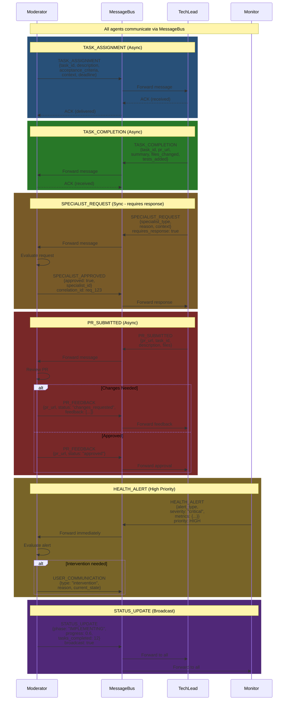

# Agent Communication Protocol

## Description
This diagram illustrates the message flow between agents in the Moderator system, showing different message types, their structures, and communication patterns (synchronous vs asynchronous).

## Diagram



## Message Types

### 1. TASK_ASSIGNMENT
**Direction**: Moderator → TechLead
**Type**: Asynchronous
**Payload Structure**:
```json
{
  "message_id": "msg_abc123",
  "message_type": "TASK_ASSIGNMENT",
  "from_agent": "moderator",
  "to_agent": "techlead",
  "requires_response": false,
  "timestamp": "2024-10-13T10:30:00Z",
  "payload": {
    "task_id": "task_001",
    "type": "FEATURE",
    "description": "Implement user authentication",
    "acceptance_criteria": [
      "Login endpoint functional",
      "JWT tokens generated",
      "Tests pass"
    ],
    "context": {
      "related_files": ["src/auth/"],
      "dependencies": [],
      "guidelines": "Use bcrypt for passwords"
    },
    "deadline": "2024-10-13T15:00:00Z"
  }
}
```

### 2. TASK_COMPLETION
**Direction**: TechLead → Moderator
**Type**: Asynchronous
**Payload Structure**:
```json
{
  "message_id": "msg_def456",
  "message_type": "TASK_COMPLETION",
  "from_agent": "techlead",
  "to_agent": "moderator",
  "requires_response": false,
  "timestamp": "2024-10-13T14:45:00Z",
  "payload": {
    "task_id": "task_001",
    "pr_url": "https://github.com/org/repo/pull/42",
    "summary": "Implemented JWT-based authentication",
    "files_changed": ["src/auth/login.py", "tests/test_auth.py"],
    "tests_added": 12,
    "documentation_updated": true
  }
}
```

### 3. PR_SUBMITTED & PR_FEEDBACK
**Direction**: TechLead → Moderator, Moderator → TechLead
**Type**: Asynchronous
**Payload Structure**:
```json
{
  "message_type": "PR_SUBMITTED",
  "payload": {
    "pr_url": "https://github.com/org/repo/pull/42",
    "task_id": "task_001",
    "description": "Add user authentication",
    "files": ["src/auth/login.py", "tests/test_auth.py"]
  }
}
```

### 4. SPECIALIST_REQUEST
**Direction**: TechLead → Moderator
**Type**: Synchronous (requires response)
**Payload Structure**:
```json
{
  "message_type": "SPECIALIST_REQUEST",
  "requires_response": true,
  "payload": {
    "specialist_type": "api_designer",
    "reason": "Need REST API design expertise",
    "context": {
      "current_progress": "Basic endpoints created",
      "specific_need": "OpenAPI schema design"
    }
  }
}
```

### 5. HEALTH_ALERT
**Direction**: Monitor → Moderator
**Type**: Asynchronous (high priority)
**Payload Structure**:
```json
{
  "message_type": "HEALTH_ALERT",
  "priority": "HIGH",
  "payload": {
    "alert_type": "token_limit_approaching",
    "severity": "warning",
    "metrics": {
      "tokens_used": 850000,
      "token_limit": 1000000,
      "percentage": 0.85
    },
    "recommendation": "Consider stopping soon"
  }
}
```

### 6. STATUS_UPDATE
**Direction**: Moderator → All
**Type**: Broadcast
**Payload Structure**:
```json
{
  "message_type": "STATUS_UPDATE",
  "broadcast": true,
  "payload": {
    "phase": "IMPLEMENTING",
    "progress": 0.6,
    "tasks_completed": 12,
    "tasks_remaining": 8,
    "prs_merged": 10
  }
}
```

## Communication Patterns

### Asynchronous Messages
- Fire-and-forget pattern
- ACK confirms delivery, not processing
- Used for most inter-agent communication
- Examples: TASK_ASSIGNMENT, TASK_COMPLETION, PR_SUBMITTED

### Synchronous Messages
- Request-response pattern
- Blocking until response received
- Uses correlation_id to link request and response
- Examples: SPECIALIST_REQUEST

### Broadcast Messages
- One-to-many communication
- All registered agents receive the message
- Used for system-wide status updates
- Examples: STATUS_UPDATE

### Priority Handling
- HIGH: Delivered immediately, interrupts current processing
- NORMAL: Queued in order, processed sequentially
- LOW: Processed during idle time

## References
- PRD: moderator-prd.md - Section 4 "Communication Protocols" (lines 219-267)
- PRD: moderator-prd.md - Section 4.1 "Message Format" and 4.2 "Task Assignment Protocol"
