# Component Architecture

## Description
This C4-style component diagram shows the system architecture with all major layers, their components, interactions, dependencies, and data flow between layers. This represents the complete Moderator system structure.

**Visual Design**: The diagram uses **white backgrounds** with **colored borders** for maximum readability. Each layer has a distinct border color, and emoji icons help identify layers at a glance. Components implemented in the current walking skeleton are marked with ✅.

## Diagram

```mermaid
graph TB
    subgraph UI["🖥️ USER INTERFACE LAYER"]
        CLI["CLI Interface<br/><i>execute, status, improve</i>"]
        WebDash["Web Dashboard<br/><i>real-time monitoring</i>"]
        VSCode["VS Code Extension<br/><i>IDE integration</i>"]
        GitHub["GitHub Bot<br/><i>PR automation</i>"]
    end

    subgraph Orchestrator["⚙️ ORCHESTRATOR LAYER"]
        Mod["<b>Moderator Agent</b><br/>Planning & QA Gatekeeper"]
        TechLead["<b>TechLead Agent</b><br/>Primary Implementation"]
        Monitor["<b>Monitor Agent</b><br/>Health & Metrics"]

        TaskDecomp["Task Decomposer<br/><i>Requirements → Tasks</i>"]
        ExecRouter["Execution Router<br/><i>Task → Backend Selection</i>"]
        ContextMgr["Context Manager<br/><i>Memory & Pruning</i>"]
        StateMgr["State Manager<br/><i>Persistence & Recovery</i>"]
        MsgBus["Message Bus<br/><i>Inter-agent Communication</i>"]
    end

    subgraph Backends["🔌 EXECUTION BACKENDS LAYER"]
        ClaudeAdapter["Claude Code Adapter<br/><i>subprocess integration</i>"]
        CCPMAdapter["CCPM Adapter<br/><i>multi-agent workflows</i>"]
        TaskMaster["Task Master Adapter<br/><i>complex orchestration</i>"]
        CustomAdapter["Custom Agents Adapter<br/><i>user-defined agents</i>"]
    end

    subgraph QA["🔍 QUALITY ASSURANCE LAYER"]
        CodeAnalyzer["Code Analyzer<br/><i>5+ detection rules</i>"]
        SecScanner["Security Scanner<br/><i>OWASP checks</i>"]
        TestGen["Test Generator<br/><i>automated test creation</i>"]
        CoverageCheck["Coverage Checker<br/><i>test coverage analysis</i>"]
    end

    subgraph Improvement["💡 IMPROVEMENT ENGINE LAYER"]
        EverThinker["Ever-Thinker<br/><i>continuous background analysis</i>"]
        ImprovementQueue["Improvement Queue<br/><i>prioritized enhancements</i>"]
        PriorityEngine["Priority Engine<br/><i>impact/effort scoring</i>"]
        LearningDB["Learning Database<br/><i>pattern extraction</i>"]
    end

    subgraph Monitoring["📊 MONITORING & SELF-HEALING"]
        HealthMon["Health Monitor<br/><i>metrics tracking</i>"]
        AnomalyDet["Anomaly Detector<br/><i>threshold violations</i>"]
        SelfHeal["Self Healer<br/><i>auto-recovery</i>"]
        AlertSys["Alert System<br/><i>user notifications</i>"]
    end

    subgraph Storage["💾 STORAGE LAYER"]
        SQLite[("SQLite Database<br/><i>executions, tasks,<br/>results, issues</i>")]
        FileSystem[("File System<br/><i>generated code,<br/>checkpoints, logs</i>")]
        Git[("Git Repository<br/><i>branches, PRs,<br/>commits</i>")]
    end

    subgraph External["🌐 EXTERNAL SERVICES"]
        GitHubAPI["GitHub API<br/><i>PR management</i>"]
        LLM_APIs["LLM APIs<br/><i>Claude, GPT-4</i>"]
    end

    %% UI connections
    CLI --> Mod
    WebDash --> Mod
    VSCode --> Mod
    GitHub --> Mod

    %% Orchestrator internal
    Mod --> TaskDecomp
    TaskDecomp --> ExecRouter
    ExecRouter --> TechLead
    Mod <--> MsgBus
    TechLead <--> MsgBus
    Monitor <--> MsgBus
    Mod --> StateMgr
    TechLead --> ContextMgr

    %% Backend connections
    ExecRouter --> ClaudeAdapter
    ExecRouter --> CCPMAdapter
    ExecRouter --> TaskMaster
    ExecRouter --> CustomAdapter

    %% QA connections
    TechLead --> CodeAnalyzer
    CodeAnalyzer --> SecScanner
    CodeAnalyzer --> TestGen
    CodeAnalyzer --> CoverageCheck
    CodeAnalyzer --> Mod

    %% Improvement connections
    Mod --> EverThinker
    EverThinker --> ImprovementQueue
    ImprovementQueue --> PriorityEngine
    PriorityEngine --> Mod
    EverThinker --> LearningDB

    %% Monitoring connections
    Monitor --> HealthMon
    HealthMon --> AnomalyDet
    AnomalyDet --> SelfHeal
    AnomalyDet --> AlertSys
    AlertSys --> Mod

    %% Storage connections
    StateMgr --> SQLite
    StateMgr --> FileSystem
    TechLead --> Git
    ClaudeAdapter --> FileSystem

    %% External connections
    TechLead --> GitHubAPI
    Mod --> GitHubAPI
    ClaudeAdapter --> LLM_APIs
    CCPMAdapter --> LLM_APIs

    %% Improved Styling with Better Contrast
    classDef uiStyle fill:#fff,stroke:#0288d1,stroke-width:3px,color:#000
    classDef orchStyle fill:#fff,stroke:#2e7d32,stroke-width:3px,color:#000
    classDef backendStyle fill:#fff,stroke:#f57c00,stroke-width:3px,color:#000
    classDef qaStyle fill:#fff,stroke:#c2185b,stroke-width:3px,color:#000
    classDef improvStyle fill:#fff,stroke:#7b1fa2,stroke-width:3px,color:#000
    classDef monStyle fill:#fff,stroke:#d84315,stroke-width:3px,color:#000
    classDef storageStyle fill:#fff,stroke:#455a64,stroke-width:3px,color:#000
    classDef extStyle fill:#fff,stroke:#00695c,stroke-width:3px,color:#000

    class CLI,WebDash,VSCode,GitHub uiStyle
    class Mod,TechLead,Monitor,TaskDecomp,ExecRouter,ContextMgr,StateMgr,MsgBus orchStyle
    class ClaudeAdapter,CCPMAdapter,TaskMaster,CustomAdapter backendStyle
    class CodeAnalyzer,SecScanner,TestGen,CoverageCheck qaStyle
    class EverThinker,ImprovementQueue,PriorityEngine,LearningDB improvStyle
    class HealthMon,AnomalyDet,SelfHeal,AlertSys monStyle
    class SQLite,FileSystem,Git storageStyle
    class GitHubAPI,LLM_APIs extStyle
```



## Component Descriptions

### 🖥️ User Interface Layer
Components with **blue borders**:
- **CLI Interface**: Command-line tool for execute, status, list-executions, improve commands
- **Web Dashboard**: Real-time monitoring dashboard (WebSocket-based)
- **VS Code Extension**: IDE integration (future)
- **GitHub Bot**: Automated PR interaction (future)

### ⚙️ Orchestrator Layer
Components with **green borders**:

**Core Agents** (shown in bold):
- **Moderator Agent**: Orchestrator, planner, QA gatekeeper
- **TechLead Agent**: Primary code implementation agent
- **Monitor Agent**: Health watchdog, metrics tracking

**Supporting Components**:
- **Task Decomposer**: Breaks requirements into executable tasks
- **Execution Router**: Selects appropriate backend for each task
- **Context Manager**: Handles memory, pruning, context overflow
- **State Manager**: SQLite persistence, checkpoints, recovery
- **Message Bus**: Async/sync inter-agent communication

### 🔌 Execution Backends Layer
Components with **orange borders**:
- **Claude Code Adapter**: Real implementation via subprocess ✅
- **CCPM Adapter**: Stub for Claude Code Project Manager
- **Task Master Adapter**: Stub for complex orchestration
- **Custom Agents Adapter**: Stub for user-defined agents

### 🔍 Quality Assurance Layer
Components with **pink/magenta borders**:
- **Code Analyzer**: 5+ detection rules (tests, secrets, errors, dependencies) ✅
- **Security Scanner**: OWASP checks (stub)
- **Test Generator**: Automated test creation (stub)
- **Coverage Checker**: Test coverage analysis (stub)

### 💡 Improvement Engine Layer
Components with **purple borders**:
- **Ever-Thinker**: Background continuous analysis ✅
- **Improvement Queue**: Prioritized enhancement backlog
- **Priority Engine**: Impact/effort/risk scoring
- **Learning Database**: Pattern extraction and tracking

### 📊 Monitoring & Self-Healing Layer
Components with **red/orange borders**:
- **Health Monitor**: Token, context, error, stagnation tracking
- **Anomaly Detector**: Threshold violations
- **Self Healer**: Automatic recovery procedures (stub)
- **Alert System**: User intervention requests

### 💾 Storage Layer
Components with **gray borders**:
- **SQLite Database**: Executions, tasks, results, issues, improvements ✅
- **File System**: Generated code, checkpoints, logs, agent memory ✅
- **Git Repository**: Branches, PRs, commits, history

### 🌐 External Services
Components with **teal borders**:
- **GitHub API**: PR creation, review, merge operations
- **LLM APIs**: Claude API, OpenAI API for agent intelligence

## Data Flow Patterns

### Request Flow
```
User → CLI → Moderator → TaskDecomp → ExecRouter → Backend → QA → Moderator → Git
```

### Improvement Flow
```
EverThinker (background) → ImprovementQueue → PriorityEngine → Moderator → TechLead
```

### Monitoring Flow
```
All Agents → Monitor → HealthMonitor → AnomalyDetector → AlertSystem → Moderator
```

### Learning Flow
```
ExecutionResults → LearningDB → PatternExtraction → Future Task Planning
```

## Key Interactions

1. **Moderator ↔ TechLead**: Task assignment, PR review, feedback
2. **ExecRouter → Backends**: Task routing based on type and context
3. **TechLead → QA Layer**: Code analysis, security scanning
4. **EverThinker → Moderator**: Improvement suggestions
5. **Monitor → All Agents**: Health checks, alerts
6. **StateMgr → Storage**: Persistence, checkpointing
7. **Agents → MessageBus**: Async/sync communication

## References
- Architecture: archetcture.md - "The Architecture Vision" diagram (lines 13-87)
- PRD: moderator-prd.md - Section 2.1 "Agent Definitions" (lines 33-125)
- CLAUDE.md: Complete system architecture (lines 33-55)
