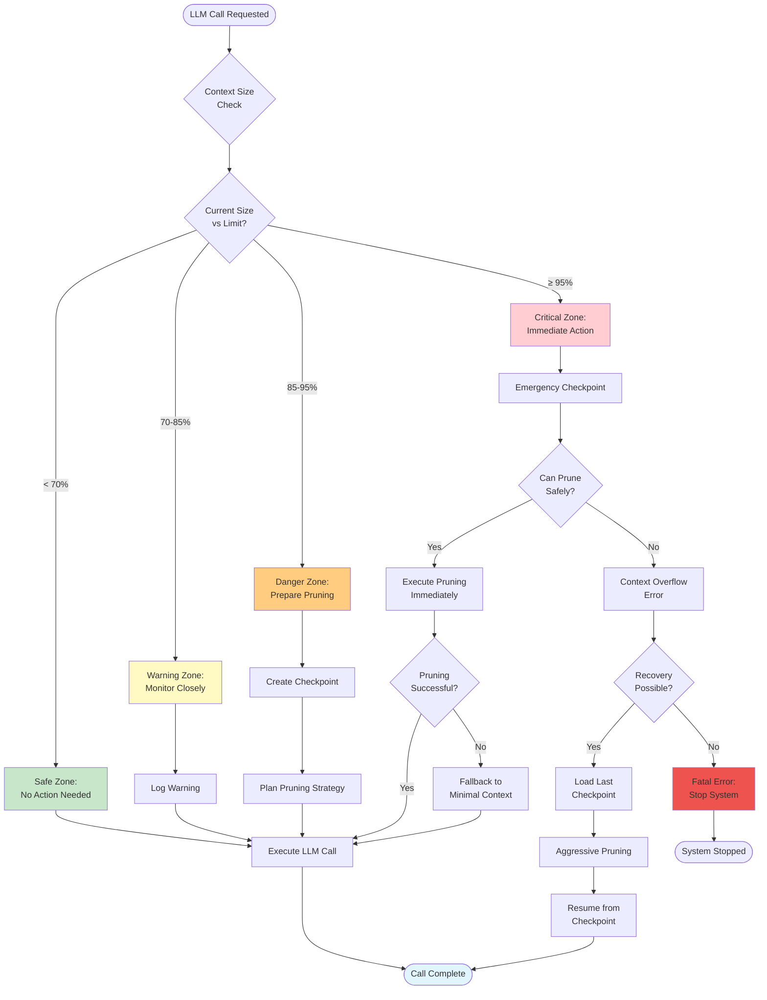
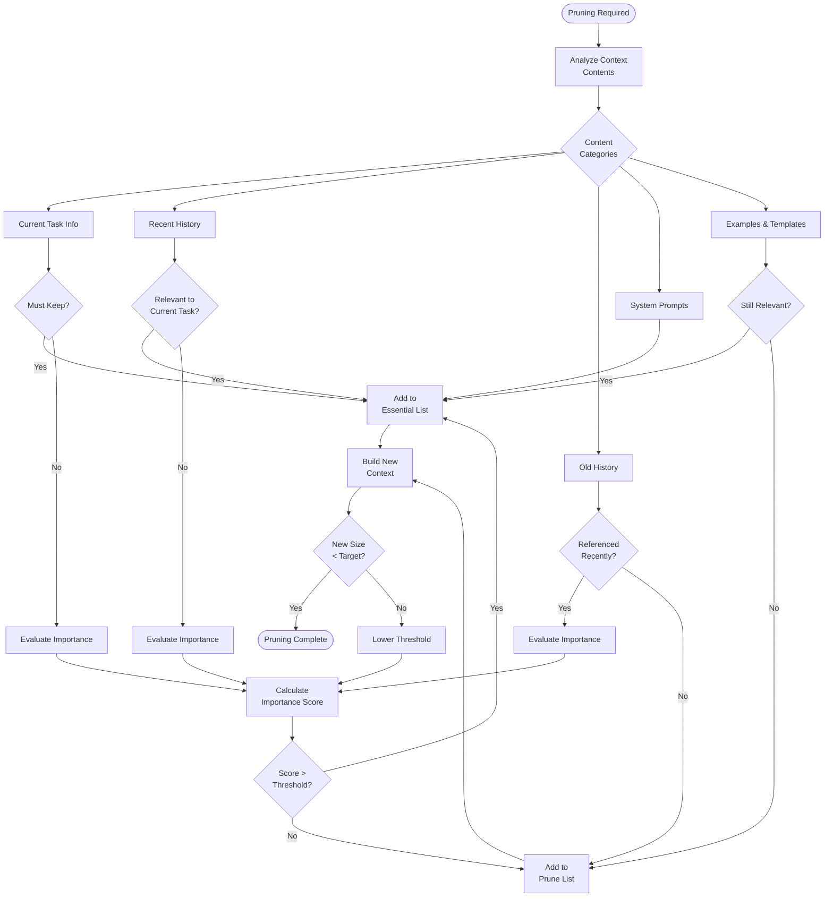

# Context Management Strategy

## Description
This flowchart shows how the system manages context window limits, including context size monitoring, pruning strategies (what to keep/remove), checkpoint creation triggers, and recovery from context overflow.

## Diagram



## Pruning Strategy Decision Tree



## Content Priority Matrix

### Always Keep (Priority 1)
```python
ALWAYS_KEEP = [
    "current_task_description",
    "current_task_acceptance_criteria",
    "system_role_prompt",
    "active_file_being_edited",
    "last_3_user_messages",
    "critical_error_context"
]
```

### Keep if Relevant (Priority 2)
```python
KEEP_IF_RELEVANT = [
    "recent_task_history (last 3 tasks)",
    "active_pr_context",
    "dependency_information",
    "current_file_structure",
    "recent_feedback (last 5 items)"
]
```

### Keep if Space Available (Priority 3)
```python
KEEP_IF_SPACE = [
    "old_task_history",
    "success_metrics",
    "project_guidelines",
    "example_code_snippets",
    "documentation_links"
]
```

### Always Prune (Priority 4)
```python
ALWAYS_PRUNE = [
    "completed_task_details (> 5 tasks ago)",
    "old_error_messages (resolved)",
    "deprecated_context",
    "temporary_debug_info",
    "redundant_information"
]
```

## Checkpoint Strategy

### Automatic Checkpoint Triggers
```python
def should_create_checkpoint(context, metrics):
    triggers = []

    # Context size approaching limit
    if metrics.context_size / metrics.context_limit > 0.80:
        triggers.append("context_size_threshold")

    # Major phase transition
    if context.phase_changed:
        triggers.append("phase_transition")

    # Significant progress
    if context.tasks_completed % 5 == 0:
        triggers.append("task_milestone")

    # Before risky operation
    if context.next_operation in ["major_refactor", "large_merge"]:
        triggers.append("risky_operation")

    # Time-based (every 30 minutes)
    if time_since_last_checkpoint() > 1800:
        triggers.append("time_interval")

    return len(triggers) > 0, triggers
```

### Checkpoint Contents
```python
class Checkpoint:
    timestamp: datetime
    context_snapshot: Dict  # Full context state
    system_state: ProjectState
    task_queue: List[Task]
    metrics: HealthMetrics
    conversation_history: List[Message]  # Compressed
    file_checksums: Dict[str, str]  # For verification

    def save(self, path: str):
        """Save checkpoint to disk"""
        checkpoint_file = f"{path}/checkpoint_{self.timestamp.isoformat()}.json"
        with open(checkpoint_file, 'w') as f:
            json.dump(self.to_dict(), f, indent=2)

    @staticmethod
    def load(path: str, timestamp: str) -> 'Checkpoint':
        """Load checkpoint from disk"""
        checkpoint_file = f"{path}/checkpoint_{timestamp}.json"
        with open(checkpoint_file, 'r') as f:
            data = json.load(f)
        return Checkpoint.from_dict(data)
```

## Context Pruning Algorithm

```python
class ContextPruner:
    def __init__(self, context_limit: int):
        self.context_limit = context_limit
        self.target_size = int(context_limit * 0.70)  # Prune to 70%

    def prune(self, context: Dict) -> Dict:
        """
        Prune context to target size while preserving essential information
        """
        # Step 1: Categorize all content
        categorized = self.categorize_content(context)

        # Step 2: Calculate importance scores
        scored = self.score_content(categorized)

        # Step 3: Select content to keep
        selected = self.select_content(scored, self.target_size)

        # Step 4: Build new context
        new_context = self.build_context(selected)

        # Step 5: Validate
        if self.calculate_size(new_context) <= self.target_size:
            return new_context
        else:
            # More aggressive pruning needed
            return self.aggressive_prune(new_context)

    def score_content(self, content: Dict) -> List[ScoredContent]:
        """
        Score content by importance
        """
        scores = []

        for item in content:
            score = 0

            # Recency (0-30 points)
            age_minutes = (now() - item.timestamp).total_seconds() / 60
            if age_minutes < 5:
                score += 30
            elif age_minutes < 30:
                score += 20
            elif age_minutes < 120:
                score += 10

            # Relevance to current task (0-40 points)
            if item.task_id == current_task_id:
                score += 40
            elif item.task_id in current_task.dependencies:
                score += 25

            # Content type priority (0-20 points)
            type_scores = {
                'system_prompt': 20,
                'current_task': 20,
                'acceptance_criteria': 18,
                'active_code': 15,
                'recent_feedback': 12,
                'task_history': 8,
                'examples': 5
            }
            score += type_scores.get(item.type, 0)

            # Reference count (0-10 points)
            score += min(10, item.reference_count * 2)

            scores.append(ScoredContent(item, score))

        return sorted(scores, key=lambda x: x.score, reverse=True)

    def select_content(self, scored: List[ScoredContent], target_size: int) -> List:
        """
        Select content to keep within target size
        """
        selected = []
        current_size = 0

        # Always include essentials first
        for item in scored:
            if item.content.is_essential:
                selected.append(item.content)
                current_size += item.content.size

        # Add remaining items by score until target reached
        for item in scored:
            if item.content.is_essential:
                continue

            if current_size + item.content.size <= target_size:
                selected.append(item.content)
                current_size += item.content.size
            else:
                break

        return selected
```

## Context Size Monitoring

```python
class ContextMonitor:
    def __init__(self):
        self.history = []
        self.warnings_sent = []

    def check_and_alert(self, context_size: int, context_limit: int):
        """
        Monitor context size and send alerts at thresholds
        """
        ratio = context_size / context_limit

        if ratio >= 0.95 and 'critical' not in self.warnings_sent:
            self.send_alert('CRITICAL', ratio)
            self.warnings_sent.append('critical')

        elif ratio >= 0.85 and 'danger' not in self.warnings_sent:
            self.send_alert('DANGER', ratio)
            self.warnings_sent.append('danger')

        elif ratio >= 0.70 and 'warning' not in self.warnings_sent:
            self.send_alert('WARNING', ratio)
            self.warnings_sent.append('warning')

        # Log history
        self.history.append({
            'timestamp': now(),
            'size': context_size,
            'ratio': ratio
        })

    def send_alert(self, level: str, ratio: float):
        """Send alert to Monitor agent"""
        message = {
            'type': 'CONTEXT_SIZE_ALERT',
            'level': level,
            'ratio': ratio,
            'recommendation': self.get_recommendation(level)
        }
        monitor_agent.handle_alert(message)

    def get_recommendation(self, level: str) -> str:
        recommendations = {
            'WARNING': "Consider pruning non-essential context soon",
            'DANGER': "Prepare checkpoint and pruning strategy",
            'CRITICAL': "Immediate action required - create checkpoint and prune"
        }
        return recommendations.get(level, "Monitor context size")
```

## Recovery from Context Overflow

### Recovery Steps
1. **Detect Overflow**: Context size ≥ 95% of limit
2. **Create Emergency Checkpoint**: Save current state
3. **Analyze Content**: Identify what can be pruned
4. **Execute Pruning**: Remove non-essential content
5. **Validate**: Ensure essential information preserved
6. **Resume**: Continue from pruned context
7. **If Failed**: Load last checkpoint and try aggressive pruning

### Aggressive Pruning Strategy
```python
def aggressive_prune(context: Dict) -> Dict:
    """
    Last resort: keep only absolute essentials
    """
    essential_only = {
        'system_prompt': context['system_prompt'],
        'current_task': context['current_task'],
        'current_file': context.get('active_file', None),
        'last_user_message': context['messages'][-1],
        'error_context': context.get('last_error', None)
    }

    return essential_only
```

## References
- PRD: moderator-prd.md - Section 11.2 "Recovery Procedures", context_overflow procedure (lines 736-741)
- Architecture: archetcture.md - "Critical Architecture Questions" #3 (lines 183-184)
- PRD: moderator-prd.md - MAX_CONTEXT_SIZE_RATIO threshold (lines 381)
