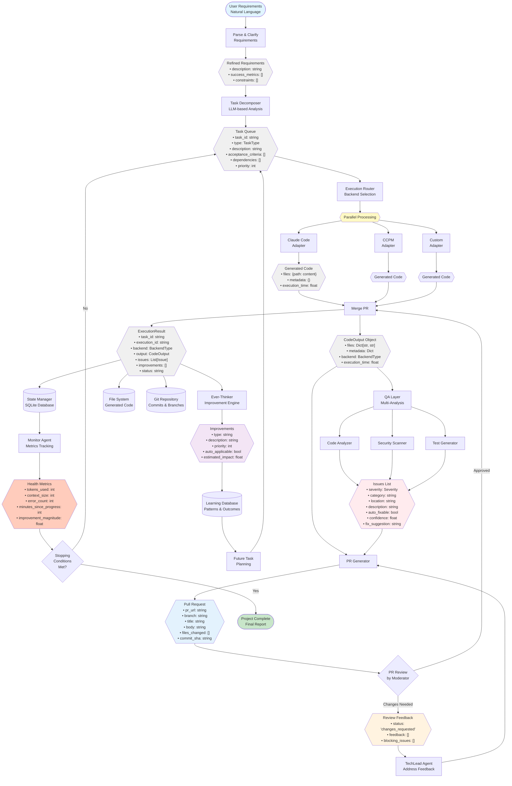

# Data Flow Architecture

## Description
This flowchart shows the complete data transformation pipeline from user requirements through execution, PR generation, review feedback, and learning. It includes data formats at each stage and highlights parallel processing points.

## Diagram



## Data Formats by Stage

### 1. User Requirements (Input)
```python
{
    "raw_text": "Create a REST API for task management",
    "timestamp": "2024-10-13T10:00:00Z",
    "user_id": "user_123"
}
```

### 2. Refined Requirements
```python
{
    "description": "Build REST API with CRUD operations for tasks",
    "success_metrics": [
        "All endpoints functional",
        "Test coverage > 80%",
        "Response time < 200ms"
    ],
    "constraints": [
        "Use Express.js",
        "PostgreSQL database",
        "JWT authentication"
    ],
    "scope": "API only, no frontend"
}
```

### 3. Task Queue
```python
[
    {
        "task_id": "task_001",
        "type": "FEATURE",
        "description": "Set up Express server",
        "acceptance_criteria": [
            "Server starts on port 3000",
            "CORS enabled",
            "Error handling configured"
        ],
        "dependencies": [],
        "priority": 1,
        "assigned_backend": "claude_code"
    },
    {
        "task_id": "task_002",
        "type": "FEATURE",
        "description": "Create Task model and schema",
        "acceptance_criteria": [...],
        "dependencies": ["task_001"],
        "priority": 2
    }
]
```

### 4. Generated Code (CodeOutput)
```python
{
    "files": {
        "src/server.js": "const express = require('express')...",
        "src/models/task.js": "const mongoose = require('mongoose')...",
        "tests/server.test.js": "describe('Server', () => {..."
    },
    "metadata": {
        "language": "javascript",
        "framework": "express",
        "lines_of_code": 543,
        "files_created": 12
    },
    "backend": "claude_code",
    "execution_time": 45.2
}
```

### 5. Issues (QA Analysis)
```python
[
    {
        "severity": "HIGH",
        "category": "security",
        "location": "src/auth/login.js:23",
        "description": "Hardcoded JWT secret",
        "auto_fixable": True,
        "confidence": 0.95,
        "fix_suggestion": "Move secret to environment variable"
    },
    {
        "severity": "MEDIUM",
        "category": "testing",
        "location": "src/models/",
        "description": "Missing unit tests for Task model",
        "auto_fixable": True,
        "confidence": 0.85,
        "fix_suggestion": "Add test file tests/models/task.test.js"
    }
]
```

### 6. Pull Request
```python
{
    "pr_url": "https://github.com/org/repo/pull/42",
    "branch": "duo-agent/feature/task_001",
    "title": "[FEATURE] Set up Express server",
    "body": "## Changes\n- Express server setup\n- CORS configured\n...",
    "files_changed": ["src/server.js", "package.json"],
    "commit_sha": "abc123def456",
    "created_at": "2024-10-13T10:30:00Z"
}
```

### 7. Review Feedback
```python
{
    "pr_url": "https://github.com/org/repo/pull/42",
    "status": "changes_requested",
    "feedback": [
        {
            "file": "src/server.js",
            "line": 23,
            "comment": "Add error handling for database connection",
            "severity": "HIGH"
        }
    ],
    "blocking_issues": [
        "Missing error handling",
        "No database connection retry logic"
    ],
    "reviewer": "moderator_agent"
}
```

### 8. Execution Result
```python
{
    "task_id": "task_001",
    "execution_id": "exec_abc12345",
    "backend": "claude_code",
    "output": {...},  # CodeOutput object
    "issues": [...],  # List of Issue objects
    "improvements": [...],  # List of Improvement objects
    "status": "success",
    "created_at": "2024-10-13T10:00:00Z",
    "completed_at": "2024-10-13T11:30:00Z"
}
```

### 9. Improvements
```python
[
    {
        "type": "performance",
        "description": "Add database query caching",
        "priority": 7,
        "auto_applicable": False,
        "estimated_impact": 0.30,  # 30% improvement
        "implementation_notes": "Use Redis for caching"
    },
    {
        "type": "testing",
        "description": "Add integration tests",
        "priority": 8,
        "auto_applicable": True,
        "estimated_impact": 0.25
    }
]
```

### 10. Health Metrics
```python
{
    "tokens_used": 125000,
    "token_limit": 1000000,
    "context_size": 45000,
    "context_limit": 100000,
    "error_count": 2,
    "error_threshold": 10,
    "minutes_since_progress": 5,
    "stagnation_threshold": 30,
    "improvement_magnitude": 0.18,  # 18% improvement
    "custom_metrics": {
        "prs_merged": 8,
        "tasks_completed": 12,
        "test_coverage": 0.82
    }
}
```

## Parallel Processing Points

1. **Backend Execution**: Multiple backends can execute different tasks simultaneously
2. **QA Analysis**: Code analysis, security scanning, and test generation run in parallel
3. **Specialist Agents**: Multiple specialist agents can work on different aspects concurrently
4. **Learning**: Pattern extraction and learning happen asynchronously in the background

## Storage Destinations

1. **SQLite Database**: Executions, tasks, results, issues, improvements
2. **File System**: Generated code files, checkpoints, logs
3. **Git Repository**: Commits, branches, PRs
4. **Learning Database**: Patterns, outcomes, success rates

## References
- Architecture: archetcture.md - "The Data Flow" (lines 117-129)
- PRD: moderator-prd.md - Section 3 "Data Models & State Management" (lines 129-194)
- CLAUDE.md: models.py data structures (lines 59-66)
