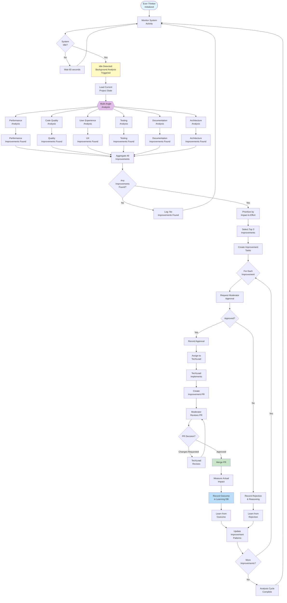
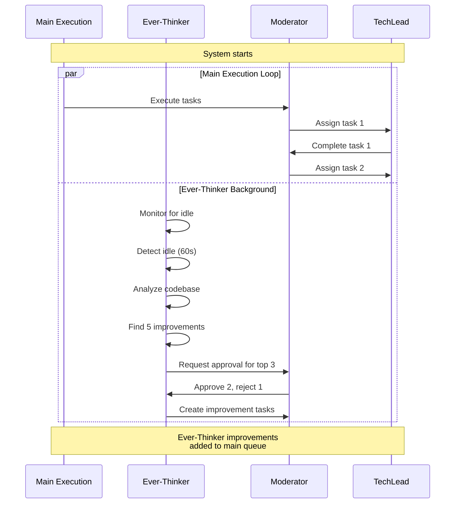

# Ever-Thinker Continuous Loop

## Description
This detailed flowchart shows the Ever-Thinker agent's continuous improvement process, including idle detection, background activation, analysis from multiple angles (performance, quality, UX, testing, docs, architecture), improvement generation, PR creation, and learning from accepted/rejected improvements. The Ever-Thinker runs in parallel with main execution.

## Diagram



## Analysis Angles

### 1. Performance Analysis
```python
class PerformanceAnalyzer:
    def analyze(self, codebase):
        """
        Analyze performance opportunities
        """
        improvements = []

        # Algorithm complexity
        improvements.extend(self.check_algorithm_complexity(codebase))

        # Database queries
        improvements.extend(self.check_n_plus_one_queries(codebase))

        # Missing indexes
        improvements.extend(self.check_database_indexes(codebase))

        # Caching opportunities
        improvements.extend(self.check_caching_opportunities(codebase))

        # Resource usage
        improvements.extend(self.check_resource_usage(codebase))

        return improvements

    def check_algorithm_complexity(self, codebase):
        """
        Find O(n²) or worse algorithms that could be optimized
        """
        issues = []
        for file in codebase.files:
            nested_loops = find_nested_loops(file)
            for loop in nested_loops:
                if loop.complexity > "O(n²)":
                    issues.append(Improvement(
                        type="performance",
                        description=f"Optimize {loop.function} - currently {loop.complexity}",
                        location=f"{file.path}:{loop.line}",
                        estimated_impact=0.40,  # 40% improvement potential
                        priority=8
                    ))
        return issues
```

### 2. Code Quality Analysis
```python
class CodeQualityAnalyzer:
    def analyze(self, codebase):
        """
        Analyze code quality opportunities
        """
        improvements = []

        # Code duplication
        improvements.extend(self.check_duplication(codebase))

        # Long functions
        improvements.extend(self.check_function_length(codebase))

        # Complex functions
        improvements.extend(self.check_cyclomatic_complexity(codebase))

        # Naming conventions
        improvements.extend(self.check_naming(codebase))

        # SOLID principles
        improvements.extend(self.check_solid_principles(codebase))

        return improvements
```

### 3. User Experience Analysis
```python
class UXAnalyzer:
    def analyze(self, codebase):
        """
        Analyze UX improvements
        """
        improvements = []

        # Error messages clarity
        improvements.extend(self.check_error_messages(codebase))

        # Response times
        improvements.extend(self.check_response_times(codebase))

        # Loading states
        improvements.extend(self.check_loading_states(codebase))

        # Accessibility
        improvements.extend(self.check_accessibility(codebase))

        return improvements
```

### 4. Testing Analysis
```python
class TestingAnalyzer:
    def analyze(self, codebase):
        """
        Analyze testing improvements
        """
        improvements = []

        # Coverage gaps
        improvements.extend(self.check_coverage_gaps(codebase))

        # Missing edge cases
        improvements.extend(self.check_edge_cases(codebase))

        # Integration tests
        improvements.extend(self.check_integration_tests(codebase))

        # E2E tests
        improvements.extend(self.check_e2e_tests(codebase))

        # Flaky tests
        improvements.extend(self.check_flaky_tests(codebase))

        return improvements
```

### 5. Documentation Analysis
```python
class DocumentationAnalyzer:
    def analyze(self, codebase):
        """
        Analyze documentation improvements
        """
        improvements = []

        # Missing README
        if not codebase.has_file("README.md"):
            improvements.append(Improvement(
                type="documentation",
                description="Create comprehensive README",
                priority=7
            ))

        # Missing API docs
        improvements.extend(self.check_api_documentation(codebase))

        # Outdated docs
        improvements.extend(self.check_outdated_docs(codebase))

        # Missing inline comments
        improvements.extend(self.check_inline_comments(codebase))

        return improvements
```

### 6. Architecture Analysis
```python
class ArchitectureAnalyzer:
    def analyze(self, codebase):
        """
        Analyze architectural improvements
        """
        improvements = []

        # Coupling
        improvements.extend(self.check_coupling(codebase))

        # Cohesion
        improvements.extend(self.check_cohesion(codebase))

        # Separation of concerns
        improvements.extend(self.check_separation_of_concerns(codebase))

        # Design patterns
        improvements.extend(self.check_design_patterns(codebase))

        return improvements
```

## Idle Detection

```python
class IdleDetector:
    def __init__(self):
        self.last_activity = time.time()
        self.idle_threshold = 60  # seconds

    def is_system_idle(self):
        """
        Determine if system is idle and Ever-Thinker can run
        """
        time_since_activity = time.time() - self.last_activity

        # Check if system is idle
        if time_since_activity < self.idle_threshold:
            return False

        # Check if any agents are active
        if self.any_agents_active():
            return False

        # Check if PRs are pending review
        if self.has_pending_prs():
            return False

        # Check if tasks are running
        if self.has_running_tasks():
            return False

        return True

    def record_activity(self, activity_type):
        """Record system activity"""
        self.last_activity = time.time()
        logger.debug(f"Activity recorded: {activity_type}")
```

## Learning System

```python
class LearningSystem:
    def __init__(self):
        self.learning_db = LearningDatabase()

    def learn_from_outcome(self, improvement, outcome):
        """
        Learn from improvement outcome (accepted/rejected/impact)
        """
        pattern = self.extract_pattern(improvement)

        # Record outcome
        self.learning_db.record_outcome(
            improvement_type=improvement.type,
            pattern=pattern,
            accepted=outcome.accepted,
            actual_impact=outcome.actual_impact,
            estimated_impact=improvement.estimated_impact,
            moderator_feedback=outcome.feedback
        )

        # Update pattern confidence
        self.update_pattern_confidence(pattern, outcome)

        # Adjust future prioritization
        self.adjust_prioritization(improvement.type, outcome)

    def extract_pattern(self, improvement):
        """
        Extract reusable pattern from improvement
        """
        return {
            'type': improvement.type,
            'keywords': extract_keywords(improvement.description),
            'location_type': improvement.location_type,
            'impact_range': (improvement.estimated_impact - 0.1, improvement.estimated_impact + 0.1)
        }

    def update_pattern_confidence(self, pattern, outcome):
        """
        Update confidence score for this pattern
        """
        current_confidence = self.learning_db.get_pattern_confidence(pattern)

        if outcome.accepted and outcome.actual_impact >= outcome.estimated_impact:
            # Successful prediction, increase confidence
            new_confidence = min(1.0, current_confidence + 0.1)
        else:
            # Poor prediction, decrease confidence
            new_confidence = max(0.0, current_confidence - 0.1)

        self.learning_db.update_pattern_confidence(pattern, new_confidence)

    def suggest_improvements(self, codebase):
        """
        Suggest improvements based on learned patterns
        """
        suggestions = []

        # Get high-confidence patterns
        patterns = self.learning_db.get_high_confidence_patterns(min_confidence=0.7)

        for pattern in patterns:
            # Check if pattern applies to current codebase
            if self.pattern_matches(pattern, codebase):
                suggestions.append(self.generate_improvement_from_pattern(pattern))

        return suggestions
```

## Parallel Execution



## Improvement Outcome Tracking

```python
class ImprovementOutcome:
    improvement_id: str
    timestamp: datetime
    accepted: bool  # Did Moderator approve?
    implemented: bool  # Was PR merged?
    estimated_impact: float
    actual_impact: float  # Measured after implementation

    rejection_reason: Optional[str]
    moderator_feedback: Optional[str]

    before_metrics: Dict
    after_metrics: Dict

    def calculate_accuracy(self):
        """
        How accurate was the impact estimate?
        """
        if not self.implemented:
            return None

        error = abs(self.actual_impact - self.estimated_impact)
        accuracy = 1.0 - min(1.0, error)
        return accuracy
```

## References
- Architecture: archetcture.md - "The Unique Innovation: Ever-Thinker" (lines 167-174)
- PRD: moderator-prd.md - Section 5.3 "Improvement Cycle" (lines 330-360)
- Architecture: archetcture.md - "Continuous Improvement Loop" (lines 96-99)
- CLAUDE.md: Ever-Thinker - Improver component (lines 173-179)
