# Gear 2 Component Architecture

**Version:** 2.0
**Status:** Week 1B Implementation (Built on Week 1A Foundation)
**Last Updated:** 2024-10-15

---

## Overview

This diagram shows the Gear 2 architecture with the two-agent system (Moderator + TechLead) built on the corrected repository isolation foundation from Week 1A.

---

## Component Architecture Diagram

```mermaid
graph TB
    subgraph "User Interface Layer"
        CLI[CLI with --target Flag]
        WebUI[Web Dashboard<br/>Future]
    end

    subgraph "Configuration Management"
        ConfigCascade[Configuration Cascade]
        ToolConfig[Tool Defaults<br/>~/moderator/config/]
        UserConfig[User Defaults<br/>~/.config/moderator/]
        ProjectConfig[Project Config<br/>target/.moderator/config.yaml]
        ExplicitConfig[Explicit Override<br/>--config flag]
    end

    subgraph "Orchestration Layer - Target Directory Aware"
        Orchestrator[Orchestrator<br/>target_dir: Path]

        subgraph "Agent System Week 1B"
            ModeratorAgent[Moderator Agent<br/>Planning & Review]
            TechLeadAgent[TechLead Agent<br/>Implementation]
            MessageBus[Message Bus<br/>Inter-agent Communication]
        end
    end

    subgraph "State Management - .moderator/ Directory"
        StateManager[StateManager<br/>target_dir/.moderator/]

        subgraph ".moderator/ Structure"
            StateDir[state/<br/>project_*/]
            ArtifactsDir[artifacts/<br/>task_*/generated/]
            LogsDir[logs/<br/>session_*.log]
            AgentMemory[agent_memory_*.json]
        end
    end

    subgraph "Execution Backends"
        BackendRouter[Backend Router]
        TestMock[TestMockBackend<br/>Test Infrastructure]
        CCPM[CCPMBackend<br/>CCPM API]
        ClaudeCode[ClaudeCodeBackend<br/>Claude CLI]
    end

    subgraph "Quality Assurance Week 1B"
        PRReviewer[PR Reviewer<br/>Automated Reviews]
        ReviewCriteria[Review Criteria<br/>Scoring System]
        FeedbackGen[Feedback Generator<br/>Actionable Feedback]
    end

    subgraph "Improvement System Week 1B"
        ImproverEngine[Improvement Engine<br/>One Cycle]
        ImprovementQueue[Improvement Queue]
    end

    subgraph "Git Operations - Target Repository"
        GitManager[GitManager<br/>target_dir/.git/]
        BranchMgmt[Branch Management]
        CommitOps[Commit Operations]
        PRCreation[PR Creation via gh CLI]
    end

    subgraph "Logging System"
        StructuredLogger[Structured Logger<br/>target_dir/.moderator/logs/]
        ConsoleOutput[Console Output]
        FileOutput[Log Files]
    end

    CLI --> Orchestrator
    CLI --> ConfigCascade

    ConfigCascade --> ExplicitConfig
    ConfigCascade --> ProjectConfig
    ConfigCascade --> UserConfig
    ConfigCascade --> ToolConfig

    Orchestrator --> StateManager
    Orchestrator --> ModeratorAgent
    Orchestrator --> TechLeadAgent
    Orchestrator --> GitManager

    ModeratorAgent <--> MessageBus
    TechLeadAgent <--> MessageBus

    ModeratorAgent --> PRReviewer
    ModeratorAgent --> ImproverEngine

    TechLeadAgent --> BackendRouter

    BackendRouter --> TestMock
    BackendRouter --> CCPM
    BackendRouter --> ClaudeCode

    TechLeadAgent --> GitManager

    PRReviewer --> ReviewCriteria
    PRReviewer --> FeedbackGen

    ImproverEngine --> ImprovementQueue

    StateManager --> StateDir
    StateManager --> ArtifactsDir
    StateManager --> LogsDir
    StateManager --> AgentMemory

    GitManager --> BranchMgmt
    GitManager --> CommitOps
    GitManager --> PRCreation

    Orchestrator --> StructuredLogger
    StructuredLogger --> ConsoleOutput
    StructuredLogger --> FileOutput

    style CLI fill:#e1f5ff
    style Orchestrator fill:#fff4e1
    style ModeratorAgent fill:#e1ffe1
    style TechLeadAgent fill:#e1ffe1
    style MessageBus fill:#ffe1f5
    style StateManager fill:#f0f0f0
    style GitManager fill:#ffe1e1
```



---

## Component Descriptions

### User Interface Layer

#### CLI with --target Flag
- **Purpose:** Entry point for user interactions
- **Week 1A Fix:** Added `--target` flag to specify target repository
- **Arguments:**
  - `requirements`: High-level project requirements
  - `--target`: Target repository directory
  - `--config`: Explicit configuration override
  - `--backend`: Backend type override
  - `--verbose`: Enable debug logging

**Example:**
```bash
python main.py "Create TODO app" --target ~/my-project
```

---

### Configuration Management

#### Configuration Cascade
- **Purpose:** Load configuration with priority order
- **Priority (highest to lowest):**
  1. Explicit Override (`--config` flag)
  2. Project-Specific (`target/.moderator/config.yaml`)
  3. User Defaults (`~/.config/moderator/config.yaml`)
  4. Tool Defaults (`~/moderator/config/config.yaml`)

**Implementation:** `src/config_loader.py`

---

### Orchestration Layer

#### Orchestrator (Updated for Gear 2)
- **Purpose:** Main coordinator for project execution
- **Week 1A Changes:**
  - Now accepts `target_dir: Path` parameter
  - Passes target directory to all components
  - No longer operates within tool repository

**Constructor:**
```python
def __init__(self, config: dict, target_dir: Path, logger: StructuredLogger):
    self.target_dir = target_dir
    self.state_manager = StateManager(target_dir)
    # ...
```

#### Moderator Agent (Week 1B)
- **Purpose:** Planning, review, and improvement management
- **Responsibilities:**
  - Task decomposition
  - PR review coordination
  - Improvement identification
  - Quality gate enforcement

**Message Types:**
- Sends: `TASK_ASSIGNED`, `PR_REVIEW_REQUESTED`, `IMPROVEMENT_REQUESTED`
- Receives: `PR_SUBMITTED`, `TASK_COMPLETED`

#### TechLead Agent (Week 1B)
- **Purpose:** Implementation and execution
- **Responsibilities:**
  - Task implementation via backend
  - PR creation
  - Feedback incorporation
  - Code generation

**Message Types:**
- Sends: `PR_SUBMITTED`, `TASK_COMPLETED`
- Receives: `TASK_ASSIGNED`, `PR_FEEDBACK`, `IMPROVEMENT_TASK`

#### Message Bus (Week 1B)
- **Purpose:** Inter-agent communication
- **Features:**
  - Asynchronous message passing
  - Message history tracking
  - Correlation ID support for request/response patterns

**Implementation:** `src/communication/message_bus.py`

---

### State Management

#### StateManager (Updated for Gear 2)
- **Purpose:** Persist project state in `.moderator/` directory
- **Week 1A Changes:**
  - Constructor now requires `target_dir: Path`
  - Creates `.moderator/` structure in target repository
  - Auto-creates `.gitignore` to exclude workspace files

**Directory Structure:**
```
target/.moderator/
├── state/
│   └── project_{id}/
│       ├── project.json
│       ├── logs.jsonl
│       └── agent_memory_{agent_id}.json
├── artifacts/
│   └── task_{id}/
│       └── generated/
│           └── *.py
├── logs/
│   └── session_{timestamp}.log
├── config.yaml (optional)
└── .gitignore (auto-created)
```

**Key Methods:**
```python
def get_project_dir(self, project_id: str) -> Path:
    """Returns: target/.moderator/state/project_{id}/"""

def get_artifacts_dir(self, project_id: str, task_id: str) -> Path:
    """Returns: target/.moderator/artifacts/task_{id}/generated/"""
```

---

### Execution Backends

#### Backend Router (Gear 2)
- **Purpose:** Select appropriate backend for task execution
- **Selection Logic:** Based on `backend.type` in configuration

#### TestMockBackend
- **Purpose:** Fast, deterministic testing
- **Use Cases:** Unit tests, CI/CD, local development
- **Output:** Dummy files for testing orchestration logic

#### CCPMBackend
- **Purpose:** Production code generation via CCPM API
- **Configuration:**
  ```yaml
  backend:
    type: "ccpm"
    api_key: ${CCPM_API_KEY}
  ```

#### ClaudeCodeBackend (Fully Implemented)
- **Purpose:** Production code generation via Claude CLI
- **Week 1 Fix:** Now actually calls `claude chat --message`
- **Configuration:**
  ```yaml
  backend:
    type: "claude_code"
    cli_path: "claude"
  ```

---

### Quality Assurance (Week 1B)

#### PR Reviewer
- **Purpose:** Automated pull request review
- **Criteria:**
  - Code quality
  - Test coverage
  - Security issues
  - Documentation
  - Acceptance criteria met

**Review Outcome:**
```python
class ReviewResult:
    approved: bool
    score: int  # 0-100
    blocking_issues: list[str]
    suggestions: list[str]
    feedback: list[ReviewFeedback]
```

#### Review Criteria
- **Scoring System:** Each criterion weighted 0-100
- **Auto-Approval Threshold:** ≥ 80 score with no blocking issues

#### Feedback Generator
- **Purpose:** Convert review results to actionable feedback
- **Output:** List of specific changes needed with code locations

---

### Improvement System (Week 1B)

#### Improvement Engine
- **Purpose:** Identify improvement opportunities
- **Analysis Angles:**
  - Performance optimization
  - Code quality enhancement
  - Test coverage gaps
  - Documentation improvements

**Gear 2 Scope:** ONE improvement cycle per project

#### Improvement Queue
- **Purpose:** Prioritize and track improvements
- **Priority Factors:**
  - Impact (high/medium/low)
  - Effort (hours estimated)
  - Category (performance/quality/tests/docs)

---

### Git Operations

#### GitManager (Updated for Gear 2)
- **Purpose:** Manage Git operations on target repository
- **Week 1A Changes:**
  - Constructor now requires `target_dir: Path`
  - All operations target `target_dir/.git/`
  - No longer risks affecting tool repository

**Constructor:**
```python
def __init__(self, target_dir: Path):
    self.repo_path = target_dir.resolve()
    # Validate it's a git repo
    if not (self.repo_path / ".git").exists():
        raise ValueError(f"Not a git repository: {self.repo_path}")
```

**Operations:**
- `create_branch(task)`: Create feature branch for task
- `commit_changes(task, file_paths)`: Commit generated files
- `push_branch(branch_name)`: Push to remote
- `create_pr(task)`: Create PR via `gh pr create`

---

### Logging System

#### Structured Logger
- **Purpose:** Comprehensive activity logging
- **Week 1A Changes:**
  - Logs written to `target/.moderator/logs/`
  - Session logs separate from state logs

**Log Format:**
```json
{
  "timestamp": "2024-10-15T10:30:00",
  "component": "moderator_agent",
  "action": "task_assigned",
  "project_id": "proj_abc123",
  "task_id": "task_001",
  "details": {}
}
```

---

## Data Flow

### Main Execution Flow (Gear 2)

```
1. User runs CLI with --target flag
   └─> CLI resolves target directory
       └─> Configuration cascade loads config
           └─> Orchestrator initialized with target_dir

2. Orchestrator creates Moderator Agent
   └─> Moderator decomposes requirements into tasks
       └─> Moderator sends TASK_ASSIGNED to TechLead via MessageBus

3. TechLead receives TASK_ASSIGNED
   └─> TechLead calls Backend to generate code
       └─> Backend writes to target/.moderator/artifacts/
           └─> TechLead commits changes to target/.git/
               └─> TechLead creates PR via gh CLI
                   └─> TechLead sends PR_SUBMITTED to Moderator

4. Moderator receives PR_SUBMITTED
   └─> Moderator triggers PR Reviewer
       └─> PR Reviewer analyzes PR against criteria
           └─> If score < 80 or blocking issues exist:
               └─> Moderator sends PR_FEEDBACK to TechLead
                   └─> TechLead incorporates feedback and resubmits
           └─> If score >= 80 and no blocking issues:
               └─> Moderator approves PR
                   └─> Proceed to next task

5. After all tasks complete
   └─> Moderator runs Improvement Engine (ONE cycle)
       └─> Identifies 2-3 improvements
           └─> Queues highest priority improvement
               └─> Assigns improvement task to TechLead
                   └─> TechLead implements improvement
                       └─> Repeat PR review cycle

6. Project completion
   └─> State saved to target/.moderator/state/
       └─> Logs written to target/.moderator/logs/
           └─> Artifacts in target/.moderator/artifacts/
```

---

## Key Architectural Decisions

### 1. Repository Isolation (Week 1A)
**Decision:** Operate on target repositories, not tool repository
**Rationale:** Enables multi-project support, prevents tool repo pollution
**Implementation:** `--target` flag + `.moderator/` directory structure

### 2. Two-Agent System (Week 1B)
**Decision:** Separate planning (Moderator) from execution (TechLead)
**Rationale:** Clear separation of concerns, enables parallel planning/execution in future
**Implementation:** Message-based communication via MessageBus

### 3. Configuration Cascade (Week 1A)
**Decision:** Four-level priority system
**Rationale:** Flexibility for different environments (team, project, user)
**Implementation:** `src/config_loader.py`

### 4. .moderator/ Workspace (Week 1A)
**Decision:** All moderator files in `.moderator/` subdirectory
**Rationale:** Clean separation, easy to gitignore, clear ownership
**Implementation:** Auto-created `.moderator/.gitignore`

### 5. Message-Based Communication (Week 1B)
**Decision:** Asynchronous message passing between agents
**Rationale:** Loose coupling, easier to add agents in future, clear audit trail
**Implementation:** `src/communication/message_bus.py`

---

## Comparison: Gear 1 vs Gear 2

| Aspect | Gear 1 | Gear 2 |
|--------|--------|--------|
| **Repository** | Operates in tool repo | Operates on target repo |
| **Multi-Project** | ❌ No | ✅ Yes |
| **State Location** | `tool/state/` | `target/.moderator/state/` |
| **Agents** | Single orchestrator | Moderator + TechLead |
| **Communication** | Direct method calls | Message bus |
| **PR Review** | Manual only | Automated + manual |
| **Improvements** | ❌ No | ✅ One cycle |
| **Configuration** | Single config file | Cascade (4 levels) |
| **CLI** | Simple requirements | `--target`, `--config`, etc. |

---

## Future Enhancements (Gear 3+)

Not included in Gear 2, but part of the vision:

- **Ever-Thinker:** Continuous background improvement cycles
- **Learning System:** Pattern recognition and adaptation
- **Multiple Improvement Cycles:** Unlimited iterations
- **Parallel Task Execution:** Execute multiple tasks simultaneously
- **Specialist Agents:** Domain-specific agents (Security, Performance, etc.)
- **Advanced QA:** Security scanning, performance testing
- **Self-Healing:** Automatic error recovery and retry logic
- **Real-time Dashboard:** WebSocket-based monitoring UI

---

## References

- **Gear 1 Plan:** `docs/multi-phase-plan/phase1/gear-1-implementation-plan.md`
- **Gear 2 Plan:** `docs/multi-phase-plan/phase2/gear-2-implementation-plan.md`
- **Architectural Fix:** `docs/multi-phase-plan/phase2/gear-2-architectural-fix.md`
- **PRD:** `docs/moderator-prd.md`
- **Architecture Vision:** `docs/archetcture.md`
