# Gear 2 Execution Loop

**Version:** 2.0
**Status:** Week 1B Implementation (Built on Week 1A Foundation)
**Last Updated:** 2024-10-15

---

## Overview

This document visualizes the complete execution flow in Gear 2, showing how tasks move through the two-agent system (Moderator + TechLead) with automated PR reviews, feedback loops, and one improvement cycle.

---

## 1. Main Execution Loop


---

## 2. PR Review Cycle (Detailed)


### PR Review Criteria Details

**Scoring System (0-100):**
- **Code Quality (30 points):** Readability, maintainability, follows best practices
- **Test Coverage (25 points):** Unit tests present, edge cases covered
- **Security (20 points):** No vulnerabilities, safe practices
- **Documentation (15 points):** Comments, docstrings, README updates
- **Acceptance Criteria (10 points):** Task requirements met

**Blocking Issues (Automatic Rejection):**
- Security vulnerabilities detected
- Missing unit tests entirely
- Acceptance criteria not met
- Breaking changes without migration plan

**Approval Threshold:**
- Score ≥ 80 **AND** No blocking issues

**Max Iterations:**
- 3 attempts per PR
- After 3 rejections, task marked as FAILED

---

## 3. Improvement Cycle (One Cycle in Gear 2)


### Improvement Cycle Constraints (Gear 2)

**Scope:**
- **ONE improvement cycle only** (Gear 2 limitation)
- **ONE task executed** (highest priority)
- Ever-Thinker continuous cycles come in Gear 3

**Identification:**
- Runs after all primary tasks complete
- Analyzes all generated code
- Looks for quick wins (low effort, high impact)

**Priority Calculation:**
```
priority_score = (impact_weight * impact_value) - (effort_hours * effort_penalty)

where:
  impact_weight = 10 (high), 5 (med), 2 (low)
  effort_penalty = 0.5 per hour
```

---

## 4. State Transitions


### Phase Descriptions

**INITIALIZING:**
- Resolve target directory (from `--target` or cwd)
- Load configuration cascade
- Initialize StateManager, GitManager, Logger
- Create agents (Moderator, TechLead)

**DECOMPOSING:**
- Moderator analyzes requirements
- Creates 3-5 sequential tasks
- Defines acceptance criteria per task
- Waits for user confirmation

**EXECUTING:**
- Sequential task execution
- For each task:
  - TechLead implements via backend
  - Creates PR
  - Moderator reviews PR (up to 3 iterations)
  - Approves or rejects
- If any task fails after max retries → FAILED
- If all tasks succeed → REVIEWING

**REVIEWING:**
- Final validation check
- Ensure all PRs merged
- Verify acceptance criteria met
- Transition to IMPROVING

**IMPROVING:**
- Run improvement engine once
- Identify and prioritize improvements
- Execute highest priority improvement
- Complete regardless of improvement success

**COMPLETED/FAILED/CANCELLED:**
- Final states
- Save state to `.moderator/state/`
- Write logs
- Exit

---

## 5. Decision Points

### 5.1 User Confirmation (After Decomposition)


**User Sees:**
```
✅ Created 4 tasks:

  1. Create data models for TODO app
  2. Implement CLI interface with argparse
  3. Add persistence layer with JSON storage
  4. Create comprehensive test suite

Proceed with execution? (yes/no):
```

---

### 5.2 PR Approval Decision

```mermaid
flowchart TD
    ReviewComplete[Review Complete] --> CalcScore[Score: 75/100]
    CalcScore --> CheckBlock[Blocking Issues: 1<br/>Missing unit tests]

    CheckBlock --> Decision{Score ≥ 80<br/>AND<br/>No Blocking?}

    Decision -->|No| CheckIter{Iterations<br/>< 3?}
    CheckIter -->|Yes| SendFeedback[Send Feedback<br/>to TechLead]
    CheckIter -->|No| RejectPR[Reject PR<br/>Mark Task FAILED]

    Decision -->|Yes| ApprovePR[Approve PR<br/>Proceed to Next Task]

    style Decision fill:#fff4e1
    style CheckIter fill:#fff4e1
    style ApprovePR fill:#e1ffe1
    style RejectPR fill:#ffe1e1
```



**Example Scenarios:**

**Scenario 1: Approved**
- Score: 85/100
- Blocking Issues: 0
- **Decision:** ✅ APPROVED

**Scenario 2: Feedback (Iteration 1)**
- Score: 75/100
- Blocking Issues: 1 (missing tests)
- Iteration: 1/3
- **Decision:** 🔄 SEND FEEDBACK

**Scenario 3: Rejected (Max Retries)**
- Score: 70/100
- Blocking Issues: 2 (security + tests)
- Iteration: 3/3
- **Decision:** ❌ REJECTED

---

### 5.3 Improvement Identification


---

## 6. Agent Interactions via Message Bus


### Message Types

**Moderator → TechLead:**
- `TASK_ASSIGNED`: Assign task for implementation
- `PR_FEEDBACK`: PR needs changes (includes feedback list)
- `IMPROVEMENT_TASK`: Assign improvement task

**TechLead → Moderator:**
- `PR_SUBMITTED`: PR created and ready for review
- `TASK_COMPLETED`: Task successfully completed (after PR approval)

**Internal (Not Sent):**
- `PR_APPROVED`: Moderator internal decision (updates state)

---

## 7. Error Handling & Recovery


### Error Recovery Strategy (Gear 2)

**No Automatic Retry in Gear 2:**
- Backend failures → Task marked FAILED
- Git failures → Task marked FAILED
- Project stops on first critical error

**Manual Recovery:**
```bash
# Check error logs
cat target/.moderator/logs/session_*.log | grep ERROR

# Check project state
cat target/.moderator/state/project_*/project.json

# Fix underlying issue, then restart
python main.py "Same requirements" --target ~/my-project
```

**Gear 3 Improvements:**
- Automatic retry with backoff
- Fallback backend chain
- Self-healing recovery

---

## Summary

**Key Characteristics of Gear 2 Execution:**

1. **Repository Isolation:** All operations on target repository via `--target` flag
2. **Two-Agent System:** Moderator (planning/review) + TechLead (implementation)
3. **Automated PR Review:** Up to 3 iterations per PR with score-based approval
4. **One Improvement Cycle:** Identifies and executes highest priority improvement
5. **Sequential Tasks:** Tasks executed one at a time (parallel in Gear 3)
6. **Message-Based Communication:** Agents communicate via MessageBus
7. **State Persistence:** All state in `target/.moderator/state/`
8. **Manual Error Recovery:** No automatic retry (added in Gear 3)

**Execution Time Estimate:**
- Task decomposition: 30 seconds
- Per task execution: 2-5 minutes (depends on backend)
- PR review: 10-30 seconds
- Feedback iteration: 2-5 minutes
- Improvement cycle: 3-10 minutes

**Total for 4-task project:** ~20-40 minutes

---

## References

- **Component Architecture:** `docs/diagrams/gear2-component-architecture.md`
- **Message Flow:** `docs/diagrams/gear2-message-flow.md`
- **Gear 2 Plan:** `docs/multi-phase-plan/phase2/gear-2-implementation-plan.md`
- **Architectural Fix:** `docs/multi-phase-plan/phase2/gear-2-architectural-fix.md`
