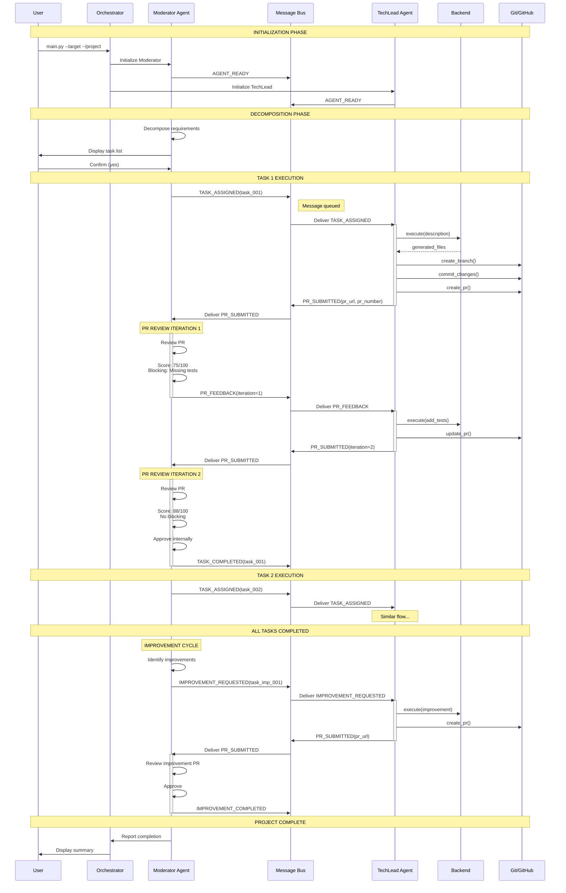
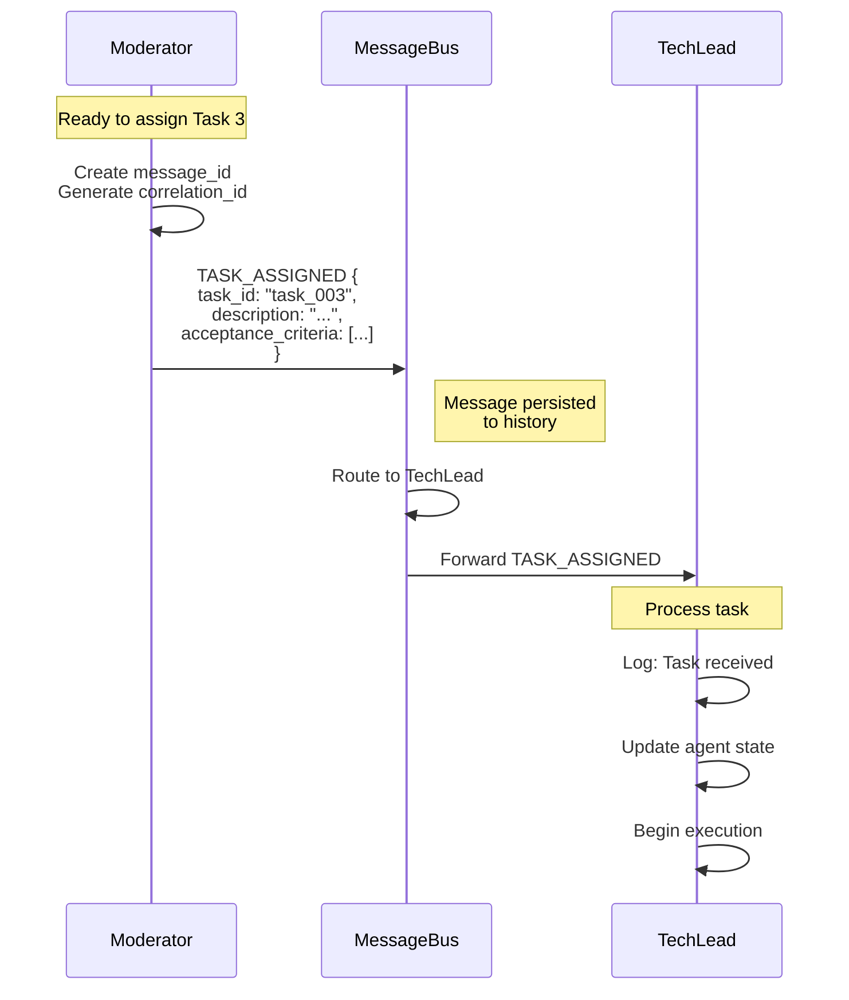
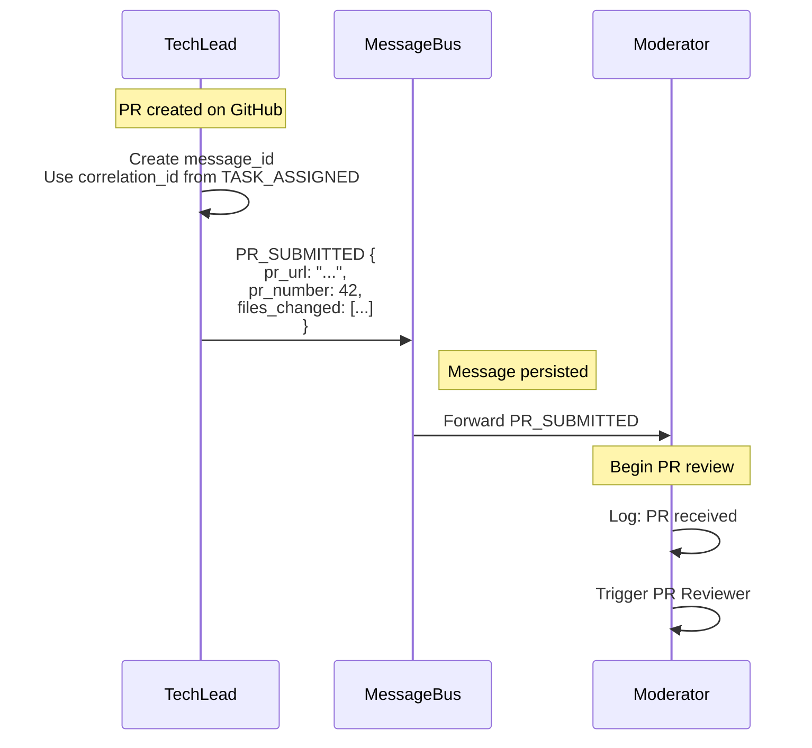
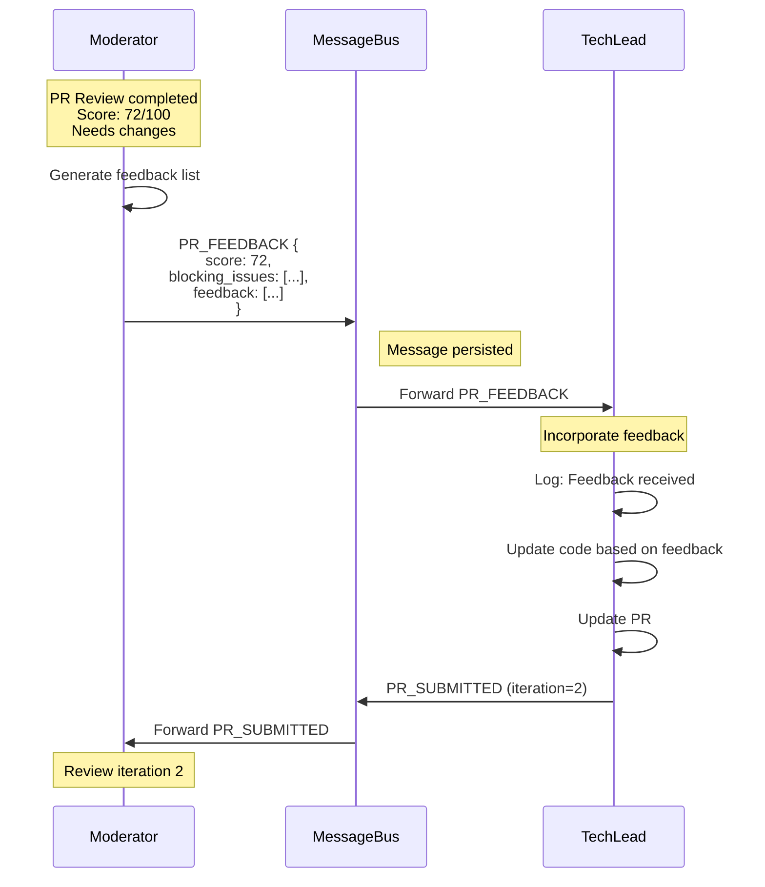
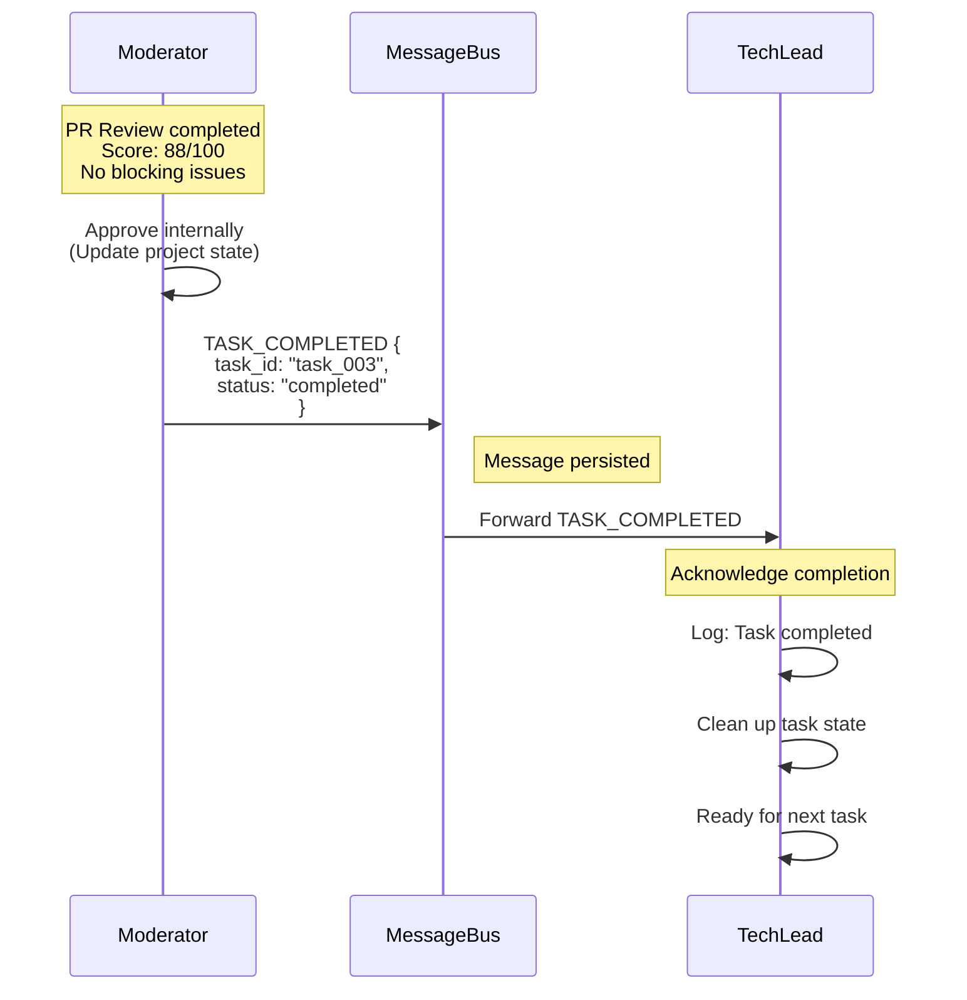
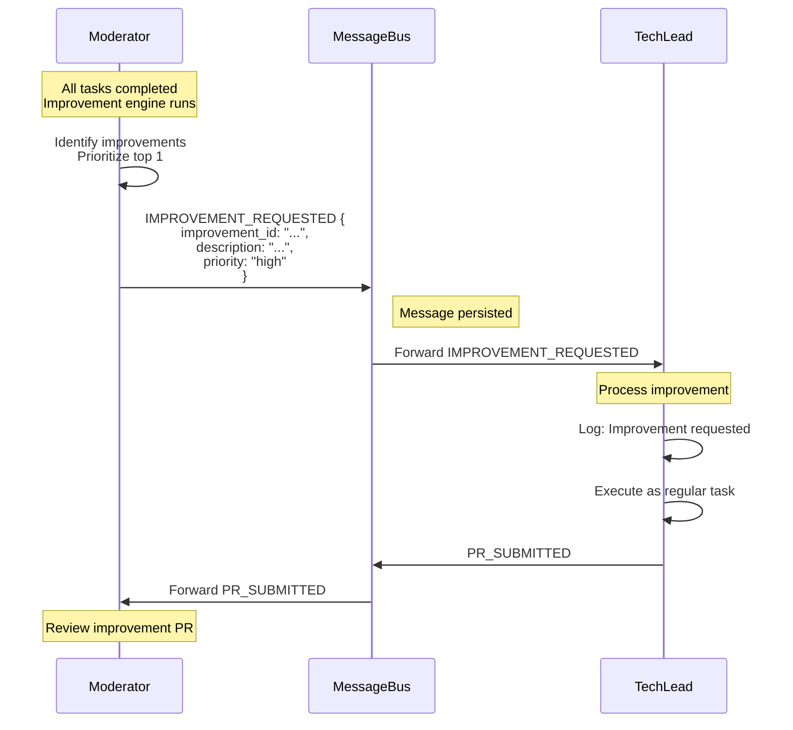
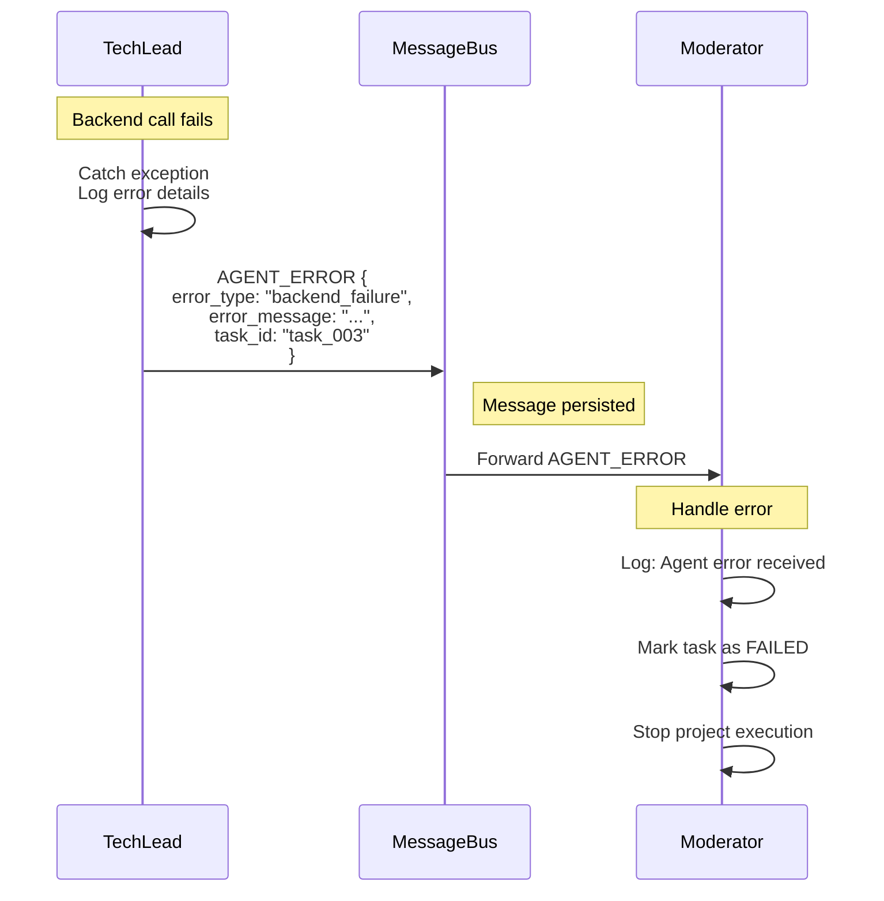

# Gear 2 Message Flow

**Version:** 2.0
**Status:** Week 1B Implementation
**Last Updated:** 2024-10-15

---

## Overview

This document details the message-based communication patterns in Gear 2's two-agent system. All inter-agent communication flows through the MessageBus for loose coupling, auditability, and future extensibility.

---

## 1. Message Types & Patterns

### 1.1 Message Type Definitions

```python
# src/communication/messages.py

from dataclasses import dataclass
from datetime import datetime
from enum import Enum
from typing import Any, Optional

class MessageType(Enum):
    """All message types in Gear 2"""
    # Task Management
    TASK_ASSIGNED = "task_assigned"
    TASK_COMPLETED = "task_completed"

    # PR Workflow
    PR_SUBMITTED = "pr_submitted"
    PR_FEEDBACK = "pr_feedback"
    PR_APPROVED = "pr_approved"

    # Improvement Cycle
    IMPROVEMENT_REQUESTED = "improvement_requested"
    IMPROVEMENT_COMPLETED = "improvement_completed"

    # System
    AGENT_READY = "agent_ready"
    AGENT_ERROR = "agent_error"

@dataclass
class AgentMessage:
    """Base message structure"""
    message_id: str
    message_type: MessageType
    from_agent: str
    to_agent: str
    timestamp: datetime
    payload: dict[str, Any]
    correlation_id: Optional[str] = None  # For request/response tracking
    requires_response: bool = False

    def to_dict(self) -> dict:
        return {
            'message_id': self.message_id,
            'message_type': self.message_type.value,
            'from_agent': self.from_agent,
            'to_agent': self.to_agent,
            'payload': self.payload,
            'requires_response': self.requires_response,
            'correlation_id': self.correlation_id,
            'timestamp': self.timestamp.isoformat()
        }
```

---

## 2. Complete Message Sequence (Happy Path)



---

## 3. Message Patterns by Scenario

### 3.1 Task Assignment Pattern



**Message Payload:**
```python
{
    "message_id": "msg_abc123",
    "message_type": "task_assigned",
    "from_agent": "moderator",
    "to_agent": "techlead",
    "timestamp": "2024-10-15T10:30:00",
    "correlation_id": "corr_task_003",
    "requires_response": True,
    "payload": {
        "task_id": "task_003",
        "description": "Implement CLI interface with argparse",
        "acceptance_criteria": [
            "CLI accepts --add, --list, --complete commands",
            "Input validation with helpful error messages",
            "Exit codes: 0 for success, 1 for errors"
        ],
        "dependencies": ["task_001", "task_002"],
        "estimated_hours": 3
    }
}
```

---

### 3.2 PR Submission Pattern



**Message Payload:**
```python
{
    "message_id": "msg_def456",
    "message_type": "pr_submitted",
    "from_agent": "techlead",
    "to_agent": "moderator",
    "timestamp": "2024-10-15T10:45:00",
    "correlation_id": "corr_task_003",  # Links back to TASK_ASSIGNED
    "requires_response": True,
    "payload": {
        "task_id": "task_003",
        "pr_url": "https://github.com/user/repo/pull/42",
        "pr_number": 42,
        "branch_name": "moderator/task-003-cli-interface",
        "files_changed": [
            "src/cli.py",
            "tests/test_cli.py",
            "README.md"
        ],
        "files_added": 2,
        "files_modified": 1,
        "lines_added": 145,
        "lines_deleted": 8,
        "iteration": 1
    }
}
```

---

### 3.3 PR Feedback Pattern (Needs Changes)



**Message Payload:**
```python
{
    "message_id": "msg_ghi789",
    "message_type": "pr_feedback",
    "from_agent": "moderator",
    "to_agent": "techlead",
    "timestamp": "2024-10-15T10:50:00",
    "correlation_id": "corr_task_003",
    "requires_response": True,
    "payload": {
        "task_id": "task_003",
        "pr_number": 42,
        "iteration": 1,
        "score": 72,
        "approved": False,
        "blocking_issues": [
            "Missing unit tests for error handling",
            "No input validation for --complete command"
        ],
        "suggestions": [
            "Add docstrings to public functions",
            "Consider using argparse subcommands instead of flags"
        ],
        "feedback": [
            {
                "severity": "blocking",
                "category": "testing",
                "file": "src/cli.py",
                "line": 45,
                "issue": "No tests for error case when task ID doesn't exist",
                "suggestion": "Add test_complete_nonexistent_task() in test_cli.py"
            },
            {
                "severity": "blocking",
                "category": "security",
                "file": "src/cli.py",
                "line": 67,
                "issue": "No validation of user input for task ID",
                "suggestion": "Validate task_id is numeric and within bounds"
            },
            {
                "severity": "suggestion",
                "category": "documentation",
                "file": "src/cli.py",
                "line": 10,
                "issue": "Function lacks docstring",
                "suggestion": "Add docstring explaining parameters and return value"
            }
        ],
        "criteria_scores": {
            "code_quality": 25,
            "test_coverage": 10,  # Low due to missing tests
            "security": 15,       # Low due to missing validation
            "documentation": 12,
            "acceptance_criteria": 10
        }
    }
}
```

---

### 3.4 PR Approval Pattern



**Message Payload:**
```python
{
    "message_id": "msg_jkl012",
    "message_type": "task_completed",
    "from_agent": "moderator",
    "to_agent": "techlead",
    "timestamp": "2024-10-15T11:00:00",
    "correlation_id": "corr_task_003",
    "requires_response": False,
    "payload": {
        "task_id": "task_003",
        "pr_number": 42,
        "final_score": 88,
        "total_iterations": 2,
        "approved": True,
        "completion_time": "2024-10-15T11:00:00",
        "files_generated": [
            "src/cli.py",
            "tests/test_cli.py"
        ]
    }
}
```

---

### 3.5 Improvement Request Pattern



**Message Payload:**
```python
{
    "message_id": "msg_mno345",
    "message_type": "improvement_requested",
    "from_agent": "moderator",
    "to_agent": "techlead",
    "timestamp": "2024-10-15T11:15:00",
    "correlation_id": "corr_improvement_001",
    "requires_response": True,
    "payload": {
        "improvement_id": "imp_001",
        "description": "Add caching layer to reduce database queries",
        "category": "performance",
        "priority": "high",
        "impact": "high",
        "effort_hours": 2,
        "priority_score": 8.5,
        "rationale": "Database queries in list_all() called on every CLI invocation. Add simple cache with 5-minute TTL to improve response time.",
        "affected_files": [
            "src/storage.py",
            "tests/test_storage.py"
        ],
        "acceptance_criteria": [
            "Cache implemented with configurable TTL",
            "Cache invalidated on data modification",
            "Performance improvement measured and documented"
        ]
    }
}
```

---

## 4. Error Handling Messages

### 4.1 Agent Error Pattern



**Message Payload:**
```python
{
    "message_id": "msg_err001",
    "message_type": "agent_error",
    "from_agent": "techlead",
    "to_agent": "moderator",
    "timestamp": "2024-10-15T10:35:00",
    "correlation_id": "corr_task_003",
    "requires_response": False,
    "payload": {
        "error_type": "backend_failure",
        "error_message": "Claude CLI execution failed: Timeout after 300 seconds",
        "task_id": "task_003",
        "task_description": "Implement CLI interface",
        "stack_trace": "...",
        "recoverable": False,
        "context": {
            "backend_type": "claude_code",
            "cli_path": "claude",
            "timeout": 300
        }
    }
}
```

---

## 5. Message Bus Implementation

### 5.1 Message Bus Architecture

```python
# src/communication/message_bus.py

from typing import Dict, List, Callable
from datetime import datetime
import uuid
from .messages import AgentMessage, MessageType

class MessageBus:
    """Central message dispatcher for agent communication"""

    def __init__(self, logger):
        self.logger = logger
        self.subscribers: Dict[str, List[Callable]] = {}
        self.message_history: List[AgentMessage] = []

    def subscribe(self, agent_id: str, callback: Callable):
        """Register agent to receive messages"""
        if agent_id not in self.subscribers:
            self.subscribers[agent_id] = []
        self.subscribers[agent_id].append(callback)

        self.logger.info(
            component="message_bus",
            action="agent_subscribed",
            agent_id=agent_id
        )

    def send(self, message: AgentMessage):
        """Send message to target agent"""
        # Persist to history
        self.message_history.append(message)

        # Log message
        self.logger.info(
            component="message_bus",
            action="message_sent",
            message_id=message.message_id,
            message_type=message.message_type.value,
            from_agent=message.from_agent,
            to_agent=message.to_agent
        )

        # Deliver to subscriber
        if message.to_agent in self.subscribers:
            for callback in self.subscribers[message.to_agent]:
                try:
                    callback(message)
                except Exception as e:
                    self.logger.error(
                        component="message_bus",
                        action="delivery_failed",
                        message_id=message.message_id,
                        to_agent=message.to_agent,
                        error=str(e)
                    )

    def create_message(
        self,
        message_type: MessageType,
        from_agent: str,
        to_agent: str,
        payload: Dict,
        correlation_id: str = None,
        requires_response: bool = False
    ) -> AgentMessage:
        """Factory method to create messages"""
        return AgentMessage(
            message_id=f"msg_{uuid.uuid4().hex[:8]}",
            message_type=message_type,
            from_agent=from_agent,
            to_agent=to_agent,
            timestamp=datetime.now(),
            payload=payload,
            correlation_id=correlation_id,
            requires_response=requires_response
        )

    def get_message_history(self, agent_id: str = None) -> List[AgentMessage]:
        """Get message history, optionally filtered by agent"""
        if agent_id:
            return [m for m in self.message_history
                   if m.from_agent == agent_id or m.to_agent == agent_id]
        return self.message_history
```

---

### 5.2 Agent Message Handling

```python
# src/agents/moderator_agent.py (excerpt)

class ModeratorAgent:
    def __init__(self, message_bus: MessageBus, ...):
        self.message_bus = message_bus

        # Subscribe to receive messages
        self.message_bus.subscribe("moderator", self._handle_message)

    def _handle_message(self, message: AgentMessage):
        """Handle incoming messages"""
        if message.message_type == MessageType.PR_SUBMITTED:
            self._handle_pr_submitted(message)
        elif message.message_type == MessageType.TASK_COMPLETED:
            self._handle_task_completed(message)
        elif message.message_type == MessageType.AGENT_ERROR:
            self._handle_agent_error(message)

    def _handle_pr_submitted(self, message: AgentMessage):
        """Handle PR submission from TechLead"""
        pr_url = message.payload["pr_url"]
        pr_number = message.payload["pr_number"]
        task_id = message.payload["task_id"]

        # Trigger PR review
        review_result = self.pr_reviewer.review_pr(pr_number, task_id)

        if review_result.approved:
            # Send completion message
            completion_msg = self.message_bus.create_message(
                message_type=MessageType.TASK_COMPLETED,
                from_agent="moderator",
                to_agent="techlead",
                payload={"task_id": task_id, "approved": True},
                correlation_id=message.correlation_id
            )
            self.message_bus.send(completion_msg)
        else:
            # Send feedback message
            feedback_msg = self.message_bus.create_message(
                message_type=MessageType.PR_FEEDBACK,
                from_agent="moderator",
                to_agent="techlead",
                payload={
                    "task_id": task_id,
                    "feedback": review_result.feedback,
                    "score": review_result.score
                },
                correlation_id=message.correlation_id,
                requires_response=True
            )
            self.message_bus.send(feedback_msg)
```

---

## 6. Message Flow Monitoring

### 6.1 Message History Log

```json
[
  {
    "message_id": "msg_abc123",
    "message_type": "task_assigned",
    "from_agent": "moderator",
    "to_agent": "techlead",
    "timestamp": "2024-10-15T10:30:00",
    "correlation_id": "corr_task_003",
    "payload": { "task_id": "task_003", "..." }
  },
  {
    "message_id": "msg_def456",
    "message_type": "pr_submitted",
    "from_agent": "techlead",
    "to_agent": "moderator",
    "timestamp": "2024-10-15T10:45:00",
    "correlation_id": "corr_task_003",
    "payload": { "pr_url": "...", "..." }
  },
  {
    "message_id": "msg_ghi789",
    "message_type": "pr_feedback",
    "from_agent": "moderator",
    "to_agent": "techlead",
    "timestamp": "2024-10-15T10:50:00",
    "correlation_id": "corr_task_003",
    "payload": { "score": 72, "feedback": [...] }
  }
]
```

### 6.2 Message Flow Visualization (CLI)

```bash
# View message flow for a project
python scripts/view_message_flow.py --project proj_abc123

# Output:
# Message Flow for project_abc123:
#
# 10:30:00  moderator → techlead   TASK_ASSIGNED      task_003
# 10:45:00  techlead → moderator   PR_SUBMITTED       PR #42
# 10:50:00  moderator → techlead   PR_FEEDBACK        Score: 72
# 10:55:00  techlead → moderator   PR_SUBMITTED       PR #42 (iter 2)
# 11:00:00  moderator → techlead   TASK_COMPLETED     task_003
# 11:05:00  moderator → techlead   TASK_ASSIGNED      task_004
# ...
```

---

## 7. Benefits of Message-Based Architecture

### 7.1 Loose Coupling
- Agents don't need direct references to each other
- Easy to add new agents in future (Gear 3+)
- Agents can be tested in isolation

### 7.2 Auditability
- Complete message history preserved
- Can replay entire conversation
- Debug issues by examining message sequence

### 7.3 Asynchronous Communication
- Agents don't block waiting for responses
- Can process multiple messages concurrently (Gear 3)
- Better error isolation

### 7.4 Extensibility
- New message types easily added
- Agents can ignore unknown message types
- Backward compatibility maintained

---

## 8. Message Flow Patterns Summary

| Pattern | From → To | Trigger | Response | Max Iterations |
|---------|-----------|---------|----------|----------------|
| Task Assignment | Moderator → TechLead | Task ready | PR_SUBMITTED | 1 |
| PR Submission | TechLead → Moderator | PR created | PR_FEEDBACK or TASK_COMPLETED | 1 per iteration |
| PR Feedback | Moderator → TechLead | Review needs changes | PR_SUBMITTED (updated) | 3 max |
| Task Completion | Moderator → TechLead | PR approved | Acknowledgment (implicit) | 1 |
| Improvement Request | Moderator → TechLead | All tasks done | PR_SUBMITTED | 1 |
| Agent Error | Either → Other | Exception caught | Project stop | 1 |

---

## References

- **Component Architecture:** `docs/diagrams/gear2-component-architecture.md`
- **Execution Loop:** `docs/diagrams/gear2-execution-loop.md`
- **Gear 2 Plan:** `docs/multi-phase-plan/phase2/gear-2-implementation-plan.md`
- **Implementation:** `src/communication/message_bus.py`, `src/communication/messages.py`
