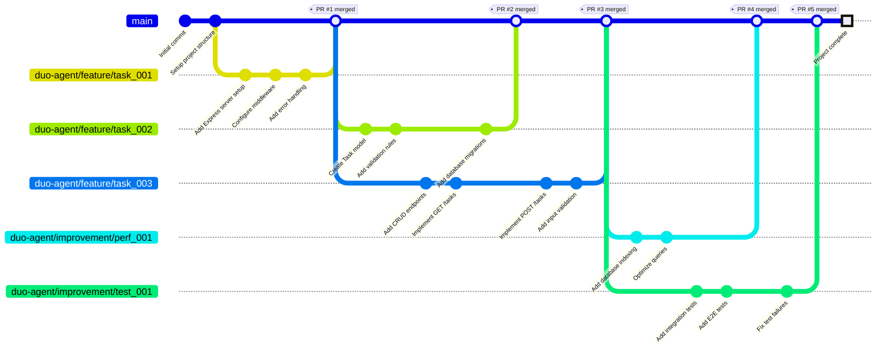
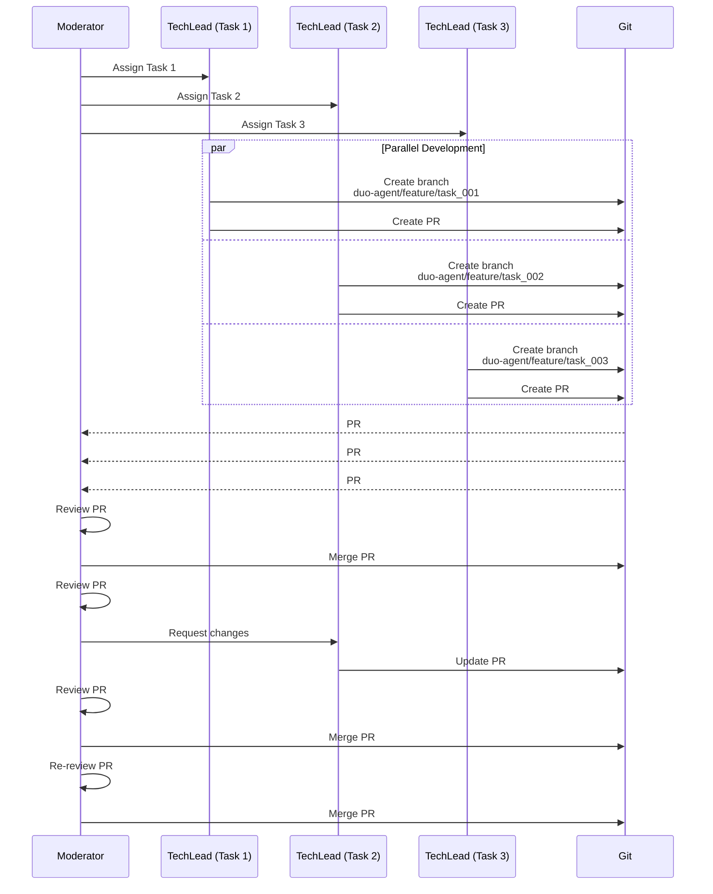
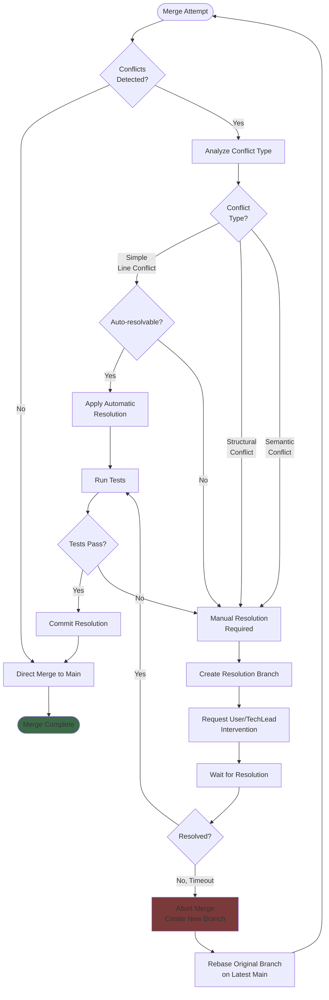

# Git Workflow

## Description
This diagram shows the branch strategy, PR lifecycle from creation to merge, parallel PR management, and conflict resolution flow in the Moderator system. Each task creates its own feature branch and PR.

## Diagram



## PR Lifecycle Flow

```mermaid
flowchart TD
    Start([Task Assigned<br/>to TechLead]) --> CreateBranch[Create Feature Branch<br/>duo-agent/{type}/{task_id}]

    CreateBranch --> Implement[Implement Changes]

    Implement --> RunTests{Local Tests<br/>Pass?}

    RunTests -->|No| FixTests[Fix Issues]
    FixTests --> RunTests

    RunTests -->|Yes| Commit[Create Commit<br/>with Structured Message]

    Commit --> CreatePR[Create Pull Request<br/>via GitHub API]

    CreatePR --> PRCreated{{"PR Created<br/>#{pr_number}"}}

    PRCreated --> CIChecks[Run CI Checks]

    CIChecks --> CIResult{CI Pass?}

    CIResult -->|No| FixCI[Fix CI Issues]
    FixCI --> UpdatePR[Update PR]
    UpdatePR --> CIChecks

    CIResult -->|Yes| ModeratorReview[Moderator Review]

    ModeratorReview --> QAAnalysis[QA Layer Analysis]

    QAAnalysis --> ReviewDecision{Review<br/>Decision?}

    ReviewDecision -->|Changes Requested| Feedback[Provide Feedback]
    Feedback --> TechLeadFix[TechLead Addresses<br/>Feedback]
    TechLeadFix --> UpdatePR

    ReviewDecision -->|Approved| MergePR[Merge PR to Main]

    MergePR --> DeleteBranch[Delete Feature Branch]

    DeleteBranch --> NotifyComplete[Notify Task Complete]

    NotifyComplete --> End([PR Lifecycle Complete])

    style Start fill:#2d5a7a
    style PRCreated fill:#7a7530
    style MergePR fill:#3d6b4a
    style End fill:#2d5a7a
```

## Parallel PR Management



## Conflict Resolution Flow



## Branch Naming Convention

### Feature Branches
```
duo-agent/feature/{task_id}
duo-agent/feature/task_001
duo-agent/feature/task_042
```

### Improvement Branches
```
duo-agent/improvement/{improvement_type}_{id}
duo-agent/improvement/perf_001
duo-agent/improvement/security_002
duo-agent/improvement/test_003
```

### Bugfix Branches
```
duo-agent/bugfix/{issue_id}
duo-agent/bugfix/issue_123
```

### Refactoring Branches
```
duo-agent/refactor/{description}
duo-agent/refactor/auth_layer
duo-agent/refactor/database_access
```

## Commit Message Format

```
{task_type}: {brief_description}

Task ID: {task_id}
Acceptance Criteria:
- {criterion_1}
- {criterion_2}
- {criterion_3}

Changes:
- {change_1}
- {change_2}
- {change_3}

Generated by: duo-agent/{agent_name}
```

### Example Commit Message
```
FEATURE: Add user authentication endpoints

Task ID: task_001
Acceptance Criteria:
- POST /login endpoint functional
- JWT tokens generated correctly
- Password hashing with bcrypt
- Input validation on all fields

Changes:
- Created src/auth/login.js with login handler
- Added JWT token generation utility
- Implemented password hashing with bcrypt
- Added input validation middleware
- Created tests/auth/login.test.js with 12 tests

Generated by: duo-agent/techlead
```

## PR Description Template

```markdown
## Summary
{Brief description of changes}

## Task Information
- **Task ID**: {task_id}
- **Task Type**: {FEATURE|BUGFIX|REFACTOR|TEST|DOCUMENT}
- **Assigned Backend**: {backend_name}

## Changes Made
- {change_1}
- {change_2}
- {change_3}

## Acceptance Criteria
- [x] {criterion_1}
- [x] {criterion_2}
- [x] {criterion_3}

## Files Changed
- `{file_path_1}` - {description}
- `{file_path_2}` - {description}

## Testing
- **Tests Added**: {count}
- **Tests Passing**: {count}/{total}
- **Coverage**: {percentage}%

## QA Results
- **Issues Found**: {count}
- **Critical**: {count}
- **High**: {count}
- **Medium**: {count}
- **Low**: {count}

## Dependencies
- Depends on: #{pr_numbers}
- Blocks: #{pr_numbers}

## Notes
{Additional notes or context}

---
Generated by Duo-Agent System
```

## PR Review Checklist

### Code Quality
- [ ] Code follows project conventions
- [ ] No obvious bugs or logic errors
- [ ] Appropriate complexity for task
- [ ] No code smells

### Testing
- [ ] Unit tests included
- [ ] Tests cover main functionality
- [ ] Edge cases tested
- [ ] Tests pass in CI

### Documentation
- [ ] Code is well-commented
- [ ] README updated if needed
- [ ] API docs current
- [ ] Breaking changes documented

### Acceptance
- [ ] Meets all acceptance criteria
- [ ] No scope creep
- [ ] Backward compatible (or documented)
- [ ] Security scan passed

## Merge Strategies

### Fast-Forward Merge (Default)
```bash
git checkout main
git merge --ff-only duo-agent/feature/task_001
```
Used when: No conflicts, linear history

### Squash Merge
```bash
git merge --squash duo-agent/feature/task_001
git commit -m "FEATURE: Complete description"
```
Used when: Multiple commits need consolidation

### Rebase and Merge
```bash
git checkout duo-agent/feature/task_001
git rebase main
git checkout main
git merge --ff-only duo-agent/feature/task_001
```
Used when: Want linear history but preserve individual commits

## References
- PRD: moderator-prd.md - Section 7 "Git & PR Management" (lines 417-495)
- PRD: moderator-prd.md - Section 7.2 "PR Workflow" with code example (lines 435-469)
- PRD: moderator-prd.md - Section 7.3 "PR Review Criteria" (lines 472-495)
