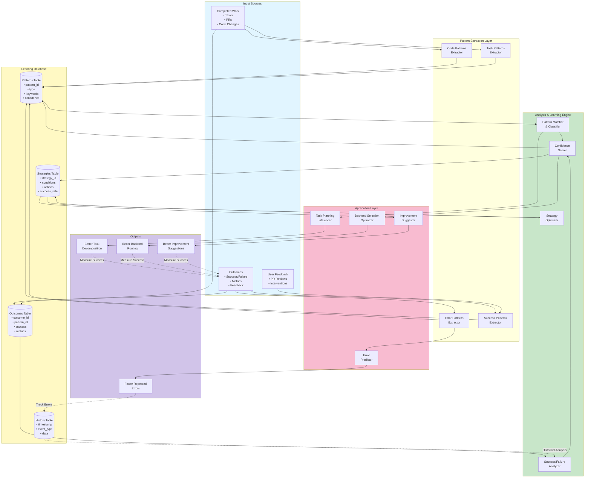

# Learning System Architecture

## Description
This component diagram shows the learning system architecture, including pattern extraction from completed work, learning database schema, success/failure tracking, strategy adjustment mechanism, and how learned patterns influence future tasks.

## Diagram



## Learning Database Schema

### Patterns Table
```sql
CREATE TABLE patterns (
    pattern_id TEXT PRIMARY KEY,
    pattern_type TEXT NOT NULL,  -- 'code', 'task', 'error', 'success'
    keywords TEXT[],
    description TEXT,
    conditions JSON,
    confidence_score REAL DEFAULT 0.5,
    success_count INTEGER DEFAULT 0,
    failure_count INTEGER DEFAULT 0,
    created_at TIMESTAMP DEFAULT CURRENT_TIMESTAMP,
    last_seen TIMESTAMP,
    metadata JSON
);

CREATE INDEX idx_pattern_type ON patterns(pattern_type);
CREATE INDEX idx_confidence ON patterns(confidence_score);
```

### Outcomes Table
```sql
CREATE TABLE outcomes (
    outcome_id TEXT PRIMARY KEY,
    pattern_id TEXT REFERENCES patterns(pattern_id),
    execution_id TEXT,
    task_id TEXT,
    success BOOLEAN NOT NULL,
    estimated_impact REAL,
    actual_impact REAL,
    metrics_before JSON,
    metrics_after JSON,
    feedback TEXT,
    timestamp TIMESTAMP DEFAULT CURRENT_TIMESTAMP
);

CREATE INDEX idx_pattern_outcomes ON outcomes(pattern_id);
CREATE INDEX idx_success ON outcomes(success);
```

### Strategies Table
```sql
CREATE TABLE strategies (
    strategy_id TEXT PRIMARY KEY,
    strategy_name TEXT NOT NULL,
    conditions JSON,          -- When to apply this strategy
    actions JSON,             -- What to do
    success_rate REAL DEFAULT 0.0,
    application_count INTEGER DEFAULT 0,
    average_impact REAL DEFAULT 0.0,
    created_at TIMESTAMP DEFAULT CURRENT_TIMESTAMP,
    last_used TIMESTAMP,
    enabled BOOLEAN DEFAULT TRUE
);

CREATE INDEX idx_success_rate ON strategies(success_rate);
```

### History Table
```sql
CREATE TABLE history (
    event_id TEXT PRIMARY KEY,
    event_type TEXT NOT NULL,
    execution_id TEXT,
    task_id TEXT,
    data JSON,
    timestamp TIMESTAMP DEFAULT CURRENT_TIMESTAMP
);

CREATE INDEX idx_event_type ON history(event_type);
CREATE INDEX idx_timestamp ON history(timestamp);
```

## Pattern Extraction

### Code Patterns
```python
class CodePatternExtractor:
    def extract_patterns(self, code_output):
        """
        Extract reusable code patterns from generated code
        """
        patterns = []

        # Framework patterns
        patterns.extend(self.extract_framework_patterns(code_output))

        # Design patterns
        patterns.extend(self.extract_design_patterns(code_output))

        # File structure patterns
        patterns.extend(self.extract_structure_patterns(code_output))

        # Naming conventions
        patterns.extend(self.extract_naming_patterns(code_output))

        return patterns

    def extract_framework_patterns(self, code_output):
        """
        Identify framework-specific patterns
        """
        patterns = []

        if self.detects_express_js(code_output):
            patterns.append(Pattern(
                type='code',
                keywords=['express', 'middleware', 'router'],
                description='Express.js server setup pattern',
                conditions={'language': 'javascript', 'task_type': 'API'}
            ))

        return patterns
```

### Task Patterns
```python
class TaskPatternExtractor:
    def extract_patterns(self, task, outcome):
        """
        Extract patterns from task execution
        """
        patterns = []

        # Task decomposition patterns
        if task.type == TaskType.FEATURE:
            pattern = self.analyze_decomposition(task, outcome)
            if pattern.success_rate > 0.7:
                patterns.append(pattern)

        # Backend selection patterns
        backend_pattern = self.analyze_backend_selection(task, outcome)
        patterns.append(backend_pattern)

        # Time estimation patterns
        time_pattern = self.analyze_time_estimation(task, outcome)
        patterns.append(time_pattern)

        return patterns
```

### Error Patterns
```python
class ErrorPatternExtractor:
    def extract_patterns(self, error, context):
        """
        Extract patterns from errors
        """
        return Pattern(
            type='error',
            keywords=self.extract_error_keywords(error),
            description=f"Error pattern: {error.category}",
            conditions={
                'error_type': error.category,
                'context': context,
                'recovery': error.recovery_strategy
            },
            metadata={
                'common_causes': self.identify_common_causes(error),
                'effective_solutions': self.identify_solutions(error)
            }
        )
```

### Success Patterns
```python
class SuccessPatternExtractor:
    def extract_patterns(self, execution_result):
        """
        Extract patterns from successful executions
        """
        if execution_result.status != "success":
            return []

        patterns = []

        # High-quality code patterns
        if execution_result.quality_score > 0.8:
            patterns.append(self.extract_quality_pattern(execution_result))

        # Fast execution patterns
        if execution_result.execution_time < expected_time * 0.7:
            patterns.append(self.extract_efficiency_pattern(execution_result))

        # High test coverage patterns
        if execution_result.test_coverage > 0.9:
            patterns.append(self.extract_testing_pattern(execution_result))

        return patterns
```

## Confidence Scoring

```python
class ConfidenceScorer:
    def calculate_confidence(self, pattern):
        """
        Calculate confidence score for a pattern (0.0 - 1.0)
        """
        success_rate = pattern.success_count / (pattern.success_count + pattern.failure_count + 1)

        # Sample size factor (more samples = more confidence)
        total_samples = pattern.success_count + pattern.failure_count
        sample_factor = min(1.0, total_samples / 20)  # Confidence maxes at 20 samples

        # Recency factor (recent successes more valuable)
        days_since_last_seen = (now() - pattern.last_seen).days
        recency_factor = math.exp(-days_since_last_seen / 30)  # Decay over 30 days

        # Combined confidence
        confidence = success_rate * sample_factor * recency_factor

        return confidence

    def update_confidence(self, pattern, outcome):
        """
        Update pattern confidence based on new outcome
        """
        if outcome.success:
            pattern.success_count += 1

            # Boost confidence if actual impact matched estimate
            if outcome.actual_impact >= outcome.estimated_impact:
                pattern.confidence_score = min(1.0, pattern.confidence_score + 0.1)
        else:
            pattern.failure_count += 1
            pattern.confidence_score = max(0.0, pattern.confidence_score - 0.1)

        pattern.last_seen = now()
        pattern.confidence_score = self.calculate_confidence(pattern)
```

## Strategy Optimization

```python
class StrategyOptimizer:
    def optimize_strategies(self):
        """
        Optimize strategies based on historical success rates
        """
        strategies = self.learning_db.get_all_strategies()

        for strategy in strategies:
            # Calculate current success rate
            success_rate = self.calculate_success_rate(strategy)

            # Update strategy
            strategy.success_rate = success_rate

            # Disable low-performing strategies
            if success_rate < 0.3 and strategy.application_count > 10:
                strategy.enabled = False
                logger.info(f"Disabled strategy {strategy.name} (success rate: {success_rate:.1%})")

            # Adjust strategy parameters
            if success_rate > 0.7:
                self.expand_strategy_conditions(strategy)
            elif success_rate < 0.5:
                self.narrow_strategy_conditions(strategy)

            self.learning_db.update_strategy(strategy)
```

## Application to Future Tasks

### Task Planning Influence
```python
class TaskPlanningInfluencer:
    def influence_task_decomposition(self, request):
        """
        Use learned patterns to improve task decomposition
        """
        # Find similar past requests
        similar_patterns = self.learning_db.find_similar_patterns(
            type='task',
            keywords=extract_keywords(request.description)
        )

        # Get high-confidence decomposition patterns
        decomposition_patterns = [
            p for p in similar_patterns
            if p.confidence_score > 0.7
        ]

        # Apply learned decomposition strategy
        if decomposition_patterns:
            best_pattern = max(decomposition_patterns, key=lambda p: p.confidence_score)
            return self.apply_decomposition_pattern(request, best_pattern)
        else:
            return self.default_decomposition(request)
```

### Backend Selection Optimization
```python
class BackendSelectionOptimizer:
    def optimize_backend_selection(self, task):
        """
        Use learned patterns to select best backend
        """
        # Get historical performance for each backend on similar tasks
        backend_performance = {}

        for backend in available_backends:
            similar_tasks = self.learning_db.find_similar_tasks(
                task_type=task.type,
                complexity=task.complexity,
                backend=backend
            )

            if similar_tasks:
                avg_success_rate = sum(t.success for t in similar_tasks) / len(similar_tasks)
                avg_execution_time = sum(t.execution_time for t in similar_tasks) / len(similar_tasks)

                backend_performance[backend] = {
                    'success_rate': avg_success_rate,
                    'avg_time': avg_execution_time,
                    'sample_size': len(similar_tasks)
                }

        # Select backend with best performance
        return self.select_best_backend(backend_performance)
```

### Improvement Suggestions
```python
class ImprovementSuggester:
    def suggest_improvements(self, codebase):
        """
        Suggest improvements based on learned patterns
        """
        suggestions = []

        # Get high-confidence improvement patterns
        patterns = self.learning_db.get_high_confidence_patterns(
            type='success',
            min_confidence=0.7
        )

        for pattern in patterns:
            # Check if pattern applies to current codebase
            if self.pattern_matches(pattern, codebase):
                # Check if this improvement was successful before
                historical_outcomes = self.learning_db.get_pattern_outcomes(pattern.pattern_id)

                if self.has_positive_outcomes(historical_outcomes):
                    suggestions.append(self.generate_improvement(pattern, historical_outcomes))

        return sorted(suggestions, key=lambda s: s.expected_impact, reverse=True)
```

## Learning Metrics

```python
class LearningMetrics:
    def calculate_system_improvement(self):
        """
        Measure how much the system has improved over time
        """
        recent = self.get_recent_executions(days=7)
        baseline = self.get_baseline_executions(days=7, weeks_ago=4)

        metrics = {
            'success_rate_improvement': self.compare_success_rates(recent, baseline),
            'execution_time_improvement': self.compare_execution_times(recent, baseline),
            'error_rate_improvement': self.compare_error_rates(recent, baseline),
            'quality_score_improvement': self.compare_quality_scores(recent, baseline)
        }

        return metrics

    def compare_success_rates(self, recent, baseline):
        """
        Compare success rates between periods
        """
        recent_rate = sum(1 for e in recent if e.success) / len(recent)
        baseline_rate = sum(1 for e in baseline if e.success) / len(baseline)

        improvement = (recent_rate - baseline_rate) / baseline_rate
        return improvement
```

## References
- Architecture: archetcture.md - "Learning System" (lines 107-110)
- PRD: moderator-prd.md - Section 15.2 "Phase 3 Features" - Learning system (line 928)
- Architecture: archetcture.md - Learning Database component (line 68)
- CLAUDE.md: "Learning system" in stubbed features (line 207)
