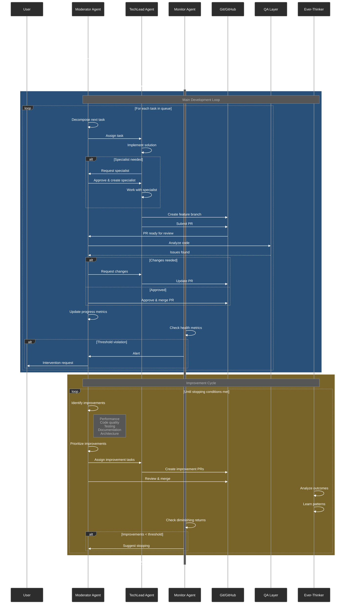

# Main Execution Loop

## Description
This diagram shows the primary development cycle in the Moderator system, illustrating how user requests flow through task decomposition, parallel execution, PR creation, review, improvements, and continuous learning.

## Diagram

## Key Elements

### Agents
- **Moderator (Blue)**: Orchestrates the entire workflow, manages task decomposition, and makes quality decisions
- **TechLead (Green)**: Primary implementation agent that writes code and creates PRs
- **Monitor (Yellow)**: Watches system health and triggers alerts when thresholds are violated

### Workflow Phases
1. **Planning Phase**: Requirements gathering, clarification, and plan approval
2. **Main Development Loop**: Task execution with PR-based workflow
3. **Improvement Cycle**: Continuous enhancement until diminishing returns

### Decision Points
- **Specialist Request**: TechLead can request specialized agents for specific tasks
- **PR Review**: Moderator reviews and either approves or requests changes
- **Health Alerts**: Monitor triggers intervention when thresholds are exceeded
- **Stopping Conditions**: System checks for diminishing returns and completion criteria

## References
- Architecture document: archetcture.md - "The Data Flow" (lines 117-129)
- PRD: moderator-prd.md - Section 5.1 "Initial Setup Workflow" and 5.2 "Development Cycle" (lines 275-326)
