# Queue Management

## Description
This flowchart shows the task queue management system including task prioritization algorithm, queue operations (add, remove, reorder), parallel execution slot management, and dependency resolution.

## Diagram

```mermaid
flowchart TD
    Start([New Task]) --> AddToQueue[Add to Queue]

    AddToQueue --> CalculatePriority[Calculate Priority<br/>Score]

    CalculatePriority --> Priority{{"Priority Score<br/>• Base priority<br/>• Dependencies<br/>• Urgency<br/>• Impact"}}

    Priority --> InsertPosition[Determine Insert<br/>Position in Queue]

    InsertPosition --> CheckDeps{Has<br/>Dependencies?}

    CheckDeps -->|Yes| CheckDepStatus{Dependencies<br/>Complete?}
    CheckDeps -->|No| ReadyQueue[Add to<br/>Ready Queue]

    CheckDepStatus -->|No| WaitingQueue[Add to<br/>Waiting Queue]
    CheckDepStatus -->|Yes| ReadyQueue

    ReadyQueue --> QueueState{{"Task Queue State"}}

    WaitingQueue --> Monitor[Monitor<br/>Dependencies]

    Monitor --> DepComplete{Dependency<br/>Completed?}

    DepComplete -->|Yes| MoveToReady[Move to<br/>Ready Queue]
    DepComplete -->|No| Monitor

    MoveToReady --> ReadyQueue

    QueueState --> Scheduler[Queue Scheduler<br/>Every 10s]

    Scheduler --> CheckSlots{Execution<br/>Slots<br/>Available?}

    CheckSlots -->|No| WaitForSlot[Wait for<br/>Available Slot]
    WaitForSlot --> Scheduler

    CheckSlots -->|Yes| SelectNext[Select Next<br/>Task by Priority]

    SelectNext --> AllocateSlot[Allocate<br/>Execution Slot]

    AllocateSlot --> AssignToAgent[Assign to<br/>TechLead]

    AssignToAgent --> Execute[Execute Task]

    Execute --> ExecutionComplete{Task<br/>Complete?}

    ExecutionComplete -->|Success| ReleaseSlot[Release<br/>Execution Slot]
    ExecutionComplete -->|Failure| HandleFailure[Handle Failure]

    HandleFailure --> RetryDecision{Retry<br/>Task?}

    RetryDecision -->|Yes| IncrementRetry[Increment<br/>Retry Count]
    IncrementRetry --> ReadyQueue

    RetryDecision -->|No| MarkFailed[Mark as<br/>Failed]

    ReleaseSlot --> CheckWaiting{Tasks in<br/>Waiting Queue?}
    MarkFailed --> ReleaseSlot

    CheckWaiting -->|Yes| CheckDepNow{Any<br/>Dependencies<br/>Met?}
    CheckWaiting -->|No| Scheduler

    CheckDepNow -->|Yes| MoveToReady
    CheckDepNow -->|No| Scheduler

    style Start fill:#2d5a7a
    style ReadyQueue fill:#3d6b4a
    style WaitingQueue fill:#7a7530
    style Execute fill:#4a6a8a
    style ReleaseSlot fill:#3d6b4a
```



## Priority Calculation Algorithm

```python
class TaskPrioritizer:
    def calculate_priority(self, task):
        """
        Calculate priority score (0-100, higher = more important)
        """
        score = 0

        # Base priority from task type
        type_priority = {
            TaskType.CRITICAL_BUGFIX: 50,
            TaskType.FEATURE: 30,
            TaskType.BUGFIX: 40,
            TaskType.REFACTOR: 20,
            TaskType.TEST: 25,
            TaskType.DOCUMENT: 15
        }
        score += type_priority.get(task.type, 30)

        # Dependency factor (blocking other tasks increases priority)
        blocking_count = self.count_tasks_blocked_by(task)
        score += min(20, blocking_count * 5)

        # Age factor (older tasks get priority boost)
        age_hours = (now() - task.created_at).total_seconds() / 3600
        score += min(15, age_hours * 0.5)

        # User priority override
        if task.user_priority:
            score += task.user_priority

        # Impact factor
        impact_scores = {
            'critical': 15,
            'high': 10,
            'medium': 5,
            'low': 0
        }
        score += impact_scores.get(task.impact, 0)

        return min(100, score)
```

## Queue Operations

### Add Task
```python
def add_task(self, task):
    """Add task to appropriate queue"""
    priority = self.calculate_priority(task)
    task.priority_score = priority

    if task.dependencies and not self.dependencies_met(task):
        self.waiting_queue.add(task)
    else:
        self.ready_queue.insert_by_priority(task)
```

### Remove Task
```python
def remove_task(self, task_id):
    """Remove task from queue"""
    # Check both queues
    if self.ready_queue.contains(task_id):
        self.ready_queue.remove(task_id)
    elif self.waiting_queue.contains(task_id):
        self.waiting_queue.remove(task_id)

    # Check if any tasks were waiting on this
    self.check_unblocked_tasks(task_id)
```

### Reorder Queue
```python
def reorder_queue(self):
    """Recalculate priorities and reorder"""
    for task in self.ready_queue:
        new_priority = self.calculate_priority(task)
        task.priority_score = new_priority

    self.ready_queue.sort_by_priority()
```

## Execution Slot Management

```python
class ExecutionSlotManager:
    def __init__(self, max_parallel_tasks=3):
        self.max_slots = max_parallel_tasks
        self.active_slots = []

    def allocate_slot(self, task):
        """Allocate an execution slot for a task"""
        if len(self.active_slots) >= self.max_slots:
            return None

        slot = ExecutionSlot(
            slot_id=f"slot_{len(self.active_slots)}",
            task_id=task.task_id,
            allocated_at=now()
        )

        self.active_slots.append(slot)
        return slot

    def release_slot(self, slot_id):
        """Release an execution slot"""
        self.active_slots = [s for s in self.active_slots if s.slot_id != slot_id]

    def available_slots(self):
        """Number of available slots"""
        return self.max_slots - len(self.active_slots)
```

## Dependency Resolution

```python
class DependencyResolver:
    def dependencies_met(self, task):
        """Check if all dependencies are satisfied"""
        if not task.dependencies:
            return True

        for dep_id in task.dependencies:
            dep_task = self.get_task(dep_id)

            if not dep_task:
                # Dependency doesn't exist - assume met
                continue

            if dep_task.status != TaskStatus.COMPLETED:
                return False

        return True

    def get_blocked_tasks(self, completed_task_id):
        """Get all tasks that were blocked by this task"""
        blocked_tasks = []

        for task in self.waiting_queue:
            if completed_task_id in task.dependencies:
                if self.dependencies_met(task):
                    blocked_tasks.append(task)

        return blocked_tasks

    def resolve_dependencies(self, completed_task_id):
        """Move tasks to ready queue when dependencies are met"""
        blocked_tasks = self.get_blocked_tasks(completed_task_id)

        for task in blocked_tasks:
            self.waiting_queue.remove(task.task_id)
            self.ready_queue.insert_by_priority(task)

        return len(blocked_tasks)
```

## Queue Statistics

```python
class QueueStatistics:
    def get_queue_stats(self):
        """Get current queue statistics"""
        return {
            'ready_queue': {
                'count': len(self.ready_queue),
                'avg_priority': self.avg_priority(self.ready_queue),
                'oldest_age_minutes': self.oldest_task_age(self.ready_queue)
            },
            'waiting_queue': {
                'count': len(self.waiting_queue),
                'avg_dependencies': self.avg_dependencies(self.waiting_queue)
            },
            'execution': {
                'active_tasks': len(self.active_slots),
                'available_slots': self.available_slots(),
                'max_slots': self.max_slots
            },
            'completed': {
                'total': self.completed_count,
                'success_rate': self.success_rate
            }
        }
```

## References
- Architecture: archetcture.md - "Scale: How do we handle 100+ task projects?" with queue-based execution (lines 189-190)
- PRD: moderator-prd.md - Task queue and priority scheduling mentioned throughout
- CLAUDE.md: "Parallel execution" in stubbed features (line 208)
