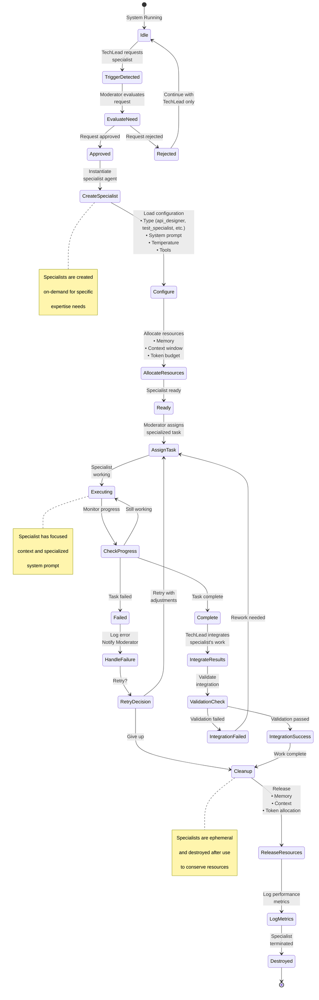

# Specialist Lifecycle

## Description
This state diagram shows the lifecycle of specialist agents, from creation trigger through configuration, task assignment, execution, result integration, and destruction. It illustrates when specialists are preferred over main agents and their resource allocation/cleanup process.

## Diagram



## Specialist Types

### Available Specialists

```python
SPECIALIST_TYPES = {
    'api_designer': {
        'name': 'API Design Specialist',
        'expertise': 'REST/GraphQL API design, OpenAPI specs',
        'model': 'claude-3-opus',
        'temperature': 0.3,
        'tools': ['openapi_generator', 'schema_validator']
    },

    'test_specialist': {
        'name': 'Testing Specialist',
        'expertise': 'Comprehensive unit and integration testing',
        'model': 'claude-3-opus',
        'temperature': 0.2,
        'tools': ['test_runner', 'coverage_analyzer']
    },

    'refactoring_expert': {
        'name': 'Refactoring Expert',
        'expertise': 'Code optimization and SOLID principles',
        'model': 'claude-3-opus',
        'temperature': 0.4,
        'tools': ['ast_analyzer', 'performance_profiler']
    },

    'documentation_writer': {
        'name': 'Documentation Writer',
        'expertise': 'Technical documentation, API docs, README',
        'model': 'claude-3-opus',
        'temperature': 0.5,
        'tools': ['markdown_formatter', 'doc_generator']
    }
}
```

## Creation Triggers

### When to Create a Specialist

```python
class SpecialistTriggerEvaluator:
    def should_create_specialist(self, request, task):
        """
        Determine if a specialist is needed
        """
        triggers = []

        # Domain expertise required
        if self.requires_specialized_knowledge(task):
            triggers.append('expertise_needed')

        # Repeated pattern detected
        if self.is_repeated_pattern(task.type):
            triggers.append('repeated_pattern')

        # High complexity
        if task.complexity > 8:
            triggers.append('high_complexity')

        # Explicit request
        if request.specialist_type:
            triggers.append('explicit_request')

        # Quality threshold
        if task.quality_requirements > 0.9:
            triggers.append('quality_threshold')

        return len(triggers) >= 2, triggers
```

## Resource Allocation

```python
class SpecialistResourceManager:
    def allocate_resources(self, specialist_type):
        """
        Allocate resources for specialist
        """
        # Base allocation
        allocation = {
            'memory_mb': 512,
            'context_tokens': 50000,
            'token_budget': 10000,
            'max_runtime_minutes': 30
        }

        # Adjust based on specialist type
        if specialist_type in ['api_designer', 'documentation_writer']:
            allocation['context_tokens'] = 75000
            allocation['token_budget'] = 15000

        return allocation

    def release_resources(self, specialist_id):
        """
        Release allocated resources
        """
        allocation = self.active_allocations.pop(specialist_id)

        # Return resources to pool
        self.resource_pool.memory_mb += allocation['memory_mb']
        self.resource_pool.available_tokens += allocation['token_budget']

        logger.info(f"Released resources for specialist {specialist_id}")
```

## Specialist vs Main Agent Decision

```python
def should_use_specialist(task, context):
    """
    Decide between specialist and main TechLead agent
    """
    # Always use TechLead for simple tasks
    if task.complexity < 5:
        return False, "Task not complex enough"

    # Use specialist for domain-specific tasks
    domain_tasks = {
        'API design': 'api_designer',
        'Testing': 'test_specialist',
        'Refactoring': 'refactoring_expert',
        'Documentation': 'documentation_writer'
    }

    for domain, specialist_type in domain_tasks.items():
        if domain.lower() in task.description.lower():
            return True, specialist_type

    # Use specialist if quality is critical
    if task.quality_requirements > 0.9:
        return True, select_best_specialist_for_task(task)

    # Use specialist if previous attempts failed
    if task.retry_count > 2:
        return True, 'refactoring_expert'

    return False, "TechLead sufficient"
```

## Integration Process

```python
class SpecialistIntegrator:
    def integrate_specialist_work(self, specialist_output, main_context):
        """
        Integrate specialist's work into main codebase
        """
        # Validate output
        validation = self.validate_output(specialist_output)

        if not validation.passed:
            return IntegrationResult(
                success=False,
                errors=validation.errors
            )

        # Merge files
        merged_files = self.merge_files(
            specialist_output.files,
            main_context.files
        )

        # Run tests
        test_results = self.run_tests(merged_files)

        if not test_results.all_passed:
            return IntegrationResult(
                success=False,
                errors=["Tests failed after integration"]
            )

        # Update main context
        main_context.files = merged_files

        return IntegrationResult(
            success=True,
            files_modified=len(merged_files)
        )
```

## Performance Metrics

```python
class SpecialistMetrics:
    def log_specialist_performance(self, specialist):
        """
        Track specialist performance for future decisions
        """
        metrics = {
            'specialist_type': specialist.type,
            'task_id': specialist.task_id,
            'execution_time_seconds': specialist.execution_time,
            'tokens_used': specialist.tokens_used,
            'success': specialist.status == 'success',
            'integration_successful': specialist.integration_result.success,
            'quality_score': specialist.quality_score,
            'cost_effectiveness': self.calculate_cost_effectiveness(specialist)
        }

        self.metrics_db.record(metrics)

        # Update success rates
        self.update_specialist_success_rate(specialist.type, metrics['success'])
```

## Cleanup Process

```python
class SpecialistCleanup:
    def cleanup_specialist(self, specialist):
        """
        Graceful shutdown and cleanup
        """
        # Save final state
        self.save_specialist_state(specialist)

        # Release resources
        self.resource_manager.release_resources(specialist.id)

        # Clear context
        specialist.context.clear()

        # Log metrics
        self.metrics_logger.log_specialist_performance(specialist)

        # Remove from active specialists
        self.active_specialists.remove(specialist.id)

        # Destroy agent instance
        del specialist

        logger.info(f"Specialist {specialist.id} cleaned up successfully")
```

## References
- PRD: moderator-prd.md - Section 2.1.4 "Specialist Agents (Dynamic)" (lines 118-125)
- PRD: moderator-prd.md - Appendix B "Specialist Agent Templates" (lines 988-1019)
- PRD: moderator-prd.md - Section 5.2 "Development Cycle" specialist request flow (lines 307-310)
