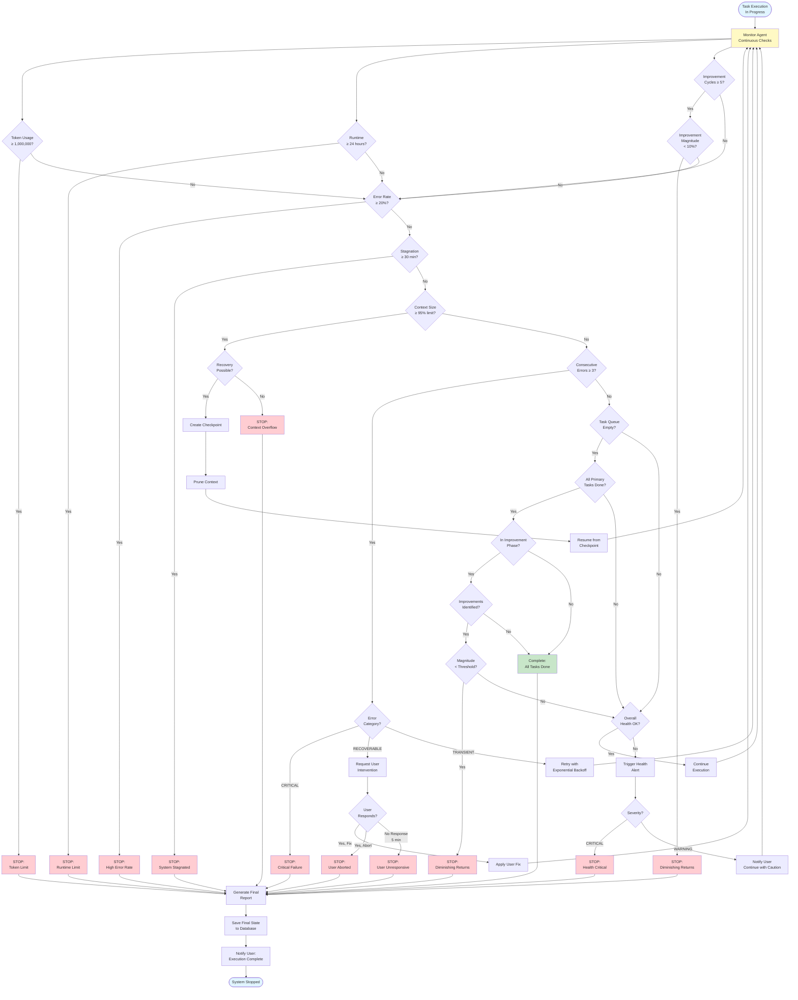

# Stopping Conditions Flowchart

## Description
This detailed flowchart shows all stopping triggers in the Moderator system, including resource limits, quality thresholds, diminishing returns detection, and user intervention points. The system continuously evaluates these conditions to determine when to halt execution.

## Diagram



## Stopping Conditions Detail

### 1. Resource Limits

#### Token Limit
**Threshold**: 1,000,000 tokens
**Check Frequency**: After each task completion
**Rationale**: Prevents runaway costs

```python
if metrics.tokens_used >= 1_000_000:
    return StopReason.TOKEN_LIMIT, "Token limit reached"
```

#### Runtime Limit
**Threshold**: 24 hours
**Check Frequency**: Every 5 minutes
**Rationale**: Prevents infinite execution

```python
elapsed = current_time - start_time
if elapsed >= 24 * 3600:  # 24 hours in seconds
    return StopReason.RUNTIME_LIMIT, "Runtime limit exceeded"
```

#### Context Size Limit
**Threshold**: 95% of context window
**Check Frequency**: Before each LLM call
**Recovery**: Create checkpoint, prune context, resume

```python
context_ratio = context_size / context_limit
if context_ratio >= 0.95:
    if recovery_possible():
        create_checkpoint()
        prune_context()
        resume()
    else:
        return StopReason.CONTEXT_OVERFLOW, "Context window full"
```

### 2. Quality Thresholds

#### Error Rate
**Threshold**: 20% of tasks failing
**Check Frequency**: After each task
**Calculation**: `error_count / total_tasks`

```python
error_rate = error_count / total_tasks
if error_rate >= 0.20:
    return StopReason.HIGH_ERROR_RATE, f"Error rate: {error_rate:.1%}"
```

#### Stagnation Detection
**Threshold**: 30 minutes without progress
**Check Frequency**: Every minute
**Progress Indicators**:
- Task completion
- PR submission
- Issue resolution

```python
if minutes_since_progress >= 30:
    return StopReason.STAGNATION, "No progress for 30 minutes"
```

#### Consecutive Errors
**Threshold**: 3 consecutive task failures
**Check Frequency**: After each error
**Action**: Depends on error category

```python
if consecutive_errors >= 3:
    if error_category == ErrorCategory.CRITICAL:
        return StopReason.CRITICAL_FAILURE
    elif error_category == ErrorCategory.RECOVERABLE:
        request_user_intervention()
    elif error_category == ErrorCategory.TRANSIENT:
        retry_with_backoff()
```

### 3. Diminishing Returns

#### Improvement Magnitude
**Threshold**: 10% improvement minimum
**Check Frequency**: End of each improvement cycle
**Calculation**: Compare metrics before/after cycle

```python
def calculate_improvement_magnitude(current, previous):
    improvements = {
        'test_coverage': (current.coverage - previous.coverage) / previous.coverage,
        'code_quality': (current.quality - previous.quality) / previous.quality,
        'performance': (current.performance - previous.performance) / previous.performance
    }

    avg_improvement = sum(improvements.values()) / len(improvements)
    return avg_improvement

if improvement_magnitude < 0.10:  # Less than 10%
    return StopReason.DIMINISHING_RETURNS, f"Improvement: {improvement_magnitude:.1%}"
```

#### Maximum Improvement Cycles
**Threshold**: 5 cycles
**Check Frequency**: Start of each improvement cycle
**Rationale**: Prevents endless optimization

```python
if improvement_cycles >= 5:
    if improvement_magnitude < MIN_IMPROVEMENT_MAGNITUDE:
        return StopReason.DIMINISHING_RETURNS
```

### 4. User Intervention

#### Manual Stop Request
**Trigger**: User sends STOP signal
**Action**: Immediate graceful shutdown

```python
if user_requested_stop:
    return StopReason.USER_STOPPED, "User requested stop"
```

#### Intervention Timeout
**Threshold**: 5 minutes waiting for user response
**Trigger**: System requests intervention, user unresponsive
**Action**: Assume abort and stop

```python
if intervention_requested and time_since_request >= 300:  # 5 minutes
    return StopReason.USER_UNRESPONSIVE, "No response to intervention request"
```

#### Off-Topic Detection
**Trigger**: System diverging from original requirements
**Action**: Request user guidance

```python
if calculate_topic_drift(current_work, original_requirements) > 0.5:
    request_user_intervention("Work diverging from requirements")
```

### 5. Health Checks

#### System Health Score
**Components**:
- Token usage (30% weight)
- Context size (25% weight)
- Error rate (25% weight)
- Progress rate (20% weight)

**Threshold**: Health score < 20%

```python
def calculate_health_score():
    token_health = 1 - (tokens_used / token_limit)
    context_health = 1 - (context_size / context_limit)
    error_health = 1 - (error_count / error_threshold)
    progress_health = 1 if minutes_since_progress < 10 else 0

    health_score = (
        token_health * 0.30 +
        context_health * 0.25 +
        error_health * 0.25 +
        progress_health * 0.20
    )

    return health_score

if health_score < 0.20:
    return StopReason.HEALTH_CRITICAL, f"Health: {health_score:.0%}"
```

## Recovery Procedures

### Context Overflow Recovery
1. Save current state to checkpoint
2. Clear agent context (keep essentials)
3. Reload only critical information:
   - Current task
   - Acceptance criteria
   - Recent 3 commits
4. Resume from last successful task

### Error Recovery
1. **TRANSIENT errors**: Exponential backoff (1s, 2s, 4s)
2. **RECOVERABLE errors**: Request user intervention
3. **CRITICAL errors**: Stop immediately

### Stagnation Recovery
1. Analyze last 5 actions
2. If same action repeated: Try alternative approach
3. If different actions: Request user guidance

## References
- PRD: moderator-prd.md - Section 6 "Stopping Conditions" (lines 365-413)
- PRD: moderator-prd.md - Section 6.1 "Automatic Stopping Triggers" with code examples
- Architecture: archetcture.md - "Critical Architecture Questions" (lines 177-190)
- CLAUDE.md: Important Notes - limits and thresholds (lines 272-279)
