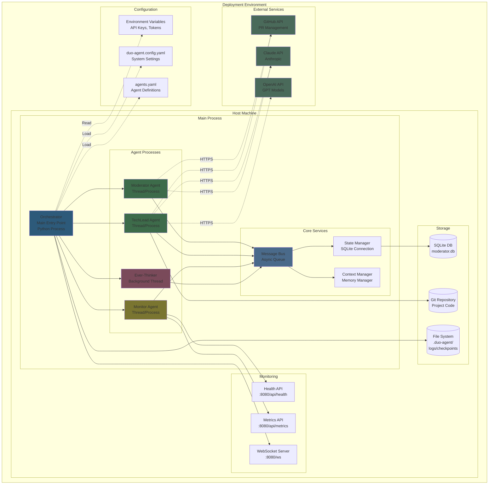

# System Deployment Architecture

## Description
This deployment diagram shows the environment setup, container/process structure, external service dependencies (Git, LLM APIs), configuration management, and monitoring endpoints for the Moderator system.

## Diagram



## Environment Setup

### Required Environment Variables

```bash
# API Keys and Tokens
export DUO_AGENT_API_KEY="claude-api-key-here"
export DUO_AGENT_GIT_TOKEN="github-token-here"
export OPENAI_API_KEY="openai-key-here"  # Optional

# System Configuration
export DUO_AGENT_WORKSPACE="/path/to/workspace"
export DUO_AGENT_LOG_LEVEL="INFO"  # DEBUG, INFO, WARNING, ERROR
export DUO_AGENT_MODEL_PROVIDER="anthropic"  # or "openai"

# Monitoring
export DUO_AGENT_MONITOR_PORT="8080"
export DUO_AGENT_ENABLE_WEBSOCKET="true"

# Resource Limits
export DUO_AGENT_MAX_TOKENS="1000000"
export DUO_AGENT_MAX_CONTEXT="100000"
export DUO_AGENT_MAX_RUNTIME_HOURS="24"

# Features
export DUO_AGENT_ENABLE_SPECIALISTS="false"  # Not yet implemented
export DUO_AGENT_ENABLE_LEARNING="false"    # Not yet implemented
```

### Configuration Files

**duo-agent.config.yaml**
```yaml
project:
  name: "example-project"
  type: "web_app"
  language: "python"

agents:
  moderator:
    model: "claude-3-opus"
    temperature: 0.3
    max_tokens: 8000

  techlead:
    model: "claude-3-opus"
    temperature: 0.5
    max_tokens: 8000

  monitor:
    check_interval_seconds: 60
    alert_channels: ["console", "log"]

limits:
  max_tokens_total: 1000000
  max_runtime_hours: 24
  max_improvement_cycles: 5
  max_error_rate: 0.20
  stagnation_minutes: 30

git:
  provider: "github"
  repository: "org/repo"
  branch_prefix: "duo-agent"
```

**agents.yaml**
```yaml
agents:
  generator:
    name: "Code Generator"
    type: "generator"
    system_prompt: "You are an expert software engineer..."
    temperature: 0.7
    max_tokens: 4000

  reviewer:
    name: "Code Reviewer"
    type: "reviewer"
    system_prompt: "You are a critical senior code reviewer..."
    temperature: 0.3
    max_tokens: 2000
```

## Container/Process Structure

### Main Process Architecture

```python
# Entry point: main.py
if __name__ == "__main__":
    # Load configuration
    config = load_config("duo-agent.config.yaml")
    env_config = load_environment_variables()

    # Initialize logging
    setup_logging(level=env_config.log_level)

    # Create core services
    state_manager = StateManager(config.database_path)
    message_bus = MessageBus()
    context_manager = ContextManager(config.max_context)

    # Create agents (threads or processes)
    moderator = ModeratorAgent(
        config=config.agents.moderator,
        message_bus=message_bus,
        state_manager=state_manager
    )

    techlead = TechLeadAgent(
        config=config.agents.techlead,
        message_bus=message_bus,
        state_manager=state_manager
    )

    monitor = MonitorAgent(
        config=config.agents.monitor,
        message_bus=message_bus,
        state_manager=state_manager
    )

    # Start agents
    moderator.start()  # Run in separate thread/process
    techlead.start()
    monitor.start()

    # Start monitoring endpoints
    monitoring_server = MonitoringServer(port=config.monitor_port)
    monitoring_server.start()

    # Main orchestration loop
    orchestrator = Orchestrator(
        moderator=moderator,
        techlead=techlead,
        monitor=monitor,
        state_manager=state_manager
    )

    # Execute user request
    result = orchestrator.execute(user_requirements)
```

### Process Model Options

**Option 1: Thread-based (Current)**
- All agents run as threads in single process
- Shared memory space
- Simpler deployment
- Lower overhead

**Option 2: Multi-process (Future)**
- Each agent runs in separate process
- Isolated memory spaces
- Better fault isolation
- Higher resource usage

**Option 3: Container-based (Future)**
- Each agent in separate container
- Orchestrated with Docker Compose
- Best isolation and scalability
- Most complex deployment

## External Service Dependencies

### GitHub API
- **Purpose**: PR creation, review, merge
- **Authentication**: Personal Access Token
- **Rate Limits**: 5000 requests/hour (authenticated)
- **Endpoints Used**:
  - `POST /repos/{owner}/{repo}/pulls`
  - `GET /repos/{owner}/{repo}/pulls/{number}`
  - `PATCH /repos/{owner}/{repo}/pulls/{number}`
  - `PUT /repos/{owner}/{repo}/pulls/{number}/merge`

### Claude API (Anthropic)
- **Purpose**: LLM for agent intelligence
- **Authentication**: API Key
- **Rate Limits**: Varies by plan
- **Models Used**:
  - `claude-3-opus-20240229` (Moderator, TechLead)
  - `claude-3-haiku-20240307` (Monitor)

### OpenAI API (Optional)
- **Purpose**: Alternative LLM provider
- **Authentication**: API Key
- **Rate Limits**: Varies by plan
- **Models Used**:
  - `gpt-4-turbo-preview`
  - `gpt-3.5-turbo`

## Monitoring Endpoints

### Health Check Endpoint
```
GET /api/health

Response:
{
  "status": "healthy",
  "uptime_seconds": 9240,
  "agents": {
    "moderator": "active",
    "techlead": "active",
    "monitor": "active"
  }
}
```

### Metrics Endpoint
```
GET /api/metrics

Response:
{
  "tokens_used": 425240,
  "context_size": 34500,
  "tasks_completed": 12,
  "prs_merged": 9
}
```

### WebSocket Endpoint
```
WS /ws

Streams real-time updates for dashboard
```

## Deployment Checklist

### Pre-Deployment
- [ ] Python 3.9+ installed
- [ ] Git installed and configured
- [ ] Claude CLI installed (`claude --version`)
- [ ] Required Python packages installed (`pip install -e .`)
- [ ] Environment variables set
- [ ] Configuration files created
- [ ] API keys obtained and configured

### Deployment
- [ ] Clone repository
- [ ] Install dependencies
- [ ] Configure environment
- [ ] Test API connections
- [ ] Run health check
- [ ] Start system

### Post-Deployment
- [ ] Verify all agents started
- [ ] Check monitoring endpoints
- [ ] Test basic functionality
- [ ] Monitor logs for errors
- [ ] Verify database created

## Docker Deployment (Future)

### Dockerfile
```dockerfile
FROM python:3.11-slim

WORKDIR /app

# Install system dependencies
RUN apt-get update && apt-get install -y \
    git \
    && rm -rf /var/lib/apt/lists/*

# Install Python dependencies
COPY requirements.txt .
RUN pip install --no-cache-dir -r requirements.txt

# Copy application
COPY . .

# Install application
RUN pip install -e .

# Expose monitoring port
EXPOSE 8080

# Run application
CMD ["python", "-m", "moderator.cli", "execute"]
```

### Docker Compose
```yaml
version: '3.8'

services:
  moderator:
    build: .
    environment:
      - DUO_AGENT_API_KEY=${DUO_AGENT_API_KEY}
      - DUO_AGENT_GIT_TOKEN=${DUO_AGENT_GIT_TOKEN}
    volumes:
      - ./workspace:/workspace
      - ./moderator.db:/app/moderator.db
    ports:
      - "8080:8080"
```

## References
- PRD: moderator-prd.md - Section 13 "Deployment Instructions" (lines 818-871)
- PRD: moderator-prd.md - Section 13.1 "Environment Setup" (lines 821-832)
- PRD: moderator-prd.md - Section 13.2 "Initial Execution" with main.py example (lines 835-871)
