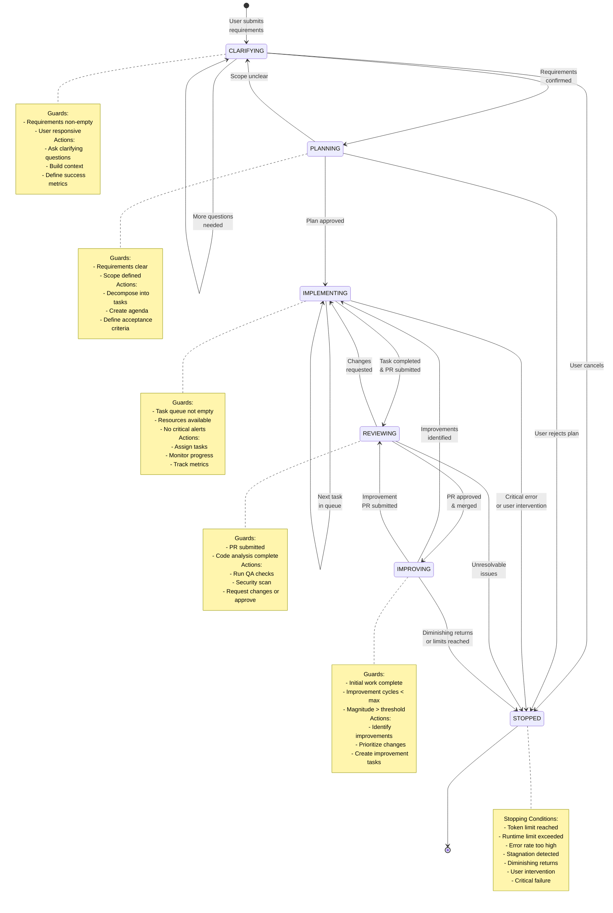

# System State Machine

## Description
This diagram shows the WorkPhase transitions in the Moderator system, including triggers, conditions, and guards for each state transition. The system progresses through different phases from clarification to completion.

## Diagram

## State Descriptions

### CLARIFYING
**Purpose**: Gather and refine user requirements
**Entry Conditions**:
- User submits initial requirements
- System initialized

**Exit Conditions**:
- Requirements are clear and complete
- Success metrics defined
- Scope boundaries established

**Guards**:
- Requirements must be non-empty
- User must be responsive

**Actions**:
- Parse initial requirements
- Identify ambiguities
- Ask clarifying questions
- Define success metrics
- Build project context

### PLANNING
**Purpose**: Create executable project plan
**Entry Conditions**:
- Requirements clarified
- User approved requirements

**Exit Conditions**:
- Task decomposition complete
- Agenda created and approved
- Dependencies mapped

**Guards**:
- Requirements must be clear
- Scope must be defined
- Resources must be available

**Actions**:
- Decompose into PR-sized tasks
- Create task dependencies
- Define acceptance criteria
- Estimate effort
- Present plan to user

### IMPLEMENTING
**Purpose**: Execute tasks and generate code
**Entry Conditions**:
- Plan approved
- Task queue populated

**Exit Conditions**:
- All primary tasks complete
- PRs submitted for review

**Guards**:
- Task queue not empty
- Resources available (tokens, context)
- No critical health alerts
- Error rate below threshold

**Actions**:
- Assign next priority task
- Monitor TechLead progress
- Track health metrics
- Handle specialist requests
- Update progress metrics

**Parallel States**:
- Multiple tasks can be in progress
- Specialist agents work in parallel
- Monitor runs continuously

### REVIEWING
**Purpose**: Quality assurance and PR approval
**Entry Conditions**:
- PR submitted by TechLead
- Code changes ready

**Exit Conditions**:
- PR approved and merged OR
- Changes requested to TechLead

**Guards**:
- PR must be submitted
- Code analysis must complete
- No pending specialist work

**Actions**:
- Run code analyzer
- Perform security scan
- Check test coverage
- Review against acceptance criteria
- Provide feedback or approve

### IMPROVING
**Purpose**: Continuous improvement cycle
**Entry Conditions**:
- Initial implementation complete
- Improvement cycles < max limit

**Exit Conditions**:
- Improvement magnitude below threshold OR
- Max improvement cycles reached OR
- No improvements identified

**Guards**:
- Initial work completed
- Improvement cycles < MAX_IMPROVEMENT_CYCLES
- Improvement magnitude > MIN_IMPROVEMENT_MAGNITUDE
- Resources still available

**Actions**:
- Analyze from multiple angles (performance, quality, UX, testing, docs, architecture)
- Identify improvement opportunities
- Prioritize by impact/effort
- Create improvement tasks
- Track improvement magnitude

### STOPPED
**Purpose**: Terminal state, system halted
**Entry Conditions**:
- Any stopping condition triggered
- User manually stops system

**Exit Conditions**:
- None (terminal state)

**Stopping Triggers**:
- Token limit reached (≥ 1,000,000)
- Runtime limit exceeded (≥ 24 hours)
- Error rate too high (≥ 20%)
- Stagnation (> 30 minutes no progress)
- Diminishing returns (improvement < 10%)
- User intervention requested
- Critical unrecoverable error

## Transition Matrix

| From State | To State | Trigger | Guard |
|------------|----------|---------|-------|
| CLARIFYING | PLANNING | Requirements confirmed | Requirements clear |
| CLARIFYING | CLARIFYING | More questions needed | Ambiguities exist |
| CLARIFYING | STOPPED | User cancels | - |
| PLANNING | IMPLEMENTING | Plan approved | User accepts plan |
| PLANNING | CLARIFYING | Scope unclear | Requirements ambiguous |
| PLANNING | STOPPED | User rejects | Plan not acceptable |
| IMPLEMENTING | REVIEWING | PR submitted | Task complete |
| IMPLEMENTING | IMPLEMENTING | Next task | Queue not empty |
| IMPLEMENTING | STOPPED | Critical error | Unrecoverable error |
| REVIEWING | IMPLEMENTING | Changes requested | PR needs work |
| REVIEWING | IMPROVING | PR merged | All primary tasks done |
| REVIEWING | STOPPED | Unresolvable issues | Cannot fix issues |
| IMPROVING | IMPLEMENTING | Improvements found | Magnitude > threshold |
| IMPROVING | REVIEWING | Improvement PR ready | PR submitted |
| IMPROVING | STOPPED | Diminishing returns | Magnitude < threshold |

## References
- PRD: moderator-prd.md - Section 3.1 "Core Data Structures", WorkPhase enumeration (lines 147-153)
- PRD: moderator-prd.md - Section 6 "Stopping Conditions" (lines 365-413)
- Architecture: archetcture.md - "The Data Flow" (lines 117-129)
