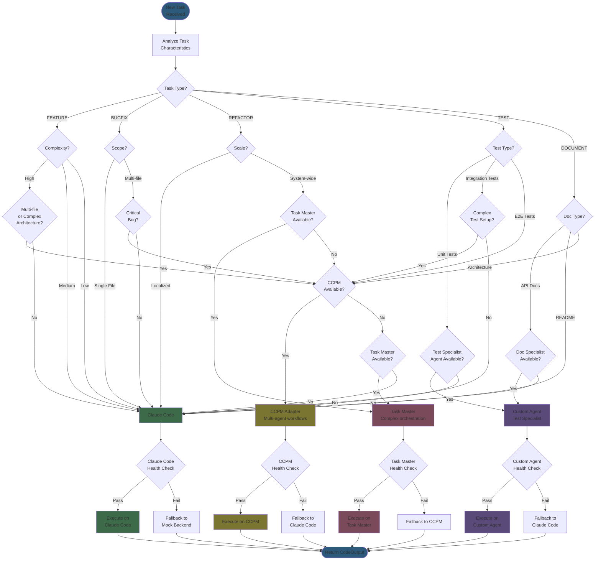

# Task Routing Decision Tree

## Description
This flowchart shows the backend selection logic used by the ExecutionRouter to determine which backend (CCPM, Claude Code, Task Master, or Custom Agents) should execute each task. Includes decision criteria, task type categorization, and fallback chains.

## Diagram



## Backend Selection Criteria

### Claude Code (Primary Backend)
**Best For**:
- Single-file features
- Medium complexity tasks
- Bug fixes (localized)
- Unit test creation
- Documentation (README, inline comments)
- Refactoring (single module)

**Task Examples**:
```python
examples = [
    "Add input validation to login function",
    "Create unit tests for User model",
    "Refactor authentication middleware",
    "Update README with installation instructions",
    "Fix null pointer exception in handler"
]
```

**Decision Factors**:
- Task scope: Single file or small module
- Complexity: Low to medium
- Dependencies: Minimal cross-file dependencies
- Time estimate: < 30 minutes

### CCPM (Multi-Agent Workflows)
**Best For**:
- Complex multi-file features
- System-wide changes
- E2E test suites
- Architecture documentation
- Critical bug fixes

**Task Examples**:
```python
examples = [
    "Implement complete user authentication system",
    "Build REST API with 10+ endpoints",
    "Create comprehensive E2E test suite",
    "Design and document microservices architecture",
    "Refactor database layer across entire application"
]
```

**Decision Factors**:
- Task scope: Multiple files, multiple modules
- Complexity: High
- Coordination: Requires multiple perspectives
- Time estimate: 1-4 hours

### Task Master (Complex Orchestration)
**Best For**:
- System-wide refactoring
- Complex integration tasks
- Multi-phase implementations
- Parallel task execution

**Task Examples**:
```python
examples = [
    "Migrate from MongoDB to PostgreSQL",
    "Refactor entire codebase to TypeScript",
    "Implement microservices architecture",
    "Add caching layer across all services"
]
```

**Decision Factors**:
- Task scope: System-wide impact
- Complexity: Very high
- Coordination: Complex dependencies
- Time estimate: 4+ hours

### Custom Agents (Specialists)
**Best For**:
- Domain-specific tasks
- Specialized expertise needed
- Repeated patterns
- User-defined workflows

**Available Specialists**:
1. **api_designer**: REST/GraphQL API design
2. **test_specialist**: Comprehensive test creation
3. **refactoring_expert**: Code optimization
4. **documentation_writer**: Technical documentation

**Task Examples**:
```python
examples = {
    "api_designer": "Design REST API following OpenAPI spec",
    "test_specialist": "Create test suite with 90% coverage",
    "refactoring_expert": "Optimize database queries for performance",
    "documentation_writer": "Generate API documentation"
}
```

**Decision Factors**:
- Specialized knowledge required
- Repeated task pattern
- Custom agent defined in system
- Task fits specialist's expertise

## Fallback Chain

### Primary Fallback Chain
```
CCPM → Task Master → Claude Code → Mock Backend
```

### Secondary Chains
```
Task Master → CCPM → Claude Code → Mock Backend
Custom Agent → Claude Code → Mock Backend
```

### Fallback Triggers
1. **Health Check Failure**: Backend not responding
2. **Rate Limit**: API quota exceeded
3. **Context Overflow**: Task too large for backend
4. **Execution Timeout**: Backend takes too long
5. **Repeated Errors**: 3+ consecutive failures

## Task Complexity Scoring

```python
def calculate_complexity(task):
    score = 0

    # File count estimate
    if estimated_files > 5:
        score += 3
    elif estimated_files > 2:
        score += 2
    else:
        score += 1

    # Dependencies
    score += len(task.dependencies)

    # Description length (proxy for complexity)
    if len(task.description) > 500:
        score += 2

    # Acceptance criteria count
    score += len(task.acceptance_criteria)

    # Keyword indicators
    complex_keywords = ['architecture', 'system-wide', 'migrate', 'refactor all']
    for keyword in complex_keywords:
        if keyword in task.description.lower():
            score += 2

    return score

# Scoring thresholds
LOW_COMPLEXITY = score <= 3
MEDIUM_COMPLEXITY = 4 <= score <= 7
HIGH_COMPLEXITY = score > 7
```

## Backend Availability Matrix

| Backend | Status | Supported Tasks | Avg Response Time |
|---------|--------|-----------------|-------------------|
| Claude Code | ✅ Real | ALL | 30-60s |
| CCPM | 🚧 Stub | FEATURE (complex) | N/A |
| Task Master | 🚧 Stub | REFACTOR (system) | N/A |
| Custom Agents | 🚧 Stub | Specialist tasks | N/A |

**Legend**:
- ✅ Real: Fully implemented and operational
- 🚧 Stub: Placeholder implementation, returns mock data

## References
- CLAUDE.md: Backend Architecture (lines 84-95)
- CLAUDE.md: ExecutionRouter - "currently stub: always uses Claude Code" (line 43)
- Architecture: archetcture.md - "Backend Agnostic Design" (lines 91-94)
- PRD: moderator-prd.md - Backend routing logic mentioned throughout
