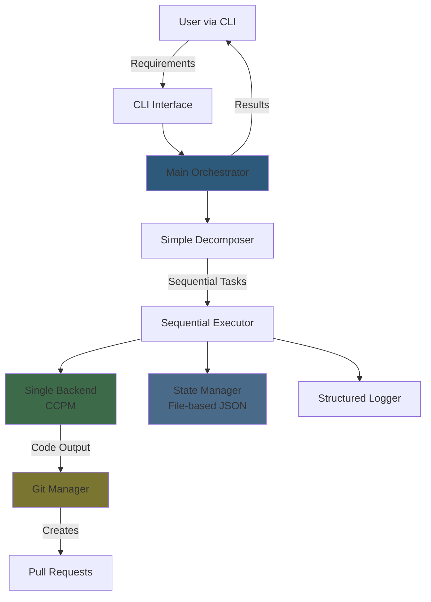

# Gear 1 Implementation Plan: Single-Agent Linear Execution

## Executive Summary

### Gear 1 Objectives
Create the **simplest possible working implementation** of Moderator that demonstrates value end-to-end:
- Single agent executes tasks sequentially (no orchestration)
- One backend only (CCPM recommended for simplicity)
- Manual approvals for all decisions
- Basic logging and state persistence
- Complete Git workflow with PR creation

### Success Criteria
- ✅ Accept user requirements as input
- ✅ Break requirements into 3-5 sequential tasks
- ✅ Execute each task using a single backend
- ✅ Create a PR for each task
- ✅ Log all activities comprehensively
- ✅ Save state to recover from failures
- ✅ Complete a simple project (TODO app) end-to-end in < 30 minutes

### What Works End-to-End
1. CLI accepts user requirements
2. Simple decomposer breaks requirements into tasks
3. Single agent executes each task sequentially
4. Git manager creates feature branches and PRs
5. State manager persists all data
6. Comprehensive logging for debugging
7. Manual review gates for quality control

### What is Explicitly NOT Included
- ❌ Multiple agents (Moderator, TechLead, Monitor)
- ❌ Automated code review
- ❌ Multiple backends / backend routing
- ❌ Parallel task execution
- ❌ Improvement cycles / Ever-Thinker
- ❌ Learning system
- ❌ Specialist agents
- ❌ Self-healing
- ❌ Real-time monitoring dashboard
- ❌ Advanced QA (security scanning, test generation)

### Expected Timeline
**3-5 days of focused development**

Day 1: Project setup + Core data models + State management
Day 2: Simple task decomposer + Backend integration
Day 3: Git workflow + PR creation
Day 4: CLI + Logging + End-to-end testing
Day 5: Polish + Documentation + Validation

---

## System Architecture for Gear 1

### Simplified Architecture Diagram



### Components Needed
- ✅ **CLI Interface**: Accept commands, display progress
- ✅ **Main Orchestrator**: Coordinate the flow
- ✅ **Simple Decomposer**: Break requirements into tasks (template-based)
- ✅ **Sequential Executor**: Run tasks one at a time
- ✅ **Backend Integration**: Single backend (CCPM or mock)
- ✅ **Git Manager**: Branch creation, commit, PR creation
- ✅ **State Manager**: File-based persistence (JSON)
- ✅ **Structured Logger**: Comprehensive activity logs

### Components Deferred to Later Gears
- ❌ Multi-agent system
- ❌ Backend router
- ❌ QA layer
- ❌ Improvement engine
- ❌ Learning database
- ❌ Monitor agent
- ❌ Health checks

---

## Core Data Models

### Minimal Data Structures

```python
# src/models.py

from dataclasses import dataclass, field, asdict
from typing import List, Dict, Any, Optional
from datetime import datetime
from enum import Enum
import json

class TaskStatus(Enum):
    PENDING = "pending"
    RUNNING = "running"
    COMPLETED = "completed"
    FAILED = "failed"
    SKIPPED = "skipped"

class ProjectPhase(Enum):
    INITIALIZING = "initializing"
    DECOMPOSING = "decomposing"
    EXECUTING = "executing"
    COMPLETED = "completed"
    FAILED = "failed"

@dataclass
class Task:
    """A single unit of work"""
    id: str
    description: str
    acceptance_criteria: List[str]
    status: TaskStatus = TaskStatus.PENDING
    branch_name: Optional[str] = None
    pr_url: Optional[str] = None
    pr_number: Optional[int] = None
    files_generated: List[str] = field(default_factory=list)
    created_at: str = field(default_factory=lambda: datetime.now().isoformat())
    started_at: Optional[str] = None
    completed_at: Optional[str] = None
    error: Optional[str] = None

    def to_dict(self) -> Dict:
        d = asdict(self)
        d['status'] = self.status.value
        return d

@dataclass
class ProjectState:
    """Overall project state"""
    project_id: str
    requirements: str
    phase: ProjectPhase = ProjectPhase.INITIALIZING
    tasks: List[Task] = field(default_factory=list)
    current_task_index: int = 0
    created_at: str = field(default_factory=lambda: datetime.now().isoformat())
    completed_at: Optional[str] = None

    def to_dict(self) -> Dict:
        return {
            'project_id': self.project_id,
            'requirements': self.requirements,
            'phase': self.phase.value,
            'tasks': [t.to_dict() for t in self.tasks],
            'current_task_index': self.current_task_index,
            'created_at': self.created_at,
            'completed_at': self.completed_at
        }

    @staticmethod
    def from_dict(data: Dict) -> 'ProjectState':
        data['phase'] = ProjectPhase(data['phase'])
        tasks = [Task(**{**t, 'status': TaskStatus(t['status'])})
                 for t in data['tasks']]
        data['tasks'] = tasks
        return ProjectState(**data)

@dataclass
class WorkLogEntry:
    """Single log entry for audit trail"""
    timestamp: str = field(default_factory=lambda: datetime.now().isoformat())
    level: str = "INFO"  # DEBUG, INFO, WARN, ERROR
    component: str = ""  # decomposer, executor, git_manager, etc.
    action: str = ""
    details: Dict[str, Any] = field(default_factory=dict)
    task_id: Optional[str] = None

    def to_dict(self) -> Dict:
        return asdict(self)
```

### File-Based Persistence Structure

```
moderator-gear1/
├── state/
│   └── project_{id}/
│       ├── project.json          # ProjectState
│       ├── logs.jsonl           # WorkLogEntry (one per line)
│       └── artifacts/
│           ├── task_{id}/
│           │   ├── generated/   # Generated code files
│           │   └── metadata.json
```

---

## Implementation Modules

### Project Structure

```
moderator-gear1/
├── src/
│   ├── __init__.py
│   ├── models.py                # Data structures
│   ├── orchestrator.py          # Main coordinator
│   ├── decomposer.py            # Task decomposition
│   ├── executor.py              # Sequential execution
│   ├── backend.py               # Backend interface + CCPM adapter
│   ├── git_manager.py           # Git operations
│   ├── state_manager.py         # State persistence
│   └── logger.py                # Structured logging
├── config/
│   └── config.yaml              # Configuration
├── state/                       # Runtime state (git-ignored)
├── logs/                        # Log files
├── tests/
│   ├── test_decomposer.py
│   ├── test_executor.py
│   └── test_integration.py
├── main.py                      # Entry point
├── requirements.txt
└── README.md
```

---

## Module Specifications

### 1. models.py (see Core Data Models section above)

### 2. state_manager.py

**Purpose**: Persist and recover project state

```python
# src/state_manager.py

import json
import os
from pathlib import Path
from typing import Optional
from .models import ProjectState, WorkLogEntry

class StateManager:
    """Manages project state persistence to filesystem"""

    def __init__(self, base_dir: str = "./state"):
        self.base_dir = Path(base_dir)
        self.base_dir.mkdir(parents=True, exist_ok=True)

    def save_project(self, state: ProjectState) -> None:
        """Save project state to JSON file"""
        project_dir = self.base_dir / f"project_{state.project_id}"
        project_dir.mkdir(parents=True, exist_ok=True)

        state_file = project_dir / "project.json"
        with open(state_file, 'w') as f:
            json.dump(state.to_dict(), f, indent=2)

    def load_project(self, project_id: str) -> Optional[ProjectState]:
        """Load project state from JSON file"""
        state_file = self.base_dir / f"project_{project_id}" / "project.json"

        if not state_file.exists():
            return None

        with open(state_file, 'r') as f:
            data = json.load(f)

        return ProjectState.from_dict(data)

    def append_log(self, project_id: str, entry: WorkLogEntry) -> None:
        """Append log entry to JSONL file"""
        project_dir = self.base_dir / f"project_{project_id}"
        project_dir.mkdir(parents=True, exist_ok=True)

        log_file = project_dir / "logs.jsonl"
        with open(log_file, 'a') as f:
            f.write(json.dumps(entry.to_dict()) + '\n')

    def get_artifacts_dir(self, project_id: str, task_id: str) -> Path:
        """Get directory for task artifacts"""
        artifacts_dir = (self.base_dir / f"project_{project_id}" /
                        "artifacts" / f"task_{task_id}" / "generated")
        artifacts_dir.mkdir(parents=True, exist_ok=True)
        return artifacts_dir
```

### 3. logger.py

**Purpose**: Structured logging for debugging and audit

```python
# src/logger.py

import sys
from typing import Any, Dict, Optional
from .models import WorkLogEntry
from .state_manager import StateManager

class StructuredLogger:
    """Logs events in structured format"""

    def __init__(self, project_id: str, state_manager: StateManager):
        self.project_id = project_id
        self.state_manager = state_manager

    def log(self, level: str, component: str, action: str,
            details: Dict[str, Any] = None, task_id: Optional[str] = None):
        """Log a structured entry"""

        entry = WorkLogEntry(
            level=level,
            component=component,
            action=action,
            details=details or {},
            task_id=task_id
        )

        # Save to file
        self.state_manager.append_log(self.project_id, entry)

        # Print to console
        icon = {"DEBUG": "🔍", "INFO": "ℹ️", "WARN": "⚠️", "ERROR": "❌"}
        print(f"{icon.get(level, '')} [{component}] {action}", file=sys.stderr)
        if details:
            for key, value in details.items():
                print(f"   {key}: {value}", file=sys.stderr)

    def debug(self, component: str, action: str, **kwargs):
        self.log("DEBUG", component, action, kwargs)

    def info(self, component: str, action: str, **kwargs):
        self.log("INFO", component, action, kwargs)

    def warn(self, component: str, action: str, **kwargs):
        self.log("WARN", component, action, kwargs)

    def error(self, component: str, action: str, **kwargs):
        self.log("ERROR", component, action, kwargs)
```

### 4. decomposer.py

**Purpose**: Break requirements into sequential tasks

```python
# src/decomposer.py

import uuid
from typing import List
from .models import Task, TaskStatus

class SimpleDecomposer:
    """Breaks requirements into tasks using templates"""

    # Template for web application projects
    WEB_APP_TEMPLATE = [
        {
            "description": "Set up project structure and dependencies",
            "criteria": [
                "Directory structure created",
                "Dependencies file (requirements.txt/package.json) created",
                "Basic configuration files present"
            ]
        },
        {
            "description": "Implement core data models and database schema",
            "criteria": [
                "Data models defined",
                "Database schema created",
                "Basic CRUD operations work"
            ]
        },
        {
            "description": "Create main application logic and API endpoints",
            "criteria": [
                "API endpoints implemented",
                "Business logic complete",
                "Error handling in place"
            ]
        },
        {
            "description": "Add tests and documentation",
            "criteria": [
                "Unit tests added",
                "Integration tests added",
                "README with usage instructions",
                "API documentation"
            ]
        }
    ]

    def decompose(self, requirements: str) -> List[Task]:
        """
        Decompose requirements into tasks.

        For Gear 1: Use simple template-based decomposition.
        Future: Use LLM-based decomposition.
        """

        # For now, use generic template
        # TODO: Add project type detection
        template = self.WEB_APP_TEMPLATE

        tasks = []
        for i, task_template in enumerate(template, 1):
            task_id = f"task_{i:03d}_{uuid.uuid4().hex[:6]}"

            # Augment description with requirements context
            description = f"{task_template['description']}. Context: {requirements}"

            task = Task(
                id=task_id,
                description=description,
                acceptance_criteria=task_template['criteria'],
                status=TaskStatus.PENDING
            )
            tasks.append(task)

        return tasks
```

### 5. backend.py

**Purpose**: Execute tasks via backend API

```python
# src/backend.py

import subprocess
import json
import time
from abc import ABC, abstractmethod
from typing import Dict, List
from pathlib import Path

class Backend(ABC):
    """Abstract backend interface"""

    @abstractmethod
    def execute(self, task_description: str, output_dir: Path) -> Dict[str, str]:
        """Execute task and return generated files"""
        pass

    @abstractmethod
    def health_check(self) -> bool:
        """Check if backend is available"""
        pass

class CCPMBackend(Backend):
    """CCPM backend adapter"""

    def __init__(self, api_key: str = None):
        self.api_key = api_key or "dummy-key"  # For testing

    def execute(self, task_description: str, output_dir: Path) -> Dict[str, str]:
        """
        Execute via CCPM API.

        This is the production backend for real code generation.
        """

        print(f"[CCPM] Executing: {task_description}")
        time.sleep(2)  # Simulate processing

        # Generate stub files
        files = {}
        output_dir.mkdir(parents=True, exist_ok=True)

        # Create a dummy file
        dummy_file = output_dir / "generated.py"
        content = f"""# Generated code for: {task_description}

def main():
    print("Hello from generated code!")
    # TODO: Implement actual functionality

if __name__ == "__main__":
    main()
"""
        dummy_file.write_text(content)
        files["generated.py"] = content

        return files

    def health_check(self) -> bool:
        """Check CCPM availability"""
        # For Gear 1: Always return True (stub)
        return True

class TestMockBackend(Backend):
    """
    TEST INFRASTRUCTURE ONLY - Generates dummy files for fast testing.

    This is permanent test infrastructure, not temporary Gear 1 code.

    Use this for:
    ✓ Unit tests (fast, deterministic)
    ✓ Integration tests (no external dependencies)
    ✓ CI/CD pipelines (no API costs)
    ✓ Local development sanity checks

    DO NOT use for production code generation.
    Use CCPMBackend or ClaudeCodeBackend for actual code generation.
    """

    def execute(self, task_description: str, output_dir: Path) -> Dict[str, str]:
        """Generate mock files for testing"""

        print(f"[TEST_MOCK] Executing: {task_description}")

        files = {}
        output_dir.mkdir(parents=True, exist_ok=True)

        # Create README
        readme = output_dir / "README.md"
        readme.write_text(f"# Generated Project\n\n{task_description}\n")
        files["README.md"] = readme.read_text()

        # Create main file
        main_file = output_dir / "main.py"
        main_file.write_text("print('Hello World')\n")
        files["main.py"] = main_file.read_text()

        return files

    def health_check(self) -> bool:
        return True
```

### 6. git_manager.py

**Purpose**: Git operations and PR creation

```python
# src/git_manager.py

import subprocess
import os
from pathlib import Path
from typing import Optional
from .models import Task

class GitManager:
    """Manages Git operations and PR creation"""

    def __init__(self, repo_path: str = "."):
        self.repo_path = Path(repo_path)

    def _run_git(self, *args) -> subprocess.CompletedProcess:
        """Run git command"""
        return subprocess.run(
            ["git", "-C", str(self.repo_path)] + list(args),
            capture_output=True,
            text=True,
            check=True
        )

    def create_branch(self, task: Task) -> str:
        """Create feature branch for task"""

        # Generate branch name
        branch_name = f"moderator-gear1/task-{task.id}"

        try:
            # Create and checkout branch
            self._run_git("checkout", "-b", branch_name)
            task.branch_name = branch_name
            return branch_name
        except subprocess.CalledProcessError as e:
            raise Exception(f"Failed to create branch: {e.stderr}")

    def commit_changes(self, task: Task, files: list[str]) -> None:
        """Commit generated files"""

        try:
            # Stage files
            for file_path in files:
                self._run_git("add", file_path)

            # Create commit message
            message = self._format_commit_message(task)

            # Commit
            self._run_git("commit", "-m", message)

        except subprocess.CalledProcessError as e:
            raise Exception(f"Failed to commit: {e.stderr}")

    def _format_commit_message(self, task: Task) -> str:
        """Format structured commit message"""

        criteria_text = "\n".join(f"- {c}" for c in task.acceptance_criteria)

        return f"""feat: {task.description[:60]}

Task ID: {task.id}

Acceptance Criteria:
{criteria_text}

Generated by: Moderator Gear 1
"""

    def create_pr(self, task: Task) -> tuple[str, int]:
        """Create pull request via GitHub CLI"""

        try:
            # Format PR body
            pr_body = self._format_pr_body(task)

            # Create PR using gh CLI
            result = subprocess.run(
                ["gh", "pr", "create",
                 "--title", f"Task {task.id}: {task.description[:50]}",
                 "--body", pr_body],
                capture_output=True,
                text=True,
                check=True,
                cwd=self.repo_path
            )

            # Extract PR URL from output
            pr_url = result.stdout.strip()

            # Get PR number
            pr_number = int(pr_url.split('/')[-1])

            return pr_url, pr_number

        except subprocess.CalledProcessError as e:
            raise Exception(f"Failed to create PR: {e.stderr}")
        except FileNotFoundError:
            raise Exception("GitHub CLI (gh) not installed")

    def _format_pr_body(self, task: Task) -> str:
        """Format PR description"""

        criteria_checklist = "\n".join(
            f"- [x] {c}" for c in task.acceptance_criteria
        )

        files_list = "\n".join(
            f"- `{f}`" for f in task.files_generated
        )

        return f"""## Task Description
{task.description}

## Acceptance Criteria
{criteria_checklist}

## Files Generated
{files_list}

## Review Notes
- This PR was generated automatically by Moderator Gear 1
- Please review code quality and verify acceptance criteria
- Manual testing recommended before merge

---
Generated by: **Moderator Gear 1** 🤖
Task ID: `{task.id}`
"""
```

### 7. executor.py

**Purpose**: Execute tasks sequentially

```python
# src/executor.py

from pathlib import Path
from typing import Optional
from .models import Task, TaskStatus, ProjectState, ProjectPhase
from .backend import Backend
from .git_manager import GitManager
from .state_manager import StateManager
from .logger import StructuredLogger

class SequentialExecutor:
    """Executes tasks one at a time"""

    def __init__(self,
                 backend: Backend,
                 git_manager: GitManager,
                 state_manager: StateManager,
                 logger: StructuredLogger):
        self.backend = backend
        self.git = git_manager
        self.state = state_manager
        self.logger = logger

    def execute_all(self, project_state: ProjectState) -> None:
        """Execute all tasks sequentially"""

        project_state.phase = ProjectPhase.EXECUTING
        self.state.save_project(project_state)

        for i, task in enumerate(project_state.tasks):
            project_state.current_task_index = i

            self.logger.info("executor", "starting_task",
                           task_id=task.id,
                           description=task.description)

            try:
                self.execute_task(task, project_state.project_id)
                task.status = TaskStatus.COMPLETED

                self.logger.info("executor", "completed_task",
                               task_id=task.id)

            except Exception as e:
                task.status = TaskStatus.FAILED
                task.error = str(e)

                self.logger.error("executor", "task_failed",
                                task_id=task.id,
                                error=str(e))

                # For Gear 1: Stop on first failure
                # Future: Add retry logic
                raise

            finally:
                self.state.save_project(project_state)

        project_state.phase = ProjectPhase.COMPLETED
        self.state.save_project(project_state)

    def execute_task(self, task: Task, project_id: str) -> None:
        """Execute a single task"""

        task.status = TaskStatus.RUNNING

        # Step 1: Create git branch
        self.logger.info("executor", "creating_branch", task_id=task.id)
        branch_name = self.git.create_branch(task)

        # Step 2: Execute via backend
        self.logger.info("executor", "calling_backend", task_id=task.id)
        output_dir = self.state.get_artifacts_dir(project_id, task.id)
        files = self.backend.execute(task.description, output_dir)
        task.files_generated = list(files.keys())

        # Step 3: Commit changes
        self.logger.info("executor", "committing_changes",
                        task_id=task.id,
                        file_count=len(files))

        file_paths = [str(output_dir / f) for f in files.keys()]
        self.git.commit_changes(task, file_paths)

        # Step 4: Create PR
        self.logger.info("executor", "creating_pr", task_id=task.id)
        pr_url, pr_number = self.git.create_pr(task)
        task.pr_url = pr_url
        task.pr_number = pr_number

        # Step 5: Wait for manual review
        self.logger.info("executor", "awaiting_review",
                        task_id=task.id,
                        pr_url=pr_url)

        print(f"\n{'='*60}")
        print(f"⏸️  MANUAL REVIEW REQUIRED")
        print(f"{'='*60}")
        print(f"PR Created: {pr_url}")
        print(f"Task: {task.description}")
        print(f"\nPlease review and merge the PR, then press ENTER to continue...")
        print(f"{'='*60}\n")

        input()  # Wait for user

        self.logger.info("executor", "review_completed", task_id=task.id)
```

### 8. orchestrator.py

**Purpose**: Coordinate the entire flow

```python
# src/orchestrator.py

import uuid
from datetime import datetime
from .models import ProjectState, ProjectPhase
from .decomposer import SimpleDecomposer
from .executor import SequentialExecutor
from .backend import Backend, CCPMBackend, TestMockBackend
from .git_manager import GitManager
from .state_manager import StateManager
from .logger import StructuredLogger

class Orchestrator:
    """Main coordinator for Gear 1"""

    def __init__(self, config: dict):
        self.config = config

        # Initialize state manager and logger first
        self.state_manager = StateManager(config.get('state_dir', './state'))

        # Components will be initialized per project
        self.decomposer = SimpleDecomposer()

    def execute(self, requirements: str) -> ProjectState:
        """Execute complete workflow"""

        # Create project
        project_id = f"proj_{uuid.uuid4().hex[:8]}"

        project_state = ProjectState(
            project_id=project_id,
            requirements=requirements,
            phase=ProjectPhase.INITIALIZING
        )

        # Initialize logger
        logger = StructuredLogger(project_id, self.state_manager)

        logger.info("orchestrator", "project_started",
                   project_id=project_id,
                   requirements=requirements)

        try:
            # Step 1: Decompose requirements
            print("\n" + "="*60)
            print("📋 STEP 1: Decomposing Requirements")
            print("="*60)

            project_state.phase = ProjectPhase.DECOMPOSING
            self.state_manager.save_project(project_state)

            tasks = self.decomposer.decompose(requirements)
            project_state.tasks = tasks

            logger.info("orchestrator", "decomposition_complete",
                       task_count=len(tasks))

            print(f"✅ Created {len(tasks)} tasks:\n")
            for i, task in enumerate(tasks, 1):
                print(f"  {i}. {task.description[:60]}...")

            self.state_manager.save_project(project_state)

            # Get user confirmation
            print("\nProceed with execution? (yes/no): ", end='')
            if input().lower() != 'yes':
                logger.warn("orchestrator", "execution_cancelled_by_user")
                print("Execution cancelled.")
                return project_state

            # Step 2: Execute tasks
            print("\n" + "="*60)
            print("⚙️  STEP 2: Executing Tasks")
            print("="*60)

            # Initialize components
            backend = self._create_backend()
            git_manager = GitManager(self.config.get('repo_path', '.'))

            executor = SequentialExecutor(
                backend=backend,
                git_manager=git_manager,
                state_manager=self.state_manager,
                logger=logger
            )

            executor.execute_all(project_state)

            # Summary
            print("\n" + "="*60)
            print("✅ PROJECT COMPLETED")
            print("="*60)
            print(f"Project ID: {project_id}")
            print(f"Tasks Completed: {len([t for t in tasks if t.status.value == 'completed'])}/{len(tasks)}")
            print(f"PRs Created: {len([t for t in tasks if t.pr_url])}")
            print("="*60 + "\n")

            logger.info("orchestrator", "project_completed",
                       project_id=project_id)

            project_state.completed_at = datetime.now().isoformat()
            self.state_manager.save_project(project_state)

            return project_state

        except Exception as e:
            logger.error("orchestrator", "project_failed",
                        project_id=project_id,
                        error=str(e))

            project_state.phase = ProjectPhase.FAILED
            self.state_manager.save_project(project_state)

            raise

    def _create_backend(self) -> Backend:
        """Create backend based on config"""

        backend_type = self.config.get('backend', {}).get('type', 'test_mock')

        if backend_type == 'ccpm':
            # Production: Real CCPM API for actual code generation
            api_key = self.config.get('backend', {}).get('api_key')
            return CCPMBackend(api_key)
        elif backend_type == 'test_mock':
            # Testing: Fast, deterministic mock for tests/CI
            return TestMockBackend()
        else:
            raise ValueError(f"Unknown backend type: {backend_type}")
```

---

## Configuration Schema

```yaml
# config/config.yaml

# Project settings
project:
  name: "gear1-test-project"
  repo_path: "."  # Path to git repository

# Backend configuration
backend:
  type: "test_mock"  # Options: test_mock (testing), ccpm (production)
  api_key: null  # Required for CCPM backend

# State management
state_dir: "./state"

# Logging
logging:
  level: "INFO"  # DEBUG, INFO, WARN, ERROR
  console: true
```

---

## Testing Philosophy

### Mock Backends are Permanent Test Infrastructure

**IMPORTANT:** `TestMockBackend` is NOT temporary "Gear 1" code. It is **permanent test infrastructure** that exists alongside production backends.

**Why TestMockBackend Exists:**
- ✅ Fast test execution (no network calls, no API costs)
- ✅ Deterministic CI/CD pipelines (no flaky external dependencies)
- ✅ Cost-free development iterations
- ✅ Sanity checks before expensive LLM calls
- ✅ Unit testing of orchestration logic without external services

**When to Use TestMock vs Production Backends:**

```python
# Default: Use TestMockBackend for fast, deterministic tests
pytest tests/                    # Runs with TestMockBackend

# Explicitly run expensive "live" tests with real backends
pytest -m live tests/            # Runs with CCPMBackend, etc.
pytest -m "not live" tests/      # Skip live tests (default)
```

### Test Configuration Strategy

#### For Fast Tests (Default):
```yaml
# test_config.yaml
backend:
  type: "test_mock"  # No API calls, instant responses
```

#### For Live Integration Tests:
```yaml
# production_config.yaml
backend:
  type: "ccpm"
  api_key: "${CCPM_API_KEY}"  # From environment
```

### pytest Configuration

Add to `pytest.ini` or `pyproject.toml`:

```ini
# pytest.ini
[pytest]
markers =
    live: marks tests that require live backends (expensive, slow)
    slow: marks tests that take significant time

# Default: run only non-live tests
addopts = -m "not live"
```

Or in `pyproject.toml`:

```toml
[tool.pytest.ini_options]
markers = [
    "live: marks tests that require live backends (expensive, slow)",
    "slow: marks tests that take significant time",
]
addopts = "-m 'not live'"
```

### Test Structure Examples

#### Fast Unit Test (Default):
```python
# tests/test_orchestrator_fast.py

import pytest
from src.orchestrator import Orchestrator

def test_backend_creation_with_test_mock():
    """Fast test using TestMockBackend"""
    config = {'backend': {'type': 'test_mock'}}
    orch = Orchestrator(config)
    backend = orch._create_backend()

    assert backend.health_check() is True
    # Fast, deterministic, no API costs
```

#### Live Integration Test (Opt-in):
```python
# tests/test_orchestrator_live.py

import pytest
import os
from src.orchestrator import Orchestrator

@pytest.mark.live
def test_ccpm_backend_execution():
    """Expensive test using real CCPM API"""
    if not os.getenv('CCPM_API_KEY'):
        pytest.skip("CCPM_API_KEY not set")

    config = {
        'backend': {
            'type': 'ccpm',
            'api_key': os.getenv('CCPM_API_KEY')
        }
    }
    orch = Orchestrator(config)
    backend = orch._create_backend()

    # This makes real API calls - slow and costs money
    result = backend.execute("Create a hello world script", Path("./tmp"))
    assert len(result) > 0
```

### Running Tests

```bash
# Default: Fast tests only (TestMockBackend)
pytest

# Explicitly run live tests
pytest -m live

# Run all tests (including live)
pytest -m ""

# Verbose output for debugging
pytest -v -m "not live"

# Run specific test file
pytest tests/test_orchestrator_fast.py
```

### CI/CD Integration

In your GitHub Actions or CI pipeline:

```yaml
# .github/workflows/test.yml
name: Tests

on: [push, pull_request]

jobs:
  fast-tests:
    runs-on: ubuntu-latest
    steps:
      - uses: actions/checkout@v3
      - name: Install dependencies
        run: pip install -r requirements.txt
      - name: Run fast tests
        run: pytest -m "not live"  # Only TestMockBackend tests

  live-tests:
    runs-on: ubuntu-latest
    # Only run on main branch or when explicitly triggered
    if: github.ref == 'refs/heads/main'
    steps:
      - uses: actions/checkout@v3
      - name: Install dependencies
        run: pip install -r requirements.txt
      - name: Run live tests
        run: pytest -m live
        env:
          CCPM_API_KEY: ${{ secrets.CCPM_API_KEY }}
```

### Key Principles

1. **TestMockBackend is permanent** - Never remove it thinking it's "just for Gear 1"
2. **Fast by default** - Most tests should use TestMockBackend
3. **Expensive opt-in** - Live tests require explicit markers
4. **Clear naming** - `test_mock` clearly indicates testing purpose
5. **Separate configs** - `test_config.yaml` vs `production_config.yaml`

---

## Main Entry Point

```python
# main.py

import sys
import yaml
from pathlib import Path
from src.orchestrator import Orchestrator

def load_config(config_path: str = "config/config.yaml") -> dict:
    """Load configuration from YAML"""
    with open(config_path, 'r') as f:
        return yaml.safe_load(f)

def main():
    """Main entry point"""

    if len(sys.argv) < 2:
        print("Usage: python main.py '<requirements>'")
        print("\nExample:")
        print("  python main.py 'Create a simple TODO app with CLI interface'")
        sys.exit(1)

    requirements = sys.argv[1]

    # Load config
    config = load_config()

    # Create orchestrator
    orch = Orchestrator(config)

    # Execute
    try:
        project_state = orch.execute(requirements)
        print(f"\n✅ Success! Project ID: {project_state.project_id}")
        sys.exit(0)
    except Exception as e:
        print(f"\n❌ Failed: {e}")
        sys.exit(1)

if __name__ == "__main__":
    main()
```

---

## Testing Strategy

### Unit Tests Required

```python
# tests/test_decomposer.py

import pytest
from src.decomposer import SimpleDecomposer
from src.models import TaskStatus

def test_decomposition_creates_tasks():
    """Test that decomposer creates tasks"""
    decomposer = SimpleDecomposer()
    tasks = decomposer.decompose("Create a simple web app")

    assert len(tasks) > 0
    assert all(t.status == TaskStatus.PENDING for t in tasks)
    assert all(t.id.startswith("task_") for t in tasks)
    assert all(len(t.acceptance_criteria) > 0 for t in tasks)

def test_task_ids_are_unique():
    """Test that task IDs are unique"""
    decomposer = SimpleDecomposer()
    tasks = decomposer.decompose("Create a simple web app")

    task_ids = [t.id for t in tasks]
    assert len(task_ids) == len(set(task_ids))
```

```python
# tests/test_state_manager.py

import pytest
import tempfile
from pathlib import Path
from src.state_manager import StateManager
from src.models import ProjectState, Task, ProjectPhase, TaskStatus

def test_save_and_load_project():
    """Test state persistence"""
    with tempfile.TemporaryDirectory() as tmpdir:
        state_manager = StateManager(tmpdir)

        # Create project
        project = ProjectState(
            project_id="test_001",
            requirements="Test requirements",
            phase=ProjectPhase.DECOMPOSING
        )
        project.tasks = [
            Task(id="task_001", description="Test task", acceptance_criteria=["Done"])
        ]

        # Save
        state_manager.save_project(project)

        # Load
        loaded = state_manager.load_project("test_001")

        assert loaded is not None
        assert loaded.project_id == "test_001"
        assert loaded.requirements == "Test requirements"
        assert len(loaded.tasks) == 1
        assert loaded.tasks[0].description == "Test task"
```

### Integration Test

```python
# tests/test_integration.py

import pytest
import tempfile
from pathlib import Path
from src.orchestrator import Orchestrator

def test_end_to_end_with_test_mock():
    """Test complete workflow with TestMockBackend"""

    with tempfile.TemporaryDirectory() as tmpdir:
        config = {
            'backend': {'type': 'test_mock'},
            'state_dir': tmpdir,
            'repo_path': tmpdir
        }

        orch = Orchestrator(config)

        # This will fail on git operations since tmpdir isn't a git repo
        # But it tests the orchestration flow

        requirements = "Create a simple calculator CLI"

        try:
            project_state = orch.execute(requirements)
            assert project_state.phase == ProjectPhase.COMPLETED
        except Exception:
            # Expected to fail on git operations in test
            pass
```

---

## Validation Criteria

### Functional Tests
- ✅ Accept requirements via command line
- ✅ Decompose into 3-5 tasks
- ✅ Execute each task sequentially
- ✅ Create feature branch for each task
- ✅ Commit generated files
- ✅ Create PR for each task
- ✅ Save state after each step
- ✅ Recover from saved state if interrupted

### Integration Test Scenario

**Test Case: Build a TODO App**

```bash
python main.py "Create a simple command-line TODO application with the following features: add task, list tasks, mark complete, delete task. Use Python and store data in a JSON file."
```

**Expected Outcome:**
1. Creates 4 tasks (setup, data model, CLI commands, tests)
2. Each task creates a feature branch
3. Each task generates code files
4. Each task creates a PR
5. All state saved to `./state/proj_xxxxx/`
6. Complete logs in `./state/proj_xxxxx/logs.jsonl`

---

## Development Tasks

| Priority | Task | Description | Time | Dependencies |
|----------|------|-------------|------|--------------|
| 1 | Setup project | Create directory structure, install deps | 2h | None |
| 2 | Data models | Implement `models.py` | 2h | 1 |
| 3 | State manager | Implement file-based persistence | 3h | 2 |
| 4 | Logger | Implement structured logging | 2h | 2,3 |
| 5 | Decomposer | Implement template-based decomposition | 3h | 2 |
| 6 | Backend | Implement TestMockBackend (test infrastructure) | 2h | 2 |
| 7 | Git manager | Implement branch/commit/PR creation | 4h | 2 |
| 8 | Executor | Implement sequential execution | 3h | 2,6,7 |
| 9 | Orchestrator | Implement main coordination | 3h | 5,8 |
| 10 | Main entry point | Implement CLI interface | 2h | 9 |
| 11 | Unit tests | Write tests for each module | 4h | All |
| 12 | Integration test | End-to-end test with TODO app | 2h | 11 |
| 13 | Documentation | Write README and usage guide | 2h | 12 |
| 14 | Polish | Error messages, edge cases | 3h | 13 |

**Total Estimated Time: 37 hours (5 days)**

---

## Code Snippets to Reuse

### From PRD Appendix A: Task Decomposition Example

The PRD provides a great template that we've adapted in `decomposer.py`:

```python
# Adapted from PRD lines 939-983
example_tasks = [
    {
        "description": "Set up Express.js server with basic middleware",
        "criteria": [
            "Server starts on port 3000",
            "CORS enabled",
            "JSON body parsing configured"
        ]
    },
    # ... more tasks
]
```

### From PRD Section 7.2: Git Workflow

Our commit message format is based on PRD lines 447-457:

```python
def format_commit_message(task):
    return f"""
{task.type}: {task.description}

Task ID: {task.id}
Acceptance Criteria:
{format_criteria(task.acceptance_criteria)}
"""
```

---

## Simplifications from Full PRD

### Explicitly NOT Implementing:

1. **Multi-Agent System** (PRD Section 2.1)
   - No Moderator, TechLead, Monitor agents
   - Single linear executor instead

2. **Automated PR Review** (PRD Section 7.3)
   - Manual review required
   - No automated code quality checks

3. **Task Queue Management** (PRD Section 5.2)
   - No parallel execution
   - Sequential only

4. **Health Monitoring** (PRD Section 14)
   - Basic logging only
   - No real-time dashboard

5. **Improvement Cycles** (PRD Section 5.3)
   - No Ever-Thinker
   - Single-pass execution

6. **Learning System** (PRD Appendix B)
   - No pattern learning
   - No improvement from feedback

7. **Backend Routing** (PRD Section 4)
   - Single backend only
   - No dynamic selection

8. **Error Recovery** (PRD Section 11)
   - Basic error logging
   - No automatic retry

---

## Success Metrics

### Measurable Success:
- ✅ Complete TODO app project in < 30 minutes
- ✅ Generate 4-5 tasks from requirements
- ✅ Create 4-5 valid PRs
- ✅ All state persisted correctly
- ✅ Can resume from any interruption point
- ✅ Human interventions < 10 (one per PR review)
- ✅ Generated code compiles/runs
- ✅ Logs are comprehensive and searchable

---

## Quick Start Guide

### Installation

```bash
# 1. Clone repository
git clone <repo-url> moderator-gear1
cd moderator-gear1

# 2. Create virtual environment
python -m venv venv
source venv/bin/activate  # On Windows: venv\Scripts\activate

# 3. Install dependencies
pip install -r requirements.txt

# 4. Install GitHub CLI (required for PR creation)
# macOS: brew install gh
# Linux: https://github.com/cli/cli#installation
# Windows: https://github.com/cli/cli#installation

# 5. Authenticate with GitHub
gh auth login

# 6. Verify setup
python -c "from src.models import ProjectState; print('✅ Setup complete')"
```

### Running First Test

```bash
# Execute with simple requirements
python main.py "Create a simple calculator CLI with add, subtract, multiply, divide operations"

# Monitor state
cat state/proj_*/project.json | python -m json.tool

# View logs
cat state/proj_*/logs.jsonl

# Check PRs
gh pr list
```

### Monitoring Execution

```bash
# In separate terminal - watch state changes
watch -n 1 'cat state/proj_*/project.json | python -m json.tool | grep phase'

# Follow logs in real-time
tail -f state/proj_*/logs.jsonl
```

### Reviewing Results

```bash
# After completion, check:
1. State file: state/proj_xxxxx/project.json
2. Logs: state/proj_xxxxx/logs.jsonl
3. Generated code: state/proj_xxxxx/artifacts/task_*/generated/
4. PRs: gh pr list
```

---

## Migration Path to Gear 2

### What Changes in Gear 2:

1. **Add TechLead Agent**
   - Replace `SequentialExecutor` with agent-based execution
   - Add agent configuration in `config.yaml`
   - Implement agent communication protocol

2. **Add Automated Review**
   - Create `ReviewAgent` class
   - Implement basic code analysis
   - Auto-approve or request changes

3. **Expand State Model**
   - Add agent state tracking
   - Add review results
   - Add improvement suggestions

4. **Add Parallel Execution**
   - Implement task queue
   - Add dependency resolution
   - Execute independent tasks in parallel

### Migration Strategy:

Keep Gear 1 code as a fallback mode:

```python
class Orchestrator:
    def __init__(self, config, gear=1):
        self.gear = gear
        if gear == 1:
            self.executor = SequentialExecutor()
        elif gear == 2:
            self.executor = AgentBasedExecutor()
```

---

## Troubleshooting

### Common Issues

**Issue**: Git commands fail
- **Solution**: Ensure you're in a git repository. Run `git init` if needed.

**Issue**: PR creation fails
- **Solution**: Install GitHub CLI (`gh`) and authenticate with `gh auth login`

**Issue**: State not persisting
- **Solution**: Check `state/` directory permissions and disk space

**Issue**: TestMockBackend generates simple stub files
- **Solution**: This is expected test infrastructure behavior. For production use, configure the CCPM backend in `config.yaml`.

### Debug Mode

Enable debug logging in `config.yaml`:

```yaml
logging:
  level: "DEBUG"
```

Then check detailed logs in `state/proj_*/logs.jsonl`.

---

## Appendix: Comparison with Walking Skeleton

### Walking Skeleton (Current Phase 2):
- Multi-backend support (Claude, CCPM, Custom)
- Task routing logic
- QA layer with code analysis
- Improvement detection
- Database (SQLite)
- CLI with multiple commands

### Gear 1 (This Plan):
- Single backend (CCPM for production, TestMockBackend for tests)
- No routing - always same backend
- No QA layer
- No improvements
- File-based state (JSON)
- Minimal CLI (one command)

### Why Step Back to Gear 1?

**Simplicity First**: Gear 1 proves the concept with absolute minimum complexity:
- Learn the workflow patterns
- Establish Git integration
- Validate manual review gates
- Build confidence before adding complexity

**Progressive Enhancement**: Each gear adds one major feature:
- Gear 1: Basic execution + Git workflow
- Gear 2: Add agents + automated review
- Gear 3: Add improvements + learning
- Gear 4: Add monitoring + self-healing

---

## References

- **Main PRD**: `docs/moderator-prd.md` - Complete system specification
- **Architecture**: `docs/archetcture.md` - Overall vision
- **Main Loop**: `docs/diagrams/main-execution-loop.md` - Execution flow
- **Git Workflow**: `docs/diagrams/git-workflow.md` - PR creation process
- **Data Flow**: `docs/diagrams/data-flow-architecture.md` - Information flow

---

**END OF GEAR 1 IMPLEMENTATION PLAN**

This plan provides everything needed to implement a working Gear 1 system. Focus on getting it working end-to-end, then iterate to add features in subsequent gears.
