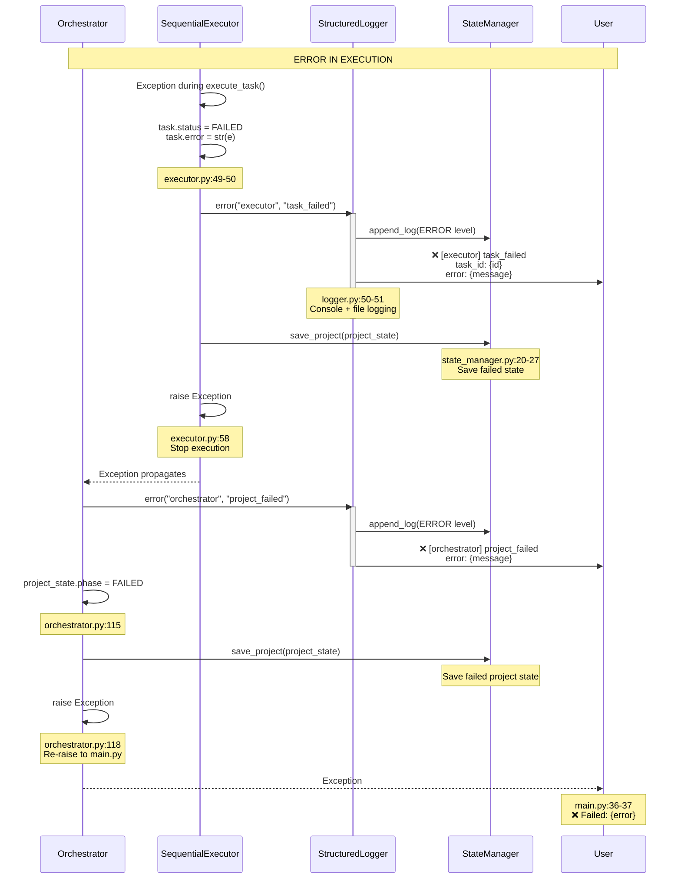

# Gear 1 - Complete Execution Sequence Diagram

This diagram shows the exact flow of execution through the Gear 1 implementation with file and line number references for code tracing.

## Main Execution Flow

```mermaid
sequenceDiagram
    participant User
    participant CLI as main.py
    participant Orch as Orchestrator
    participant Decomp as SimpleDecomposer
    participant State as StateManager
    participant Logger as StructuredLogger
    participant Exec as SequentialExecutor
    participant Backend as Backend (TestMock/CCPM/ClaudeCode)
    participant Git as GitManager
    participant GH as GitHub (gh CLI)

    Note over User,GH: PHASE 1: INITIALIZATION & DECOMPOSITION

    User->>CLI: python main.py "Create calculator CLI"
    activate CLI
    Note over CLI: main.py:13-40<br/>Parse args, load config

    CLI->>CLI: load_config("config/config.yaml")
    Note over CLI: main.py:8-11<br/>Load YAML configuration

    CLI->>Orch: Orchestrator(config)
    activate Orch
    Note over Orch: orchestrator.py:19-26<br/>Initialize components

    Orch->>State: StateManager(config['state_dir'])
    activate State
    Note over State: state_manager.py:16-18<br/>Create state directory
    State-->>Orch: state_manager instance
    deactivate State

    Orch->>Decomp: SimpleDecomposer()
    activate Decomp
    Note over Decomp: decomposer.py:11-12<br/>Initialize decomposer
    Decomp-->>Orch: decomposer instance
    deactivate Decomp

    CLI->>Orch: execute(requirements)
    Note over Orch: orchestrator.py:28-118<br/>Main workflow

    Orch->>Orch: Create project_id (uuid)
    Note over Orch: orchestrator.py:32<br/>project_id = f"proj_{uuid.uuid4().hex[:8]}"

    Orch->>Orch: ProjectState(project_id, requirements)
    Note over Orch: orchestrator.py:34-38<br/>Initialize project state

    Orch->>Logger: StructuredLogger(project_id, state_manager)
    activate Logger
    Note over Logger: logger.py:15-17<br/>Initialize logger
    Logger-->>Orch: logger instance
    deactivate Logger

    Orch->>Logger: info("orchestrator", "project_started")
    activate Logger
    Note over Logger: logger.py:44-45<br/>Log to file + console
    Logger->>State: append_log(project_id, entry)
    Note over State: state_manager.py:41-48<br/>Write to logs.jsonl
    Logger->>User: ℹ️ [orchestrator] project_started
    Note over Logger: logger.py:35-39<br/>Console output with emoji
    deactivate Logger

    Orch->>User: 📋 STEP 1: Decomposing Requirements
    Note over Orch: orchestrator.py:49-51<br/>Print banner

    Orch->>Orch: Update phase = DECOMPOSING
    Note over Orch: orchestrator.py:53

    Orch->>State: save_project(project_state)
    activate State
    Note over State: state_manager.py:20-27<br/>Save to project.json
    deactivate State

    Orch->>Decomp: decompose(requirements)
    activate Decomp
    Note over Decomp: decomposer.py:51-78<br/>Template-based breakdown

    Decomp->>Decomp: Select template (WEB_APP_TEMPLATE)
    Note over Decomp: decomposer.py:61<br/>Uses generic template

    loop For each task in template
        Decomp->>Decomp: Create Task(id, description, criteria)
        Note over Decomp: decomposer.py:64-76<br/>Generate task objects
    end

    Decomp-->>Orch: List[Task] (4 tasks)
    deactivate Decomp

    Orch->>Orch: project_state.tasks = tasks
    Note over Orch: orchestrator.py:57

    Orch->>Logger: info("orchestrator", "decomposition_complete")
    activate Logger
    Logger->>State: append_log()
    Logger->>User: ℹ️ [orchestrator] decomposition_complete
    deactivate Logger

    Orch->>User: ✅ Created 4 tasks:<br/>1. Set up project structure...<br/>2. Implement core data models...<br/>3. Create main application logic...<br/>4. Add tests and documentation...
    Note over Orch: orchestrator.py:62-64<br/>Display task list

    Orch->>State: save_project(project_state)
    Note over State: state_manager.py:20-27<br/>Save with tasks

    Orch->>User: Proceed with execution? (yes/no):
    Note over Orch: orchestrator.py:69<br/>Manual approval gate

    User->>Orch: yes
    Note over Orch: orchestrator.py:70-73<br/>Check user input

    Note over User,GH: PHASE 2: TASK EXECUTION (SEQUENTIAL)

    Orch->>User: ⚙️ STEP 2: Executing Tasks
    Note over Orch: orchestrator.py:76-78<br/>Print banner

    Orch->>Orch: Create backend instance
    Note over Orch: orchestrator.py:81<br/>backend = _create_backend()

    alt Backend Type: test_mock
        Orch->>Backend: TestMockBackend()
        Note over Orch: orchestrator.py:133<br/>Fast test backend
    else Backend Type: ccpm
        Orch->>Backend: CCPMBackend(api_key)
        Note over Orch: orchestrator.py:128<br/>Production CCPM
    else Backend Type: claude_code
        Orch->>Backend: ClaudeCodeBackend(cli_path)
        Note over Orch: orchestrator.py:132<br/>Claude Code CLI
    end
    activate Backend

    Orch->>Git: GitManager(config['repo_path'])
    activate Git
    Note over Git: git_manager.py:16-17<br/>Initialize with repo path
    Git-->>Orch: git_manager instance
    deactivate Git

    Orch->>Exec: SequentialExecutor(backend, git, state, logger)
    activate Exec
    Note over Exec: executor.py:18-26<br/>Initialize executor
    Exec-->>Orch: executor instance
    deactivate Exec

    Orch->>Exec: execute_all(project_state)
    activate Exec
    Note over Exec: executor.py:28-64<br/>Execute tasks sequentially

    Exec->>Exec: Update phase = EXECUTING
    Note over Exec: executor.py:31

    Exec->>State: save_project(project_state)
    Note over State: state_manager.py:20-27<br/>Save phase change

    loop For each task in project_state.tasks
        Exec->>Exec: current_task_index = i
        Note over Exec: executor.py:35

        Exec->>Logger: info("executor", "starting_task")
        activate Logger
        Logger->>User: ℹ️ [executor] starting_task<br/>task_id: task_001_xxx
        deactivate Logger

        Exec->>Exec: execute_task(task, project_id)
        Note over Exec: executor.py:42<br/>Execute single task

        activate Exec
        Note over Exec: executor.py:66-113<br/>SINGLE TASK EXECUTION

        Exec->>Exec: task.status = RUNNING
        Note over Exec: executor.py:69

        Note over Exec,Git: STEP 1: CREATE BRANCH

        Exec->>Logger: info("executor", "creating_branch")
        Logger->>User: ℹ️ [executor] creating_branch

        Exec->>Git: create_branch(task)
        activate Git
        Note over Git: git_manager.py:28-39<br/>Git branch creation

        Git->>Git: branch_name = f"moderator-gear1/task-{task.id}"
        Note over Git: git_manager.py:31

        Git->>Git: _run_git("checkout", "-b", branch_name)
        Note over Git: git_manager.py:35<br/>subprocess: git checkout -b

        Git->>Git: task.branch_name = branch_name
        Note over Git: git_manager.py:36

        Git-->>Exec: branch_name
        deactivate Git

        Note over Exec,Backend: STEP 2: GENERATE CODE

        Exec->>Logger: info("executor", "calling_backend")
        Logger->>User: ℹ️ [executor] calling_backend

        Exec->>State: get_artifacts_dir(project_id, task.id)
        activate State
        Note over State: state_manager.py:50-55<br/>Create artifacts/task_xxx/generated/
        State-->>Exec: Path to output directory
        deactivate State

        Exec->>Backend: execute(task.description, output_dir)
        activate Backend
        Note over Backend: backend.py:84-102 (TestMock)<br/>or backend.py:33-61 (CCPM)<br/>or backend.py:125-169 (ClaudeCode)

        Backend->>Backend: Generate files (README.md, main.py, etc.)
        Note over Backend: TestMock: Creates stub files<br/>CCPM/ClaudeCode: Real generation

        Backend->>Backend: Write files to output_dir
        Note over Backend: backend.py:93-100 (TestMock)<br/>Create README.md and main.py

        Backend-->>Exec: Dict[filename, content]
        deactivate Backend

        Exec->>Exec: task.files_generated = list(files.keys())
        Note over Exec: executor.py:78

        Note over Exec,Git: STEP 3: COMMIT CHANGES

        Exec->>Logger: info("executor", "committing_changes")
        Logger->>User: ℹ️ [executor] committing_changes<br/>file_count: 2

        Exec->>Exec: file_paths = [str(output_dir/f) for f in files]
        Note over Exec: executor.py:85

        Exec->>Git: commit_changes(task, file_paths)
        activate Git
        Note over Git: git_manager.py:41-56<br/>Git commit

        loop For each file_path in files
            Git->>Git: _run_git("add", file_path)
            Note over Git: git_manager.py:47<br/>subprocess: git add
        end

        Git->>Git: message = _format_commit_message(task)
        Note over Git: git_manager.py:50<br/>Format structured message

        Note over Git: git_manager.py:68-81<br/>Commit message format:<br/>feat: {description}<br/>Task ID: {id}<br/>Acceptance Criteria:<br/>- criterion1<br/>- criterion2

        Git->>Git: _run_git("commit", "-m", message)
        Note over Git: git_manager.py:53<br/>subprocess: git commit

        Git-->>Exec: (commit complete)
        deactivate Git

        Note over Exec,Git: STEP 4: PUSH BRANCH

        Exec->>Logger: info("executor", "pushing_branch")
        Logger->>User: ℹ️ [executor] pushing_branch

        alt task.branch_name exists
            Exec->>Git: push_branch(task.branch_name)
            activate Git
            Note over Git: git_manager.py:58-66<br/>Push to remote

            Git->>Git: _run_git("push", "-u", "origin", branch_name)
            Note over Git: git_manager.py:63<br/>subprocess: git push -u origin

            Git-->>Exec: (push complete)
            deactivate Git
        else No branch name
            Exec->>Exec: raise Exception("Branch name not set")
            Note over Exec: executor.py:93
        end

        Note over Exec,GH: STEP 5: CREATE PULL REQUEST

        Exec->>Logger: info("executor", "creating_pr")
        Logger->>User: ℹ️ [executor] creating_pr

        Exec->>Git: create_pr(task)
        activate Git
        Note over Git: git_manager.py:83-119<br/>Create PR via gh CLI

        Git->>Git: pr_body = _format_pr_body(task)
        Note over Git: git_manager.py:97

        Note over Git: git_manager.py:115-145<br/>PR body format:<br/>## Task Description<br/>## Acceptance Criteria<br/>## Files Generated<br/>## Review Notes

        Git->>GH: gh pr create --base dev --title "..." --body "..."
        activate GH
        Note over Git: git_manager.py:100-108<br/>subprocess: gh pr create

        GH-->>Git: PR URL (stdout)
        deactivate GH

        Git->>Git: Extract PR URL and number
        Note over Git: git_manager.py:111-115

        Git->>Git: task.pr_url = pr_url
        Git->>Git: task.pr_number = pr_number

        Git-->>Exec: (pr_url, pr_number)
        deactivate Git

        Exec->>Exec: task.pr_url = pr_url<br/>task.pr_number = pr_number
        Note over Exec: executor.py:98-99

        Note over Exec,User: STEP 6: MANUAL REVIEW GATE

        Exec->>Logger: info("executor", "awaiting_review")
        Logger->>User: ℹ️ [executor] awaiting_review<br/>pr_url: {url}

        Exec->>User: ⏸️ MANUAL REVIEW REQUIRED<br/>PR Created: {pr_url}<br/>Task: {description}<br/><br/>Please review and merge the PR, then press ENTER...
        Note over Exec: executor.py:106-113<br/>Wait for user input

        User->>Exec: [ENTER]
        Note over User: User reviews PR on GitHub,<br/>merges to dev branch,<br/>then presses ENTER

        Exec->>Logger: info("executor", "review_completed")
        Logger->>User: ℹ️ [executor] review_completed

        deactivate Exec

        alt Task succeeded
            Exec->>Exec: task.status = COMPLETED
            Note over Exec: executor.py:43

            Exec->>Logger: info("executor", "completed_task")
            Logger->>User: ℹ️ [executor] completed_task
        else Task failed
            Exec->>Exec: task.status = FAILED<br/>task.error = str(e)
            Note over Exec: executor.py:49-50

            Exec->>Logger: error("executor", "task_failed")
            Logger->>User: ❌ [executor] task_failed<br/>error: {message}

            Exec->>Exec: raise (stop execution)
            Note over Exec: executor.py:58<br/>Gear 1: Stop on first failure
        end

        Exec->>State: save_project(project_state)
        Note over State: state_manager.py:20-27<br/>Save task status
    end

    Exec->>Exec: project_state.phase = COMPLETED
    Note over Exec: executor.py:63

    Exec->>State: save_project(project_state)
    Note over State: state_manager.py:20-27<br/>Save final state

    Exec-->>Orch: (execution complete)
    deactivate Exec

    Note over User,GH: PHASE 3: COMPLETION

    Orch->>User: ✅ PROJECT COMPLETED<br/>Project ID: {project_id}<br/>Tasks Completed: 4/4<br/>PRs Created: 4
    Note over Orch: orchestrator.py:93-100<br/>Summary output

    Orch->>Logger: info("orchestrator", "project_completed")
    Logger->>User: ℹ️ [orchestrator] project_completed

    Orch->>Orch: project_state.completed_at = now()
    Note over Orch: orchestrator.py:105

    Orch->>State: save_project(project_state)
    Note over State: state_manager.py:20-27<br/>Save completion timestamp

    Orch-->>CLI: project_state
    deactivate Orch

    CLI->>User: ✅ Success! Project ID: {project_id}
    Note over CLI: main.py:33-34

    deactivate Backend
    deactivate CLI
```



## Error Handling Flow



## File References Quick Index

### Entry Point
- **main.py:13-40** - CLI argument parsing and execution
- **main.py:8-11** - Configuration loading

### Core Orchestration
- **orchestrator.py:28-118** - Main execute() workflow
- **orchestrator.py:120-137** - Backend creation logic

### Task Decomposition
- **decomposer.py:51-78** - decompose() method
- **decomposer.py:14-49** - WEB_APP_TEMPLATE definition

### Task Execution
- **executor.py:28-64** - execute_all() sequential loop
- **executor.py:66-113** - execute_task() single task workflow

### Git Operations
- **git_manager.py:28-39** - create_branch()
- **git_manager.py:41-56** - commit_changes()
- **git_manager.py:58-66** - push_branch()
- **git_manager.py:83-119** - create_pr()
- **git_manager.py:68-81** - _format_commit_message()
- **git_manager.py:121-145** - _format_pr_body()

### Backend Adapters
- **backend.py:68-106** - TestMockBackend
- **backend.py:27-67** - CCPMBackend
- **backend.py:109-187** - ClaudeCodeBackend

### State Management
- **state_manager.py:20-27** - save_project()
- **state_manager.py:29-39** - load_project()
- **state_manager.py:41-48** - append_log()
- **state_manager.py:50-55** - get_artifacts_dir()

### Logging
- **logger.py:19-39** - log() method (console + file)
- **logger.py:41-51** - Helper methods (debug, info, warn, error)

### Data Models
- **models.py:25-44** - Task dataclass
- **models.py:48-76** - ProjectState dataclass
- **models.py:79-90** - WorkLogEntry dataclass
- **models.py:11-16** - TaskStatus enum
- **models.py:18-23** - ProjectPhase enum

## Key Checkpoints for Code Tracing

### Checkpoint 1: Initialization
```
Entry: main.py:13
Flow: main() → load_config() → Orchestrator() → execute()
Exit: orchestrator.py:28
```

### Checkpoint 2: Decomposition
```
Entry: orchestrator.py:56
Flow: decomposer.decompose() → Create Task objects → Save state
Exit: orchestrator.py:66
```

### Checkpoint 3: User Approval
```
Entry: orchestrator.py:69
Flow: Print prompt → input() → Check response
Exit: orchestrator.py:73 (if yes) or orchestrator.py:72 (if no)
```

### Checkpoint 4: Per-Task Execution
```
Entry: executor.py:66
Flow: Create branch → Generate code → Commit → Push → Create PR → Wait for review
Exit: executor.py:43 (success) or executor.py:50 (failure)
```

### Checkpoint 5: Git Workflow
```
Entry: executor.py:73 (create_branch)
Flow: Branch → Commit → Push → PR
Exit: executor.py:99 (pr_number set)
```

### Checkpoint 6: Manual Review Gate
```
Entry: executor.py:106
Flow: Print PR info → input() → Continue
Exit: executor.py:113
```

### Checkpoint 7: Completion
```
Entry: orchestrator.py:93
Flow: Print summary → Log completion → Save state → Return
Exit: main.py:34
```

## State Transitions

```
INITIALIZING (orchestrator.py:37)
    ↓
DECOMPOSING (orchestrator.py:53)
    ↓
EXECUTING (executor.py:31)
    ↓
COMPLETED (executor.py:63) or FAILED (orchestrator.py:115)
```

## Task Status Transitions

```
PENDING (decomposer.py:74)
    ↓
RUNNING (executor.py:69)
    ↓
COMPLETED (executor.py:43) or FAILED (executor.py:49)
```

## Logging Points

Every major action is logged at these points:

1. **project_started** - orchestrator.py:43
2. **decomposition_complete** - orchestrator.py:59
3. **execution_cancelled_by_user** - orchestrator.py:71
4. **starting_task** - executor.py:37
5. **creating_branch** - executor.py:72
6. **calling_backend** - executor.py:76
7. **committing_changes** - executor.py:81
8. **pushing_branch** - executor.py:89
9. **creating_pr** - executor.py:96
10. **awaiting_review** - executor.py:102
11. **review_completed** - executor.py:113
12. **completed_task** - executor.py:45
13. **task_failed** - executor.py:52
14. **project_completed** - orchestrator.py:102
15. **project_failed** - orchestrator.py:111

All logs are written to:
- **Console**: stderr with emoji icons
- **File**: `.moderator/state/project_*/logs.jsonl`

## Directory Structure Created During Execution

```
moderator/
├── state/                          # or .moderator/state/ in Gear 2
│   └── project_proj_abc123/
│       ├── project.json            # ProjectState
│       ├── logs.jsonl              # WorkLogEntry (append-only)
│       └── artifacts/
│           ├── task_001_xxx/
│           │   └── generated/
│           │       ├── README.md
│           │       └── main.py
│           ├── task_002_yyy/
│           └── ...
└── .git/
    └── refs/heads/
        └── moderator-gear1/
            ├── task-task_001_xxx
            ├── task-task_002_yyy
            └── ...
```

## Usage Guide for Code Tracing

### 1. Start from Entry Point
```bash
# Set breakpoint at main.py:13
# Follow the flow through:
# main() → load_config() → Orchestrator() → execute()
```

### 2. Watch State Changes
```bash
# Monitor state file in real-time:
watch -n 1 'cat state/proj_*/project.json | python -m json.tool | grep -E "phase|status"'
```

### 3. Follow Logs
```bash
# Tail logs as they're written:
tail -f state/proj_*/logs.jsonl | jq .
```

### 4. Trace Task Execution
```bash
# Set breakpoints at:
# - executor.py:66 (execute_task entry)
# - executor.py:73 (create_branch)
# - executor.py:76 (backend execution)
# - executor.py:86 (commit)
# - executor.py:90 (push)
# - executor.py:97 (create PR)
```

### 5. Check Git State
```bash
# Watch branches being created:
watch -n 1 'git branch | grep moderator-gear1'

# Watch commits being made:
git log --oneline moderator-gear1/task-* --all
```

This diagram should help you navigate through the code and understand the exact flow! Let me know if you need any clarifications.
