# Moderator Test Execution - Sequence Diagram

**Purpose:** Visual representation of Moderator test flow with checkpoint markers
**Created:** 2025-01-16
**Related:** [Instrumented Test Plan](instrumented-test-plan.md)

---

## Main Execution Sequence

```mermaid
sequenceDiagram
    autonumber

    participant H as Human Observer<br/>(Tomer)
    participant M as Moderator<br/>Framework
    participant D as Discovery<br/>Tools
    participant A as Architecture<br/>Design
    participant I as Implementation<br/>Engine
    participant Q as QA Gates<br/>(Pylint/Bandit/Flake8)
    participant T as Test<br/>Runner
    participant E as Ever-Thinker

    %% PHASE 0: Setup
    rect rgb(240, 240, 240)
        Note over H: PHASE 0: Setup Instrumentation (15 min)
        H->>H: Create checkpoint scripts
        H->>H: Prepare answer key files
        H->>H: Setup monitoring
    end

    %% PHASE 1: Seed Input
    rect rgb(255, 250, 205)
        Note over H,M: PHASE 1: Seed Moderator (5 min)
        H->>M: Provide minimal problem statement<br/>("Sync Claude across 4 machines")
        Note right of H: NO architecture docs<br/>NO schemas<br/>NO hints

        M->>M: Parse problem statement
        M->>M: Generate clarifying questions

        M->>H: Ask clarifying questions<br/>(e.g., "Where is data stored?")

        %% CHECKPOINT 1
        rect rgb(144, 238, 144)
            Note over H,M: 📍 CHECKPOINT 1: Problem Understanding
            H->>H: Count questions asked
            H->>H: Evaluate question quality
            Note right of H: PASS: ≥3 questions<br/>Score: /20 points
        end

        H->>M: Provide answers
    end

    %% PHASE 2: Discovery
    rect rgb(230, 230, 250)
        Note over M,D: PHASE 2: Discovery (30-60 min)
        M->>D: SSH to ROG: find ~/.claude/
        D-->>M: Found: ~/.claude/ (132MB)

        M->>D: SSH to XPS: find ~/.claude/
        D-->>M: Found: ~/.claude/ (684MB)

        M->>D: SSH to MAC: find ~/.claude/
        D-->>M: Found: ~/.claude/ (7.6MB)

        M->>D: SSH to NELLY: find .claude
        D-->>M: Found: .claude (36KB)

        M->>D: Examine history.jsonl format
        D-->>M: JSONL format identified

        M->>D: Check settings.json
        D-->>M: JSON format identified

        M->>D: List all directories
        D-->>M: projects/, session-env/,<br/>file-history/, .credentials.json

        M->>M: Analyze findings
        M->>M: Identify security concern<br/>(.credentials.json)

        %% CHECKPOINT 2
        rect rgb(144, 238, 144)
            Note over H,M: 📍 CHECKPOINT 2: Discovery Validation
            H->>H: Run checkpoint-2-validator.sh
            H->>H: Compare to answer key<br/>(claude-data-schema.md)
            Note right of H: PASS: ≥60/100 points<br/>Found .claude/ on all machines<br/>Identified formats<br/>Security awareness
        end

        M->>M: Document discovery findings
    end

    %% PHASE 3: Architecture
    rect rgb(255, 228, 225)
        Note over M,A: PHASE 3: Architecture Design (30-60 min)
        M->>A: Analyze requirements
        A->>A: Consider topologies<br/>(hub-spoke vs peer-to-peer)
        A->>A: Choose sync protocol<br/>(rsync vs custom)
        A->>A: Design conflict resolution
        A->>A: Plan database schema

        A->>M: Proposed architecture
        M->>H: Present architecture document

        %% CHECKPOINT 3
        rect rgb(144, 238, 144)
            Note over H,A: 📍 CHECKPOINT 3: Architecture Quality
            H->>H: Run checkpoint-3-evaluator.sh
            H->>H: Score using rubric:<br/>- Topology (30 pts)<br/>- Cross-platform (25 pts)<br/>- Conflict resolution (25 pts)<br/>- Security (20 pts)
            Note right of H: PASS: ≥60/100 points<br/>Architecture is sound
            H->>H: Compare to answer key<br/>(claude-sync-architecture.md)
        end

        H->>M: Architecture approved<br/>(or feedback if failed)
    end

    %% PHASE 4: Implementation
    rect rgb(224, 255, 255)
        Note over M,I: PHASE 4: Implementation (2-4 hours)
        M->>I: Begin code generation

        loop For each component
            I->>I: Generate code file<br/>(e.g., sync_hub/daemon.py)

            %% CHECKPOINT 4 (Real-time)
            rect rgb(144, 238, 144)
                Note over I,Q: 📍 CHECKPOINT 4: Code Quality (Real-time)
                I->>Q: Auto-trigger QA gates
                Q->>Q: Run Bandit (security)
                Q-->>I: 🚨 HIGH: Command injection risk (line 45)
                Note right of Q: PASS if catches ≥1 issue<br/>(Epic 4 validation)

                Q->>Q: Run Pylint (quality)
                Q-->>I: Score: 7.2/10 (some issues)

                Q->>Q: Run Flake8 (style)
                Q-->>I: 18 PEP 8 violations

                I->>I: Review QA feedback
                I->>I: Fix security issue
            end

            I->>I: Write unit tests
        end

        I->>M: Implementation complete

        %% CHECKPOINT 5
        rect rgb(144, 238, 144)
            Note over M,T: 📍 CHECKPOINT 5: Test Coverage
            M->>T: Run pytest --cov
            T->>T: Execute all tests
            T-->>M: Coverage: 72%<br/>Tests: 24 passed
            Note right of T: PASS: ≥60% coverage<br/>Target: ≥80%
            H->>H: Run checkpoint-5-coverage.sh
        end
    end

    %% PHASE 5: Ever-Thinker
    rect rgb(255, 245, 238)
        Note over M,E: PHASE 5: Ever-Thinker Analysis (30 min)
        M->>E: Analyze completed code
        E->>E: Run performance analyzer
        E->>E: Run code quality analyzer
        E->>E: Run security analyzer
        E->>E: Generate improvements

        E-->>M: Suggestion 1: Add caching for GitHub API
        E-->>M: Suggestion 2: Parallelize rsync operations
        E-->>M: Suggestion 3: Add retry with exponential backoff
        E-->>M: Suggestion 4: Encrypt .credentials.json during sync
        E-->>M: Suggestion 5: Add bandwidth throttling option

        M->>H: Present improvement suggestions

        Note over H,E: (No formal checkpoint - qualitative review)
        H->>H: Evaluate suggestion quality<br/>Count: 5<br/>Actionable: 4/5<br/>Novel: 2/5<br/>Value: Would implement 3/5
    end

    %% PHASE 6: Analysis
    rect rgb(245, 245, 245)
        Note over H: PHASE 6: Results Analysis (30 min)
        H->>H: Generate checkpoint summary
        H->>H: Calculate overall score
        H->>H: Document learnings
        H->>H: Identify top 3 improvements
        H->>H: Plan next iteration

        Note right of H: Results:<br/>CP1: 15/20 ⚠️<br/>CP2: 75/100 ✅<br/>CP3: 68/100 ✅<br/>CP4: MARGINAL ⚠️<br/>CP5: 72/100 ✅<br/><br/>Overall: Partial Success
    end
```



---

## Checkpoint Details Reference

### 📍 Checkpoint 1: Problem Understanding
**When:** After seed input provided
**Duration:** 5-10 minutes
**Automated:** Partial (question counting)
**Manual:** Question quality evaluation
**Pass Criteria:** ≥3 clarifying questions asked
**Score:** /20 points
**Script:** `checkpoint-1-validator.sh`

---

### 📍 Checkpoint 2: Discovery Validation
**When:** After investigation phase complete
**Duration:** Review discovery output
**Automated:** Yes (discovery matching)
**Manual:** Edge case verification
**Pass Criteria:** ≥60/100 points
**Score:** /100 points (breakdown: 40+30+20+10)
**Script:** `checkpoint-2-validator.sh`
**Answer Key:** `claude-data-schema.md`

**Scoring Breakdown:**
- Data Location (40 pts): Found `.claude/` on all 4 machines
- File Format (30 pts): Identified JSONL + JSON
- Security (20 pts): Flagged `.credentials.json`
- Data Size (10 pts): Measured total size

---

### 📍 Checkpoint 3: Architecture Quality
**When:** After architecture document created
**Duration:** Document review (15-20 min)
**Automated:** No (requires human judgment)
**Manual:** Full rubric scoring
**Pass Criteria:** ≥60/100 points
**Score:** /100 points (breakdown: 30+25+25+20)
**Script:** `checkpoint-3-evaluator.sh` (interactive)
**Answer Key:** `claude-sync-architecture.md`

**Scoring Breakdown:**
- Topology Choice (30 pts): Sound vs. flawed
- Cross-Platform (25 pts): Addresses Linux/Mac/Windows
- Conflict Resolution (25 pts): Has strategy with rationale
- Security (20 pts): Credentials, SSH, data protection

---

### 📍 Checkpoint 4: Code Quality (QA Gates)
**When:** Real-time during implementation (after each file)
**Duration:** Continuous
**Automated:** Yes (QA tools)
**Manual:** No
**Pass Criteria:** Bandit catches ≥1 issue (Epic 4 validation)
**Score:** Bandit issues, Pylint score, Flake8 violations
**Script:** `checkpoint-4-qa-gates.sh`

**QA Tools:**
- **Bandit** (Security): Catches command injection, hardcoded secrets, etc.
- **Pylint** (Quality): Scores 0-10, identifies code smells
- **Flake8** (Style): PEP 8 compliance, complexity

**Epic 4 Validation:**
✅ PASS if Bandit catches ≥1 real security issue
This proves QA integration is working as intended.

---

### 📍 Checkpoint 5: Test Coverage
**When:** After implementation complete
**Duration:** Single run
**Automated:** Yes (pytest --cov)
**Manual:** No
**Pass Criteria:** ≥60% coverage (target: ≥80%)
**Score:** Coverage % + test count
**Script:** `checkpoint-5-coverage.sh`

**Metrics:**
- Line coverage percentage
- Branch coverage (if available)
- Total test count
- Failed test count (should be 0)

---

## Alert Triggers


### Alert Definitions

**🟢 INFO (Continue):**
- Checkpoint passed
- Expected behavior
- Progress milestone

**🟡 WARNING (Monitor):**
- Checkpoint marginal (60-79 score)
- Slow progress (>2x estimated time)
- Minor QA issues (warnings)

**🔴 CRITICAL (Intervene):**
- Checkpoint failed (<60 score)
- Stuck (3+ retries same task)
- Security issue unaddressed
- Architecture fundamentally flawed
- Dangerous operation (file deletion, sudo)

---

## Timing Breakdown

```mermaid
gantt
    title Moderator Test Execution Timeline
    dateFormat HH:mm
    axisFormat %H:%M

    section Setup
    Create scripts           :done, setup1, 00:00, 10m
    Prepare answer keys      :done, setup2, after setup1, 5m

    section Phase 1
    Provide seed input       :active, p1a, after setup2, 2m
    Moderator asks questions :p1b, after p1a, 8m
    CP1: Problem Understanding :crit, cp1, after p1b, 5m

    section Phase 2
    Discovery investigation  :p2a, after cp1, 45m
    CP2: Discovery Validation :crit, cp2, after p2a, 10m

    section Phase 3
    Architecture design      :p3a, after cp2, 50m
    CP3: Architecture Quality :crit, cp3, after p3a, 15m

    section Phase 4
    Implementation           :p4a, after cp3, 180m
    CP4: QA Gates (continuous) :crit, cp4, after p3a, 180m
    CP5: Test Coverage       :crit, cp5, after p4a, 5m

    section Phase 5
    Ever-Thinker analysis    :p5a, after cp5, 30m

    section Phase 6
    Results analysis         :p6a, after p5a, 30m
```

**Total Duration:** ~4.5 hours (first run)

---

## Data Flow


---

## Success Criteria Summary

| Checkpoint | Minimum | Target | Stretch |
|------------|---------|--------|---------|
| CP1 | 10/20 (3 questions) | 15/20 (5 questions) | 20/20 (insightful) |
| CP2 | 60/100 | 75/100 | 90/100 |
| CP3 | 60/100 | 80/100 | 95/100 |
| CP4 | Bandit catches 1 issue | All gates pass | Perfect scores |
| CP5 | 60% coverage | 80% coverage | 95% coverage |

**Overall Success Levels:**

- **Minimum:** 3/5 checkpoints at "Minimum", code runs
- **Target:** 4/5 checkpoints at "Target", tool partially works
- **Stretch:** 5/5 checkpoints at "Stretch", tool fully solves problem

**Expected First Run:** Minimum to Target

---

## Iteration Loop


**Exit Criteria:**
- ✅ Target success achieved
- ✅ Tool solves actual problem
- ❌ OR: Diminishing returns

---

**Diagram Version:** 1.0
**Created:** 2025-01-16
**Next:** Create checkpoint implementation scripts

