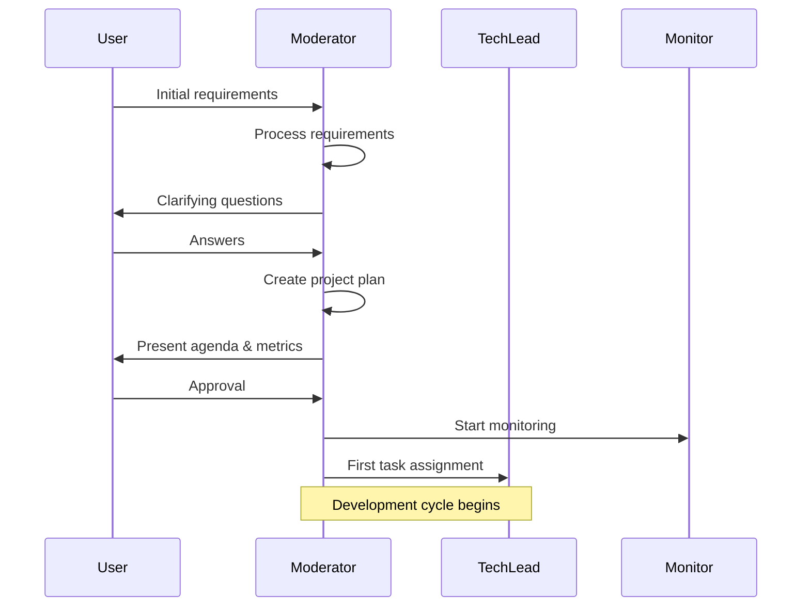

# Product Requirements Document (PRD)
## Duo-Agent Autonomous Development System

### Version 1.0 - MVP Release
**Document Status:** Ready for Implementation  
**Target Implementer:** LLM Agent Management System (Claude Task Master or equivalent)  
**Implementation Complexity:** High  
**Estimated Implementation Time:** 4-6 weeks  

---

## 1. Executive Summary

### 1.1 Product Vision
Create a self-orchestrating development system that autonomously builds, reviews, and continuously improves greenfield software projects with minimal human intervention.

### 1.2 Core Value Proposition
- **Autonomous Development:** System operates independently after initial scope definition
- **Self-Improving Architecture:** Continuous enhancement loop that never considers work "complete"
- **Quality Enforcement:** Built-in PR-based workflow with automated review cycles
- **Observable & Debuggable:** Comprehensive logging and state tracking for full traceability

### 1.3 Success Metrics
- Successfully complete a greenfield project from specification to working code
- Achieve <5 human interventions per project
- Maintain system health score >80% throughout execution
- Generate improvements in at least 3 cycles before hitting stopping conditions

---

## 2. System Architecture

### 2.1 Agent Definitions

#### 2.1.1 Moderator Agent
**Role:** Orchestrator, Planner, and Quality Gatekeeper

**Responsibilities:**
- Process initial user requirements and clarify scope
- Create high-level project agenda and success metrics  
- Decompose work into PR-sized chunks
- Approve/reject PRs from TechLead
- Manage improvement cycles
- Monitor stopping conditions
- Maintain communication with user when needed

**Key Capabilities Required:**
- Natural language understanding for requirement processing
- Project planning and task decomposition
- Code review and quality assessment
- Decision-making on architectural choices

**Configuration:**
```yaml
agent_type: moderator
model: claude-3-opus or gpt-4
temperature: 0.3  # Lower for consistent decision-making
max_context: 100000 tokens
memory_type: persistent
tools:
  - git_operations
  - pr_management
  - task_queue_management
  - metric_evaluation
```

#### 2.1.2 TechLead Agent  
**Role:** Primary Implementation Agent

**Responsibilities:**
- Receive tasks from Moderator
- Create implementation plans
- Write actual code
- Create and submit PRs
- Request specialist agents when needed
- Report completion and request next tasks

**Key Capabilities Required:**
- Code generation across multiple languages
- Testing and debugging
- Documentation writing
- Technical decision-making

**Configuration:**
```yaml
agent_type: techlead
model: claude-3-opus or gpt-4
temperature: 0.5  # Balanced for creativity and consistency
max_context: 100000 tokens
memory_type: task-scoped
tools:
  - file_operations
  - code_execution
  - testing_framework
  - git_operations
  - specialist_request
```

#### 2.1.3 Monitor Agent
**Role:** System Health Watchdog

**Responsibilities:**
- Track token usage and context size
- Monitor error rates and stagnation
- Alert on threshold violations
- Generate health reports
- Trigger stopping conditions

**Configuration:**
```yaml
agent_type: monitor
model: claude-3-haiku or gpt-3.5  # Lighter model sufficient
temperature: 0.1  # Deterministic monitoring
check_interval: 60 seconds
memory_type: metrics-only
```

#### 2.1.4 Specialist Agents (Dynamic)
**Types Available:**
- `api_designer`: REST/GraphQL API design
- `test_specialist`: Unit/Integration test creation
- `refactoring_expert`: Code optimization and cleanup
- `documentation_writer`: README, API docs, inline comments

**Lifecycle:** Created on-demand, destroyed after task completion

---

## 3. Data Models & State Management

### 3.1 Core Data Structures

```python
# Project State
class ProjectState:
    project_id: str
    name: str
    description: str
    original_requirements: str
    refined_requirements: str
    success_metrics: List[Metric]
    current_phase: WorkPhase
    created_at: datetime
    last_activity: datetime
    
# Work Phase Enumeration
class WorkPhase(Enum):
    CLARIFYING = "clarifying"
    PLANNING = "planning"
    IMPLEMENTING = "implementing"
    REVIEWING = "reviewing"
    IMPROVING = "improving"
    STOPPED = "stopped"

# Task Definition
class Task:
    task_id: str
    parent_task_id: Optional[str]
    type: TaskType  # FEATURE, BUGFIX, REFACTOR, TEST, DOCUMENT
    description: str
    acceptance_criteria: List[str]
    assigned_to: str
    status: TaskStatus
    created_at: datetime
    started_at: Optional[datetime]
    completed_at: Optional[datetime]
    pr_url: Optional[str]
    
# Health Metrics
class HealthMetrics:
    tokens_used: int
    token_limit: int
    context_size: int
    context_limit: int
    error_count: int
    error_threshold: int
    minutes_since_progress: int
    stagnation_threshold: int
    improvement_magnitude: float  # Percentage improvement in last cycle
    custom_metrics: Dict[str, float]
    
# Work Log Entry
class WorkLogEntry:
    timestamp: datetime
    agent_id: str
    action_type: ActionType
    task_id: Optional[str]
    description: str
    reasoning: str  # Why the agent made this decision
    input_data: Dict
    output_data: Dict
    success: bool
    error_message: Optional[str]
```

### 3.2 Persistence Layer

```yaml
storage:
  type: filesystem  # Initially, can upgrade to database
  structure:
    project_root/
      .duo-agent/
        state.json        # Current ProjectState
        tasks.jsonl       # Task queue and history
        health.json       # Current HealthMetrics
        logs/
          moderator.jsonl
          techlead.jsonl
          monitor.jsonl
          specialists.jsonl
        checkpoints/      # State snapshots for recovery
          checkpoint_TIMESTAMP.json
```

---

## 4. Communication Protocols

### 4.1 Message Format

```python
class AgentMessage:
    message_id: str
    from_agent: str
    to_agent: str
    message_type: MessageType
    payload: Dict
    requires_response: bool
    correlation_id: Optional[str]  # Links to original message
    timestamp: datetime

class MessageType(Enum):
    TASK_ASSIGNMENT = "task_assignment"
    TASK_COMPLETION = "task_completion"
    PR_SUBMITTED = "pr_submitted"
    PR_FEEDBACK = "pr_feedback"
    SPECIALIST_REQUEST = "specialist_request"
    SPECIALIST_APPROVED = "specialist_approved"
    STATUS_UPDATE = "status_update"
    HEALTH_ALERT = "health_alert"
    USER_COMMUNICATION = "user_communication"
```

### 4.2 Task Assignment Protocol

```yaml
Moderator -> TechLead:
  message_type: TASK_ASSIGNMENT
  payload:
    task: Task object
    context: 
      related_files: List[str]
      dependencies: List[task_id]
      architectural_guidelines: str
    deadline: Optional[datetime]
    
TechLead -> Moderator:
  message_type: TASK_COMPLETION
  payload:
    task_id: str
    pr_url: str
    summary: str
    files_changed: List[str]
    tests_added: int
    documentation_updated: bool
```

---

## 5. Workflow Specifications

### 5.1 Initial Setup Workflow



### 5.2 Development Cycle

```python
# Pseudocode for main development loop
while not stopping_conditions_met():
    # Moderator assigns next task
    task = moderator.get_next_priority_task()
    moderator.assign_task_to_techlead(task)
    
    # TechLead implements
    implementation = techlead.implement_task(task)
    
    # Check if specialist needed
    if techlead.needs_specialist():
        specialist = create_specialist(techlead.specialist_request)
        specialist_result = specialist.execute()
        techlead.incorporate_specialist_work(specialist_result)
        destroy_specialist(specialist)
    
    # Submit PR
    pr = techlead.create_pull_request(implementation)
    
    # Review cycle
    review_result = moderator.review_pr(pr)
    while review_result.needs_changes:
        techlead.address_feedback(review_result.feedback)
        pr.update()
        review_result = moderator.review_pr(pr)
    
    # Merge and continue
    pr.merge()
    moderator.update_progress_metrics()
```

### 5.3 Improvement Cycle

```python
class ImprovementCycle:
    def execute(self):
        # Moderator reflects on current state
        current_metrics = calculate_project_metrics()
        improvement_opportunities = moderator.identify_improvements(
            current_metrics,
            angles=["performance", "code_quality", "user_experience", 
                   "testing", "documentation", "architecture"]
        )
        
        # Prioritize improvements
        prioritized = moderator.prioritize_improvements(
            improvement_opportunities,
            criteria=["impact", "effort", "risk"]
        )
        
        # Create improvement tasks
        for improvement in prioritized[:3]:  # Top 3 improvements
            task = moderator.create_improvement_task(improvement)
            task_queue.add(task)
        
        # Check diminishing returns
        improvement_magnitude = calculate_improvement_magnitude(
            current_metrics, 
            previous_metrics
        )
        
        if improvement_magnitude < DIMINISHING_RETURNS_THRESHOLD:
            return StopReason.DIMINISHING_RETURNS
```

---

## 6. Stopping Conditions

### 6.1 Automatic Stopping Triggers

```python
class StoppingConditions:
    # Resource limits
    MAX_TOKENS = 1_000_000
    MAX_RUNTIME_HOURS = 24
    MAX_IMPROVEMENT_CYCLES = 5
    
    # Quality thresholds  
    MIN_IMPROVEMENT_MAGNITUDE = 0.10  # 10% improvement required
    MAX_ERROR_RATE = 0.20  # 20% task failure rate
    MAX_STAGNATION_MINUTES = 30
    
    # Safety limits
    MAX_CONTEXT_SIZE_RATIO = 0.95  # 95% of context limit
    MAX_CONSECUTIVE_ERRORS = 3
    
    def evaluate(self, state: ProjectState, metrics: HealthMetrics) -> Tuple[bool, str]:
        if metrics.tokens_used >= self.MAX_TOKENS:
            return True, "Token limit reached"
        
        if metrics.error_count / state.total_tasks > self.MAX_ERROR_RATE:
            return True, "Error rate too high"
            
        if metrics.minutes_since_progress > self.MAX_STAGNATION_MINUTES:
            return True, "System stagnated"
            
        if state.improvement_cycles >= self.MAX_IMPROVEMENT_CYCLES:
            if metrics.improvement_magnitude < self.MIN_IMPROVEMENT_MAGNITUDE:
                return True, "Diminishing returns"
                
        return False, ""
```

### 6.2 User Intervention Triggers

```yaml
intervention_required_when:
  - error_type: CRITICAL_FAILURE
    description: "Core system error that prevents continuation"
  - error_type: OFF_TOPIC
    description: "System diverging from original requirements"
  - error_type: INFINITE_LOOP
    description: "Same task attempted >3 times without success"
  - error_type: RESOURCE_EXHAUSTION
    description: "Approaching hard limits on any resource"
```

---

## 7. Git & PR Management

### 7.1 Repository Structure

```
project_root/
├── .duo-agent/           # System metadata
├── src/                  # Main source code
├── tests/                # Test files
├── docs/                 # Documentation
├── .github/
│   └── pull_requests/    # PR templates and history
├── README.md
└── duo-agent.config.yaml
```

### 7.2 PR Workflow

```python
class PullRequestWorkflow:
    def create_pr(self, task: Task, changes: List[FileChange]) -> PR:
        # Create feature branch
        branch_name = f"duo-agent/{task.type}/{task.task_id[:8]}"
        git.create_branch(branch_name)
        
        # Apply changes
        for change in changes:
            file.write(change.path, change.content)
        
        # Commit with structured message
        commit_message = f"""
        {task.type}: {task.description}
        
        Task ID: {task.task_id}
        Acceptance Criteria:
        {format_criteria(task.acceptance_criteria)}
        
        Changes:
        {format_changes(changes)}
        """
        git.commit(commit_message)
        
        # Create PR
        pr_body = generate_pr_description(task, changes)
        pr = github.create_pull_request(
            title=f"[{task.type}] {task.description[:60]}",
            body=pr_body,
            base="main",
            head=branch_name
        )
        
        return pr
```

### 7.3 PR Review Criteria

```yaml
review_checklist:
  code_quality:
    - passes_linting: bool
    - follows_conventions: bool
    - no_obvious_bugs: bool
    - appropriate_complexity: bool
    
  testing:
    - has_tests: bool
    - tests_pass: bool
    - adequate_coverage: bool  # >80% for new code
    
  documentation:
    - code_is_commented: bool
    - readme_updated: bool
    - api_docs_current: bool
    
  acceptance:
    - meets_acceptance_criteria: bool
    - no_scope_creep: bool
    - backwards_compatible: bool
```

---

## 8. Logging & Observability

### 8.1 Structured Logging Format

```python
class LogEntry:
    timestamp: datetime
    level: LogLevel  # DEBUG, INFO, WARN, ERROR, CRITICAL
    agent_id: str
    trace_id: str  # Unique ID for tracking across agents
    span_id: str   # Unique ID for this operation
    parent_span_id: Optional[str]
    
    # Context
    task_id: Optional[str]
    pr_id: Optional[str]
    
    # Content
    event_type: str
    message: str
    data: Dict  # Structured data
    
    # Decision tracking
    decision_made: Optional[str]
    reasoning: Optional[str]
    alternatives_considered: Optional[List[str]]
```

### 8.2 Key Events to Log

```yaml
mandatory_log_events:
  moderator:
    - requirement_clarification
    - task_creation
    - task_assignment
    - pr_review_started
    - pr_review_decision
    - improvement_identified
    - stopping_condition_triggered
    
  techlead:
    - task_received
    - implementation_started
    - specialist_requested
    - code_generated
    - tests_written
    - pr_created
    - feedback_received
    - feedback_addressed
    
  monitor:
    - health_check
    - threshold_approached
    - threshold_exceeded
    - alert_sent
    - metrics_snapshot
```

### 8.3 Debugging Interface

```python
class DebugInterface:
    def get_agent_state(self, agent_id: str) -> Dict:
        """Returns current state of specific agent"""
        
    def get_task_trace(self, task_id: str) -> List[LogEntry]:
        """Returns all logs related to a specific task"""
        
    def get_decision_history(self, agent_id: str) -> List[Decision]:
        """Returns all decisions made by an agent with reasoning"""
        
    def replay_from_checkpoint(self, checkpoint_id: str):
        """Restore system state from a checkpoint"""
        
    def get_conversation_history(self, agent_pair: Tuple[str, str]) -> List[Message]:
        """Returns all messages between two agents"""
```

---

## 9. Implementation Instructions

### 9.1 Phase 1: Core Infrastructure (Week 1)

**Tasks for Implementation Agent:**

1. **Set up project structure**
   ```bash
   duo-agent-template/
   ├── agents/
   │   ├── base_agent.py
   │   ├── moderator.py
   │   ├── techlead.py
   │   └── monitor.py
   ├── core/
   │   ├── state_manager.py
   │   ├── task_queue.py
   │   ├── message_bus.py
   │   └── git_integration.py
   ├── utils/
   │   ├── logging.py
   │   ├── metrics.py
   │   └── persistence.py
   ├── config/
   │   └── default_config.yaml
   └── main.py
   ```

2. **Implement base agent class**
   - Message handling
   - State management
   - Tool integration
   - Memory management

3. **Create message bus**
   - Async message passing
   - Message persistence
   - Retry logic

4. **Build state manager**
   - State persistence
   - Checkpoint creation
   - State recovery

### 9.2 Phase 2: Agent Implementation (Week 2)

1. **Moderator Agent**
   - Requirement processing logic
   - Task decomposition algorithm
   - PR review logic
   - Improvement identification

2. **TechLead Agent**  
   - Code generation integration
   - Testing framework
   - PR creation workflow
   - Specialist request logic

3. **Monitor Agent**
   - Metric collection
   - Threshold monitoring
   - Alert system
   - Health reporting

### 9.3 Phase 3: Workflow Integration (Week 3)

1. **Main orchestration loop**
2. **Stopping conditions evaluator**
3. **Improvement cycle implementation**
4. **Git/GitHub integration**
5. **User interaction interface**

### 9.4 Phase 4: Testing & Hardening (Week 4)

1. **Unit tests for each component**
2. **Integration tests for workflows**
3. **Error recovery mechanisms**
4. **Performance optimization**
5. **Documentation generation**

---

## 10. Configuration Schema

```yaml
# duo-agent.config.yaml
project:
  name: string
  description: string
  type: [web_app, cli_tool, library, api_service]
  language: [python, javascript, typescript, go]
  
agents:
  moderator:
    model: string
    temperature: float
    max_tokens: int
    tools: list
    
  techlead:
    model: string
    temperature: float  
    max_tokens: int
    tools: list
    
  monitor:
    check_interval_seconds: int
    alert_channels: list
    
limits:
  max_tokens_total: int
  max_runtime_hours: int
  max_improvement_cycles: int
  max_error_rate: float
  stagnation_minutes: int
  
thresholds:
  context_size_warning: float  # Percentage
  token_usage_warning: float   # Percentage
  error_count_critical: int
  
features:
  enable_specialists: bool
  enable_auto_recovery: bool
  enable_user_notifications: bool
  
git:
  provider: [github, gitlab, bitbucket]
  repository: string
  branch_prefix: string
  require_pr_reviews: bool
```

---

## 11. Error Handling & Recovery

### 11.1 Error Categories

```python
class ErrorCategory(Enum):
    TRANSIENT = "transient"       # Retry automatically
    RECOVERABLE = "recoverable"   # Needs intervention
    CRITICAL = "critical"         # Stop system
    
class ErrorHandler:
    retry_strategies = {
        ErrorCategory.TRANSIENT: ExponentialBackoff(max_retries=3),
        ErrorCategory.RECOVERABLE: RequestUserIntervention(),
        ErrorCategory.CRITICAL: SystemShutdown()
    }
```

### 11.2 Recovery Procedures

```yaml
recovery_procedures:
  context_overflow:
    - Save current state to checkpoint
    - Clear agent context
    - Reload only essential information
    - Resume from last successful task
    
  git_conflict:
    - Attempt automatic merge
    - If failed, create new branch
    - Request manual resolution
    - Continue on resolved branch
    
  api_rate_limit:
    - Pause affected agent
    - Switch to backup model if available
    - Resume after cooldown period
    
  task_failure:
    - Log detailed error
    - Attempt with different approach
    - After 3 failures, skip and mark for review
```

---

## 12. Testing Requirements

### 12.1 Test Scenarios

```python
# Core functionality tests
def test_requirement_to_task_decomposition():
    """Moderator correctly breaks down requirements into tasks"""
    
def test_task_implementation():
    """TechLead successfully implements assigned task"""
    
def test_pr_review_cycle():
    """Complete PR creation, review, and merge cycle"""
    
def test_improvement_identification():
    """System identifies valid improvements after initial implementation"""
    
def test_stopping_conditions():
    """System stops appropriately when conditions are met"""
    
# Error handling tests
def test_context_overflow_recovery():
    """System recovers from context size limits"""
    
def test_api_failure_handling():
    """System handles API failures gracefully"""
    
def test_specialist_failure():
    """System continues when specialist agent fails"""
```

### 12.2 Validation Criteria

```yaml
acceptance_criteria:
  functional:
    - Complete a simple TODO app from requirements
    - Generate at least 3 improvements
    - All PRs pass review within 2 attempts
    - No critical errors during execution
    
  performance:
    - Token usage within 20% of estimate
    - Completion within 2 hours for simple project
    - Less than 5% error rate
    
  quality:
    - Generated code passes linting
    - Test coverage >80%
    - Documentation is complete
    - Logs are comprehensive and searchable
```

---

## 13. Deployment Instructions

### 13.1 Environment Setup

```bash
# Required environment variables
export DUO_AGENT_API_KEY="your-api-key"
export DUO_AGENT_GIT_TOKEN="your-git-token"
export DUO_AGENT_LOG_LEVEL="INFO"
export DUO_AGENT_WORKSPACE="/path/to/workspace"

# Optional configuration
export DUO_AGENT_MODEL_PROVIDER="anthropic"  # or "openai"
export DUO_AGENT_MONITOR_PORT="8080"  # For health monitoring endpoint
```

### 13.2 Initial Execution

```python
# main.py entry point
if __name__ == "__main__":
    # Load configuration
    config = load_config("duo-agent.config.yaml")
    
    # Initialize system
    state_manager = StateManager(config)
    message_bus = MessageBus()
    
    # Create agents
    moderator = ModeratorAgent(config.agents.moderator)
    techlead = TechLeadAgent(config.agents.techlead)
    monitor = MonitorAgent(config.agents.monitor)
    
    # Register agents with message bus
    message_bus.register(moderator)
    message_bus.register(techlead)
    message_bus.register(monitor)
    
    # Start monitoring
    monitor.start()
    
    # Get initial requirements from user
    requirements = get_user_requirements()
    
    # Begin orchestration
    orchestrator = Orchestrator(
        moderator=moderator,
        techlead=techlead,
        monitor=monitor,
        state_manager=state_manager
    )
    
    orchestrator.execute(requirements)
```

---

## 14. Monitoring Dashboard Specifications

### 14.1 Required Metrics Display

```yaml
dashboard_sections:
  overview:
    - current_phase
    - active_task
    - pr_in_review
    - improvement_cycle_number
    
  health:
    - token_usage_gauge
    - context_size_gauge
    - error_rate_chart
    - stagnation_timer
    
  progress:
    - tasks_completed
    - prs_merged
    - improvements_implemented
    - code_coverage_trend
    
  alerts:
    - active_warnings
    - recent_errors
    - intervention_requests
```

### 14.2 API Endpoints

```python
# Monitoring API
GET /api/health          # System health status
GET /api/metrics         # Current metrics
GET /api/state           # Current system state
GET /api/logs            # Recent logs (paginated)
GET /api/tasks           # Task queue and history
POST /api/intervention   # Manual intervention endpoint
```

---

## 15. Future Enhancements (Post-MVP)

### 15.1 Phase 2 Features
- **Parallel worktree management** for concurrent development
- **Advanced specialist agents** with domain expertise
- **Self-modification capabilities** for agent code
- **Multi-project orchestration**

### 15.2 Phase 3 Features
- **Learning system** that improves based on past projects
- **Custom agent creation** through natural language
- **Distributed execution** across multiple machines
- **Advanced visualization** of system behavior

---

## Appendix A: Example Task Decomposition

```python
# Example: "Build a REST API for task management"
example_task_decomposition = [
    {
        "task_id": "001",
        "type": "FEATURE",
        "description": "Set up Express.js server with basic middleware",
        "acceptance_criteria": [
            "Server starts on port 3000",
            "CORS enabled",
            "JSON body parsing configured",
            "Basic error handling middleware"
        ]
    },
    {
        "task_id": "002", 
        "type": "FEATURE",
        "description": "Create Task model and database schema",
        "acceptance_criteria": [
            "Task model with id, title, description, status, created_at",
            "Database migrations created",
            "Validation rules defined"
        ]
    },
    {
        "task_id": "003",
        "type": "FEATURE", 
        "description": "Implement CRUD endpoints for tasks",
        "acceptance_criteria": [
            "POST /tasks - Create task",
            "GET /tasks - List tasks",
            "GET /tasks/:id - Get single task",
            "PUT /tasks/:id - Update task",
            "DELETE /tasks/:id - Delete task"
        ]
    },
    {
        "task_id": "004",
        "type": "TEST",
        "description": "Add integration tests for API endpoints",
        "acceptance_criteria": [
            "Test coverage >80%",
            "All endpoints tested",
            "Error cases covered"
        ]
    }
]
```

---

## Appendix B: Specialist Agent Templates

```python
# Specialist agent configuration templates
specialist_templates = {
    "api_designer": {
        "model": "claude-3-opus",
        "temperature": 0.3,
        "system_prompt": """You are an API design specialist. 
        Focus on RESTful principles, proper HTTP status codes, 
        clear endpoint naming, and comprehensive error handling.""",
        "tools": ["openapi_generator", "schema_validator"]
    },
    
    "test_specialist": {
        "model": "claude-3-opus",
        "temperature": 0.2,
        "system_prompt": """You are a testing specialist.
        Write comprehensive unit and integration tests.
        Ensure edge cases are covered and aim for >90% coverage.""",
        "tools": ["test_runner", "coverage_analyzer"]
    },
    
    "refactoring_expert": {
        "model": "claude-3-opus",
        "temperature": 0.4,
        "system_prompt": """You are a refactoring specialist.
        Focus on code clarity, performance optimization,
        and adherence to SOLID principles.""",
        "tools": ["ast_analyzer", "performance_profiler"]
    }
}
```

---

## Implementation Notes for LLM Task Master

1. **Start with Phase 1** - Get the core message passing and state management working first
2. **Use mock agents initially** - Test the orchestration logic before implementing full agent intelligence
3. **Implement comprehensive logging from day 1** - This will be crucial for debugging
4. **Create a simple test project** - Use a TODO app or similar as your validation project
5. **Focus on the happy path first** - Get basic functionality working before adding error handling
6. **Make configuration external** - All magic numbers and thresholds should be configurable
7. **Build incrementally** - Each phase should produce a working system, even if limited

This PRD provides sufficient detail for an LLM Agent Management system to begin implementation. The architecture is designed to be testable, observable, and incrementally buildable while avoiding unnecessary complexity in the MVP phase.
